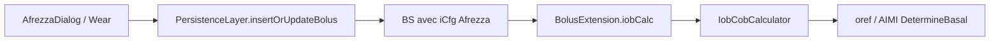

# Afrezza (insuline inhalée) — intégration AAPS / OpenApsAIMI

Documentation d’analyse et de plan d’intégration pour le patch [CAPTCG/Afrezza-AAPS-Plugin](https://github.com/CAPTCG/Afrezza-AAPS-Plugin) et la PR upstream [nightscout/AndroidAPS#4877](https://github.com/nightscout/AndroidAPS/pull/4877).

**État OpenApsAIMI (branche `dev_OAPSAIMI_mergeDEV`, juin 2026) :** Afrezza **non intégré** — aucune référence `Afrezza` / `OREF_INHALED_AFREZZA` dans le fork. L’architecture insulinique moderne (ICfg par bolus) est **déjà présente** et compatible.

---

## 1. Problème produit

### Symptôme

Un utilisateur en boucle fermée qui prend **Afrezza** (Technosphere, inhalé) pour les repas et logue la dose dans AAPS en « record only » voit souvent :

- l’IOB Afrezza calculé avec la **courbe du bolus pompe** (Fiasp/Lyumjev, DIA 5–8 h) ;
- un **IOB fantôme** pendant des heures alors que l’effet Afrezza est essentiellement terminé en **~2,5 h** ;
- AAPS qui **retient le basal** (SMB / micro-bolus / AIMI) par excès de prudence → **hyper prolongée** après repas.

### Cause racine

Avant la refonte insulinique (AAPS 3.4+), un seul plugin `activeInsulin` global modélisait tout. Depuis `dev`, **chaque bolus porte son propre `ICfg`** (pic, DIA, concentration) et le calculateur IOB utilise `iCfg.iobCalcForTreatment()` par bolus — **si** le bolus est enregistré avec le bon `ICfg`.

Le problème actuel n’est donc plus architectural : c’est l’**absence d’un type insulinique Afrezza** + **limites DIA trop hautes** (min 5 h) + **UX de log rapide**.

---

## 2. Architecture AAPS `dev` (déjà dans OpenApsAIMI)

| Composant | Rôle | Fichier clé |
|-----------|------|-------------|
| `ICfg` | Pic, DIA (ms), concentration par insuline | `core/data/.../ICfg.kt` |
| `BS.iobCalc()` | IOB par bolus via son `ICfg` | `core/objects/.../BolusExtension.kt` |
| `InsulinManager` | CRUD multi-insulines | `implementation/.../InsulinImpl.kt` |
| `Bolus.insulinConfiguration` | Persistance Room de l’`ICfg` | `database/impl/.../Bolus.kt` |
| Éditeur insuline (Compose) | Templates + validation DIA | `ui/.../insulinManagement/` |
| IOB agrégé loop / AIMI | `IobCobCalculator` somme tous les bolus | `plugins/main/.../IobCobCalculatorPlugin.kt` |

Chaîne IOB simplifiée :



**Point clé :** aucun changement spécifique dans le moteur oref/AIMI n’est requis si le bolus Afrezza est persisté avec `ICfg` peak=40 min, DIA=2,5 h.

---

## 3. Ce que apporte le patch CAPTCG

Source : `patches/afrezza-combined.patch` (~36 fichiers, ~947 lignes). Base vérifiée : upstream `dev` @ `3616b5a476`.

### 3.1 Modèle insulinique (Phase 1)

| Changement | Détail |
|------------|--------|
| `InsulinType.OREF_INHALED_AFREZZA` | value=6, peak=40 min, DIA=2,5 h, `isInhaled=true` |
| `HardLimits` | `LIMIT_DIA_INHALED` 1,5–4 h — **DIA pompe inchangé** (voir `LIMIT_DIA`) |
| `InsulinImpl.insulinTemplateList()` | Ajout template Afrezza |
| Tests `ICfgAfrezzaIobTest` | 9 tests — courbe oref bilinéaire à tp=40, td=150 min |

Paramètres PK par défaut :

| Paramètre | Afrezza (plugin) | Fiasp (pompe typique) |
|-----------|------------------|------------------------|
| Onset | ~12 min | ~10–20 min |
| Pic | **40 min** | 55 min |
| DIA | **2,5 h** | 5–8 h |
| Voie | Inhalée | SC |

### 3.2 UX (Phase 2)

| Composant | Comportement |
|-----------|--------------|
| `AfrezzaDialogScreen` | Bottom sheet Compose : boutons **4U / 8U / 12U** + confirmation |
| `AfrezzaDialogViewModel` | `persistenceLayer.insertOrUpdateBolus()` — **record-only**, pas de file pompe |
| `TreatmentBottomSheet` | Bouton Afrezza si un insuline `isInhaled` est configuré |
| `QuickLaunchAction` | Action statique Afrezza sur l’écran d’accueil |
| `ElementType.AFREZZA` | Navigation, icône, couleur insuline |
| `Sources.AfrezzaDialog` | Traçabilité UserEntry / historique |

Logique ViewModel (extrait conceptuel) :

1. Résoudre `ICfg` Afrezza via `InsulinManager` (match `OREF_INHALED_AFREZZA.insulinPeakTime` ou `isInhaled`).
2. Créer `BS(amount=4|8|12, iCfg=afrezza, notes="Afrezza inhaled")`.
3. `insertOrUpdateBolus` — **bypass queue pompe**.

### 3.3 Wear OS (Phase 3)

| Composant | Rôle |
|-----------|------|
| `AfrezzaActivity` | Sélection cartouche 4/8/12U sur montre |
| `EventData.ActionAfrezzaPreCheck/Confirmed` | Événements Wear ↔ téléphone |
| `DataHandlerMobile` | Handler côté phone : log via `PersistenceLayer` |
| `ActionSource` | Tuile Actions Wear (« Afrz ») |

### 3.4 Liste des fichiers touchés (patch)

```
app/                    ComposeMainActivity, AppNavGraph, AppRoute
core/data/              Sources.AfrezzaDialog, ICfgAfrezzaIobTest
core/interfaces/        InsulinType, HardLimits, EventData, strings
core/interfaces/        ElementType (moved from core/ui; ElementCategory colocated)
core/ui/                ElementTypeStyle, strings
database/               UserEntry.Sources, SourcesExtension
implementation/         InsulinImpl, HardLimitsImpl, UserEntryPresentationHelperImpl
plugins/sync/           DataHandlerMobile (Wear)
ui/                     AfrezzaDialog (3 fichiers), TreatmentBottomSheet/ViewModel,
                        QuickLaunchAction, MainScreen, strings
wear/                   AfrezzaActivity, ActionSource, manifest, drawable, strings
shared/tests/           HardLimitsMock
```

---

## 4. Lacune identifiée dans le patch combiné

Le plan CAPTCG (`docs/IMPLEMENTATION_PLAN.md`) prévoit une modification de **`InsulinManagementViewModel`** pour valider le slider DIA avec `minDiaInhaled()` / `maxDiaInhaled()` quand le template est inhalé.

**Le fichier `InsulinManagementViewModel.kt` n’apparaît pas dans `afrezza-combined.patch`.**

Conséquence sur OpenApsAIMI actuel :

```kotlin
// ui/.../InsulinManagementViewModel.kt — validation actuelle
if (editedICfg.dia < hardLimits.minDia() || editedICfg.dia > hardLimits.maxDia())
```

`minDia()` = **5,0 h** → impossible d’enregistrer le template Afrezza (DIA 2,5 h) **sans correctif additionnel** :

- ajouter `minDiaInhaled()` / `maxDiaInhaled()` au patch **et**
- brancher `saveCurrentInsulin()` + `diaRange()` sur `editorTemplate?.isInhaled`.

**À traiter explicitement lors du port sur OpenApsAIMI** (même si upstream merge la PR telle quelle).

> **Mise à jour 2026-08-08 (merge `dev`).** La lacune est comblée depuis longtemps sur le fork :
> `InsulinManagementViewModel.saveCurrentInsulin()`, `diaRange()`, `peakRange()` et
> `resolveEditorTemplate()` branchent bien sur `editorTemplate?.isInhaled`.
> L'API `HardLimits` a par ailleurs été remplacée en amont par des plages :
> `minDia()` / `maxDia()` → `diaRange()`, `minPeak()` / `maxPeak()` → `peakRange()`,
> `minIC()` / `maxIC()` → `icRange()`. Les variantes inhalées propres au fork suivent la même forme :
> `diaRangeInhaled()` et `peakRangeInhaled()` (constantes `LIMIT_DIA_INHALED` et `LIMIT_PEAK_INHALED`).
> Les extraits de code ci-dessus gardent les anciens noms parce qu'ils décrivent l'état historique du patch.

---

## 5. Impact OpenApsAIMI / AIMI

### 5.1 Compatibilité IOB

AIMI (`DetermineBasalAIMI2`) consomme l’IOB via `IobCobCalculator` et les structures export JSONL (`iob_u`, `InsulinStackingStance`, `MealAbsorptionPhaseEngine`, HTR).

| Mécanisme AIMI | Effet Afrezza correctement loggé |
|----------------|----------------------------------|
| IOB agrégé tick | Décroissance ~2,5 h — plus d’IOB fantôme 5 h+ |
| `InsulinStackingStance` / surveillance IOB | Moins de blocage basal post-repas injustifié |
| `MealAbsorptionPhaseEngine` | Meilleure séparation repas / insuline active courte |
| HTR floors | IOB réel plus bas après 2 h → corrections pump plus tôt si besoin |
| Meal Advisor IOB discount | Toujours appliqué sur IOB total — Afrezza inclus dans la somme |

**Pas de branchement AIMI dédié requis** — le gain vient du **bon `ICfg` par bolus**.

### 5.2 Points de merge à risque (fork)

| Zone | Risque |
|------|--------|
| `ui/.../main/MainScreen.kt` | Dashboard AIMI / skin overview — conflits navigation |
| `TreatmentBottomSheet` / `TreatmentViewModel` | Boutons traitement fork vs upstream |
| `QuickLaunchAction` | Barre d’actions personnalisée |
| `InsulinType.kt` | Enum partagé — ajout valeur 6 |
| `InsulinManagementViewModel` | **Correctif DIA inhalé manquant dans patch** |

### 5.3 Ce qui ne change pas

- Bolus **pompe** : toujours tagués avec `profile.iCfg` actif.
- Autosens / UAM : utilisent IOB total — comportement **attendu** (reprise basal/SMB quand Afrezza retombe).
- Nightscout : le patch ajoute `Sources.AfrezzaDialog` ; vérifier round-trip `ICfg` sur sync NS si utilisé (plan CAPTCG Phase 3.4).

---

## 6. Procédure d’intégration OpenApsAIMI

### 6.1 Ne pas faire un `git am` aveugle

Comme pour Eversense, le fork a des deltas AIMI/dashboard. Préférer :

1. **Branche dédiée** `feature/afrezza-inhaled-insulin` depuis `dev_OAPSAIMI_mergeDEV`.
2. Appliquer `afrezza-combined.patch` avec `git am --3way` **ou** port manuel fichier par fichier.
3. **Ajouter obligatoirement** le correctif `InsulinManagementViewModel` (DIA inhalé).
4. Résoudre conflits `MainScreen`, `TreatmentBottomSheet` en **combinant** (ne pas écraser AIMI).
5. Compiler + tests :

```bash
./gradlew :core:data:testFullDebugUnitTest --tests "app.aaps.core.data.model.ICfgAfrezzaIobTest" --no-daemon
./gradlew :plugins:aps:compileFullDebugKotlin --no-daemon
```

### 6.2 Checklist post-merge

- [ ] Insulin Management → Ajouter → **Afrezza (Inhaled)** → Save (DIA 2,5 h accepté)
- [ ] Treatment sheet → bouton Afrezza visible
- [ ] Log 8U → historique avec notes « Afrezza inhaled »
- [ ] Graphique IOB : retour ~0 à 2,5 h (pas 5 h+)
- [ ] Boucle AIMI : pas de retenue basal excessive 3 h après Afrezza seul
- [ ] Export JSONL : `iob_u` cohérent avec decay courte
- [ ] Wear (optionnel) : tuile Actions → 4/8/12U

### 6.3 Alternative upstream

Si [PR #4877](https://github.com/nightscout/AndroidAPS/pull/4877) merge dans Nightscout `dev` :

1. Merger `dev` → fork en préservant AIMI.
2. Vérifier que `InsulinManagementViewModel` inclut bien les limites inhalées.
3. Supprimer tout doublon si le patch CAPTCG avait été appliqué manuellement avant.

---

## 7. Utilisation (utilisateur final)

### Configuration initiale

1. AAPS → **Insulin Management** → **Add** (+)
2. Template **Afrezza (Inhaled)** — défauts peak 40 min, DIA 2,5 h
3. **Save**

### Log repas (2 taps)

1. **Treatment** (ou Quick Launch Afrezza)
2. **Afrezza** → **4U / 8U / 12U** → confirmer

### Log alternatif

Insulin Dialog → **Record Only** → sélectionner Afrezza → saisir dose.

### Wear

Actions tile → slot **Afrezza (Afrz)** → cartouche → swipe confirm.

---

## 8. Validation pharmacocinétique

Le patch valide le **modèle oref bilinéaire existant** (`ICfg.iobCalcForTreatment`) aux paramètres Afrezza — pas une courbe Weibull pulmonaire dédiée.

Tests `ICfgAfrezzaIobTest` vérifient :

- IOB = dose à t=0
- IOB ≈ 0 à t = DIA (150 min)
- Pic d’activité vers 40 min
- Pas de NaN / valeurs négatives
- À 90 min : IOB Afrezza < IOB Fiasp
- Somme Afrezza + Fiasp correcte

Références PK : Rave et al., *Diabetes Technology & Therapeutics*, 2015 ; notice Afrezza (MannKind).

**Décision produit CAPTCG :** une seule courbe pour toutes les cartouches (4/8/12U) — l’échelle dose est gérée par `bolus.amount`, pas par trois `ICfg` distincts.

---

## 9. Risques et mitigations

| Risque | Mitigation |
|--------|------------|
| Modèle oref inadapté à DIA 2,5 h | Tests PK ; courbe alternative localisée dans `ICfg.iobCalcForTreatment` si besoin |
| DIA min 5 h bloque config | Correctif `InsulinManagementViewModel` (lacune patch) |
| Mauvaise dose saisie | Boutons cartouche fixes 4/8/12U |
| Sur-correction après fin Afrezza | Comportement oref **correct** — valider en terrain |
| Conflit merge AIMI dashboard | Merge manuel `MainScreen` / Treatment |
| Feature expérimentale | Avertissement CAPTCG : non réglementaire, discuter avec endocrinologue |

---

## 10. Références

| Lien | Description |
|------|-------------|
| [CAPTCG/Afrezza-AAPS-Plugin](https://github.com/CAPTCG/Afrezza-AAPS-Plugin) | Patch + README + `IMPLEMENTATION_PLAN.md` |
| [nightscout/AndroidAPS#4877](https://github.com/nightscout/AndroidAPS/pull/4877) | PR upstream `dev` |
| [nightscout/AndroidAPS#269](https://github.com/nightscout/AndroidAPS/issues/269) | Discussion Insulin Management multi-insulines |
| `docs/MERGE_CONSTRAINT_EVERSENSE.md` | Modèle de doc merge constraint (à dupliquer pour Afrezza si port effectué) |

---

## 11. Synthèse décisionnelle (OpenApsAIMI)

| Question | Réponse |
|----------|---------|
| Le fork est-il prêt structurellement ? | **Oui** — ICfg par bolus + `iobCalcForTreatment` en place |
| Afrezza est-il déjà intégré ? | **Non** |
| Effort estimé | **Faible–moyen** — ~1 PR upstream, + correctif éditeur DIA, résolution conflits dashboard |
| Bénéfice AIMI | **Élevé** pour utilisateurs Afrezza+pompe — IOB et décisions basal/SMB alignés sur la réalité PK |
| Prochaine étape recommandée | Port patch + fix `InsulinManagementViewModel` sur branche dédiée, smoke terrain, puis commentaire PR #4877 |

---

*Document généré pour OpenApsAIMI — juin 2026. À mettre à jour après port effectif ou merge upstream #4877.*
