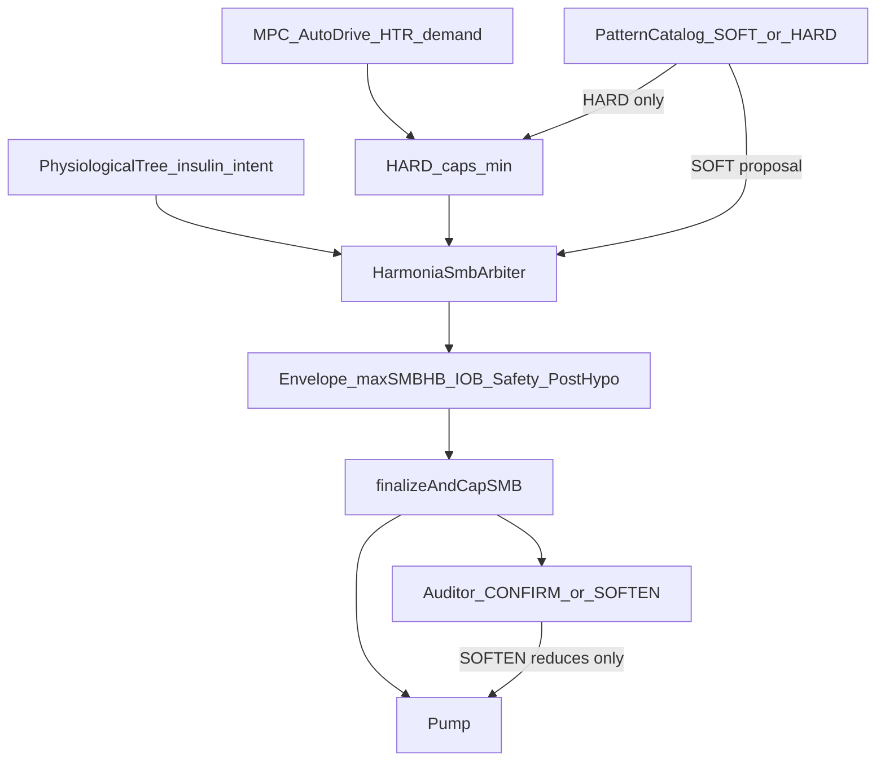

# AIMI — Harmonia SMB Arbitration (soft catalog → live lift)

**Status:** implemented 2026-07-25 (no shadow mode)  
**Related:** [AIMI_SMB_OWNERSHIP_MATRIX.md](AIMI_SMB_OWNERSHIP_MATRIX.md), [AIMI_DECISION_CASCADE_CONTRACT.md](AIMI_DECISION_CASCADE_CONTRACT.md), [AIMI_PHYSIOLOGICAL_PATTERN_CATALOG.md](AIMI_PHYSIOLOGICAL_PATTERN_CATALOG.md)

---

## 1. Problem

On confirmed undeclared / first-wave rises, AutoDrive / MPC often demanded ~2.0–2.2 U while the
physiological pattern catalog **hard-min’d SMB to 1.20 U** after ML and before any real Harmonia
arbitration. Harmonia production stayed basal-only (`adds_smb_authority=false`), and the Auditor
could only CONFIRM/SOFTEN a dose already amputated.

The tree already saw meal-like geometry; it lacked a dose-path **insulin intent** and Harmonia lacked
an explicit SMB authority contract bounded by `maxSMBHB`.

---

## 2. Product rule

```text
SI tree.intent ∈ {MEAL_SUPPORT, NEED_MORE_INSULIN}
ET riseConfirmed (Δ / MealCertainty / first-wave / undeclared)
ET mpcDemand > catalog.softProposedCap
ET catalog capKind = SOFT (not protective HARD)
ALORS harmonia.smb = min(mpcDemand, maxSMBHB, iobHeadroom, other hard envelope)
SINON hard caps bind; protective → REDUCE; else ACCEPT
```

Auditor: **CONFIRM / SOFTEN only** — never lift. No shadow mode.

---

## 3. Contracts

### 3.1 Pattern catalog — `PatternCapKind`

| Kind | Meaning | Binding |
|------|---------|---------|
| `SOFT` | Proposal / context (meal first-wave, undeclared) | **No** silent `min()` |
| `HARD` | Protective / stacking / exercise / poor sleep… | `min()` before finalize |

`MEAL_FIRST_WAVE` and `MEAL_UNDECLARED_FAST` publish `proposedCapU=1.20` with `capKind=SOFT`.  
`PhysiologicalPatternSnapshot` exposes `smbCapKind`, `mealPatternCap`, `hardBindingCapU()`, `softProposedCapU()`.

When a soft meal proposal coexists with protective HARD patterns (exercise, stacking, post-hypo…),
both are visible: Harmonia may see the soft proposal, but `hardBindingCapU()` still binds via `min()`
before finalize. Soft meal never erases a co-active HARD protector.

### 3.2 Tree — `InsulinIntent`

Deployed on `PhysiologicalTreeSnapshot`:

- `NEED_MORE_INSULIN` — meal-like trunk/branches + confirmed rise  
- `MEAL_SUPPORT` — meal-like with milder rise  
- `PROTECTIVE` / `STABILIZE` / `NONE`

`insulin_authority` label is **`harmonia_basal_and_smb_arbitration`** (not “none_lot1”).

### 3.3 Harmonia — `HarmoniaSmbAuthorityDecision`

| Mode | Effect | `adds_smb_authority` |
|------|--------|----------------------|
| `ACCEPT` | Keep current demand (envelope-clamped) | false |
| `LIFT_WITHIN_ENVELOPE` | Raise toward `min(mpc, envelope)` | true when delta |
| `REDUCE` | Cut (protective / soft proposal under block) | true when delta |

Envelope: `min(maxSmbEffectiveU [= max(maxSMB,maxSMBHB)], IOB headroom)` plus prior HARD pattern /
stacking / physio / post-hypo guards. **Never above maxSMBHB path.**

Basal-first mutex unchanged: no SMB LIFT while basal-first owns the channel or RBT authority is `NONE`.

### 3.4 Auditor

Payload includes `physiological_patterns` + `harmonia_smb_authority`.  
Prompt reminds: CONFIRM/SOFTEN only; External async remains advisory (⚠️ same-tick lift must not depend on it).

---

## 4. Tick flow (SMB path)



`PatternCapHold` holds only **HARD** caps across flaps; soft 1.20 is never re-materialized as a binding hold.

---

## 5. Ownership alignment

1. First early-return still wins (legacy meal / safety / advisor…).  
2. Global / Autodrive / RBT path computes demand.  
3. Soft catalog proposes; Harmonia arbitrates SMB when channel open.  
4. **Every** delivery still exits `finalizeAndCapSMB`.  
5. Auditor never becomes a second lift engine.

See updated [AIMI_SMB_OWNERSHIP_MATRIX.md](AIMI_SMB_OWNERSHIP_MATRIX.md) §2.

---

## 6. Field validation criteria

- Confirmed rise + soft meal: `smb_binding_trace` shows `PATTERN_SOFT_PROPOSAL` not binding `PATTERN_CAP` at 1.20.  
- `harmonia_smb_authority.mode=LIFT_WITHIN_ENVELOPE` with `smb_u ≤ maxSMBHB`.  
- Protective HARD patterns still bind (e.g. 0.40–0.55 U).  
- Auditor External: `advisory_only`; no same-tick lift dependency.  
- Post-hypo / stacking / SafetyNet still cut after arbitration.

---

## 7. Non-goals

- No shadow / would_lift-only mode.  
- No free dosing above `maxSMBHB` / IOB / SafetyNet.  
- No Auditor lift.  
- No deletion of the pattern catalog.  
- No new inter-module Gradle dependencies.
