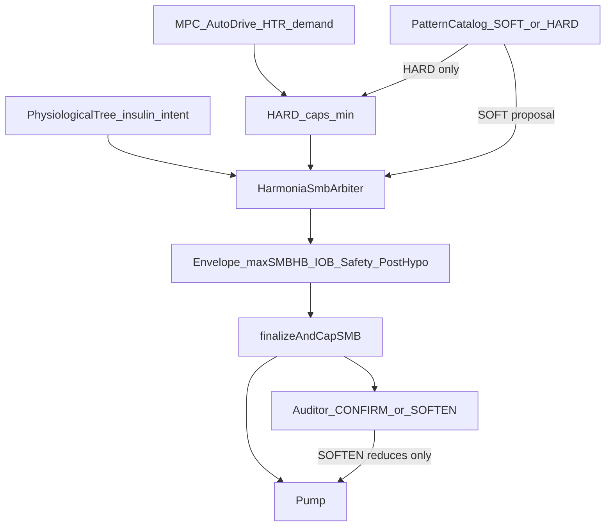

# AIMI — Harmonia SMB Arbitration (soft catalog → live lift)

**Status:** implemented 2026-07-25 (no shadow mode); undeclared-meal hyper handling extended 2026-07-26 (see §8)  
**Related:** [AIMI_SMB_OWNERSHIP_MATRIX.md](AIMI_SMB_OWNERSHIP_MATRIX.md), [AIMI_DECISION_CASCADE_CONTRACT.md](AIMI_DECISION_CASCADE_CONTRACT.md), [AIMI_PHYSIOLOGICAL_PATTERN_CATALOG.md](AIMI_PHYSIOLOGICAL_PATTERN_CATALOG.md)

---

## 1. Problem

On confirmed undeclared / first-wave rises, AutoDrive / MPC often demanded ~2.0–2.2 U while the
physiological pattern catalog **hard-min’d SMB to 1.20 U** after ML and before any real Harmonia
arbitration. Harmonia production stayed basal-only (`adds_smb_authority=false`), and the Auditor
could only CONFIRM/SOFTEN a dose already amputated.

The tree already saw meal-like geometry; it lacked a dose-path **insulin intent** and Harmonia lacked
an explicit SMB authority contract bounded by `maxSMBHB`.

---

## 2. Product rule

```text
SI tree.intent ∈ {MEAL_SUPPORT, NEED_MORE_INSULIN}
ET riseConfirmed (Δ / MealCertainty / first-wave / undeclared)
ET mpcDemand > catalog.softProposedCap
ET catalog capKind = SOFT (not protective HARD)
ALORS harmonia.smb = min(mpcDemand, maxSMBHB, iobHeadroom, other hard envelope)
SINON hard caps bind; protective → REDUCE; else ACCEPT
```

Auditor: **CONFIRM / SOFTEN only** — never lift. No shadow mode.

---

## 3. Contracts

### 3.1 Pattern catalog — `PatternCapKind`

| Kind | Meaning | Binding |
|------|---------|---------|
| `SOFT` | Proposal / context (meal first-wave, undeclared) | **No** silent `min()` |
| `HARD` | Protective / stacking / exercise / poor sleep… | `min()` before finalize |

`MEAL_FIRST_WAVE` and `MEAL_UNDECLARED_FAST` publish `proposedCapU=1.20` with `capKind=SOFT`.  
`PhysiologicalPatternSnapshot` exposes `smbCapKind`, `mealPatternCap`, `hardBindingCapU()`, `softProposedCapU()`.

When a soft meal proposal coexists with protective HARD patterns (exercise, stacking, post-hypo…),
both are visible: Harmonia may see the soft proposal, but `hardBindingCapU()` still binds via `min()`
before finalize. Soft meal never erases a co-active HARD protector.

### 3.2 Tree — `InsulinIntent`

Deployed on `PhysiologicalTreeSnapshot`:

- `NEED_MORE_INSULIN` — meal-like trunk/branches + confirmed rise  
- `MEAL_SUPPORT` — meal-like with milder rise  
- `PROTECTIVE` / `STABILIZE` / `NONE`

`insulin_authority` label is **`harmonia_basal_and_smb_arbitration`** (not “none_lot1”).

### 3.3 Harmonia — `HarmoniaSmbAuthorityDecision`

| Mode | Effect | `adds_smb_authority` |
|------|--------|----------------------|
| `ACCEPT` | Keep current demand (envelope-clamped) | false |
| `LIFT_WITHIN_ENVELOPE` | Raise toward `min(mpc, envelope)` | true when delta |
| `REDUCE` | Cut (protective / soft proposal under block) | true when delta |

Envelope: `min(maxSmbEffectiveU [= max(maxSMB,maxSMBHB)], IOB headroom)` plus prior HARD pattern /
stacking / physio / post-hypo guards. **Never above maxSMBHB path.**

Basal-first mutex unchanged: no SMB LIFT while basal-first owns the channel or RBT authority is `NONE`.

### 3.4 Auditor

Payload includes `physiological_patterns` + `harmonia_smb_authority`.  
Prompt reminds: CONFIRM/SOFTEN only; External async remains advisory (⚠️ same-tick lift must not depend on it).

---

## 4. Tick flow (SMB path)



`PatternCapHold` holds only **HARD** caps across flaps; soft 1.20 is never re-materialized as a binding hold.

---

## 5. Ownership alignment

1. First early-return still wins (legacy meal / safety / advisor…).  
2. Global / Autodrive / RBT path computes demand.  
3. Soft catalog proposes; Harmonia arbitrates SMB when channel open.  
4. **Every** delivery still exits `finalizeAndCapSMB`.  
5. Auditor never becomes a second lift engine.

See updated [AIMI_SMB_OWNERSHIP_MATRIX.md](AIMI_SMB_OWNERSHIP_MATRIX.md) §2.

---

## 6. Field validation criteria

- Confirmed rise + soft meal: `smb_binding_trace` shows `PATTERN_SOFT_PROPOSAL` not binding `PATTERN_CAP` at 1.20.  
- `harmonia_smb_authority.mode=LIFT_WITHIN_ENVELOPE` with `smb_u ≤ maxSMBHB`.  
- Protective HARD patterns still bind (e.g. 0.40–0.55 U).  
- Auditor External: `advisory_only`; no same-tick lift dependency.  
- Post-hypo / stacking / SafetyNet still cut after arbitration.

---

## 7. Non-goals

- No shadow / would_lift-only mode.  
- No free dosing above `maxSMBHB` / IOB / SafetyNet.  
- No Auditor lift.  
- No deletion of the pattern catalog.  
- No new inter-module Gradle dependencies.

---

## 8. Undeclared-meal hyper handling (2026-07-26)

### 8.1 Problem

On confirmed undeclared meals the SMB was starved in two distinct regimes, evidenced by two
24 h support packages:

- **Rise / plateau** (25/07, BG 200–248 for ~90 min): the RBT authority gate treated
  `predictive_hypo_suppressed == true` as a hypo risk and forced authority to `NONE`
  (`PREDICTIVE_HYPO`), so SMB was under-delivered (2.82 U where ~7.5 U was demanded).
- **Descent** (26/07 quiche lorraine, fat/protein, peak 259 mg/dL): the rise was well handled
  (~20 U) but as the sawtooth ticked down at BG still ~247, **two independent layers** hard-zeroed
  SMB for 14 cycles: the authority gate collapsed to `NONE` when `meal_rise_confirmed` flipped off,
  and the terminal safety wall fired `droppingFast* / isPrediction / isAcceleratingDown`.

Root insight: `predictive_hypo_suppressed` means *the LGS halt was **suppressed*** (BG rising /
clearly hyper — no imminent hypo), not that a hypo is imminent. Denying correction on that flag is a
semantic inversion. And a benign post-peak descent at BG ≫ target must not be read as a freefall.

### 8.2 Contract — two layers must open together

Correction on a hyper descent requires **both** independent layers to open on the **same predicate**:

| Layer | Where | Legacy failure | Fix |
|-------|-------|----------------|-----|
| **Authority (RBT)** | `RecursiveBeliefAuthorityGate` | `predictiveHypoSuppressed` → `NONE` | A1 / A1b keep **SOFT** |
| **Terminal safety** | `DetermineBasalaimiSMB2.determineCriticalConditions` | `dropping* / isPrediction / isAcceleratingDown` → `SMB=0` | `HyperInstalledDroppingExemption` bypass |

**Single source of truth** for “may shed insulin on a clear-hyper, moderate descent” =
`HyperInstalledDroppingExemption.shouldBypass`: `bg > 180`, `bg ≥ target + 45`, `−15 < Δ < 0`,
and a 10-min linear projection `bg + 2Δ ≥ hypoThreshold + 40`. Both layers consume it, so authority
and the safety wall open at the exact same tick.

### 8.3 Mechanisms

- **A1 — meal-rise bypass** (`RecursiveBeliefAuthorityGate.shouldBypassPredictiveHypoForMeal`):
  fires the predictive-hypo meal bypass on strong meal corroboration (mode / causal / latent /
  hypothesis) even without `mealRiseConfirmed`; softens `HARD → SOFT`. Reasons
  `PREDICTIVE_HYPO_MEAL_BYPASS[_HYPER]`.
- **A1b — clear-hyper hold** (same gate): when the halt was merely suppressed, hold **SOFT** instead
  of `NONE`. Rising/flat clear-hyper (`Δ ≥ 0`, `bg ≥ hypoThreshold + 40`) holds directly; a hyper
  **descent** holds only while `HyperInstalledDroppingExemption.shouldBypass` is true. Reason
  `PREDICTIVE_HYPO_HYPER_HOLD`. Flag `OApsAIMIMealHyperBypassEnabled` (default on, fail-safe).
- **Lever 1 — hyper-installed dropping exemption** (`safety/HyperInstalledDroppingExemption.kt`,
  wired in `determineCriticalConditions`): `bypassedByHyperDrop` now covers `droppingFast`,
  `droppingFastAtHigh`, `droppingVeryFast`, **`isPrediction`, and `isAcceleratingDown`**. `isBg90`,
  `isHypoBlocked`, `isBelowMinThreshold` are **never** bypassed. Flag
  `OApsAIMIHyperDroppingExemptEnabled` (default on).
- **effort-veto override** (`patient/MealCertainty.kt`): a strong digestion rise
  (`bg ≥ 200 && Δ ≥ 4`, active absorption wave) overrides a postprandial HR/steps `effort_veto` that
  would otherwise pin `MealCertainty = LOW` → `PROTECTIVE_REDUCTION`.
- **PKPD hyper-reversion** (`pkpd/AdvancedPredictionEngine.kt`, flag `OApsAIMIPkpdHyperReversion`):
  in clear hyper (`bg ≥ 160`, Guard B not falling-hard) the insulin-only path is held at the
  counter-regulation baseline (≤ 80 ≤ currentBG) instead of collapsing to the absorbing 39 floor,
  so `eventual` / `composite_min` stop hallucinating a false hypo. General robustness (a false-39
  was not the poison of the 26/07 quiche, but occurs ~68×/24 h elsewhere).

### 8.4 Guard-rails (non-negotiable)

- Absolute freefall floor **−15 mg/dL/5 min** and **10-min projection ≥ hypo + 40** bound *every*
  relaxation.  
- `MIN_BG = 180`: below it the safety wall re-closes (a small 180→target zero tail is accepted).  
- Every lever is `HARD → SOFT` or a conditional bypass — none grants `HARD`, none touches
  `isBg90` / `isHypoBlocked` / `isBelowMinThreshold` / hypo LGS.

### 8.5 Field validation criteria

- Hyper descent (BG ≫ target, `−15 < Δ < 0`, projection safe): `reason_codes` show
  `PREDICTIVE_HYPO_HYPER_HOLD`, `effective_authority = SOFT`, and the narrative shows
  `SMB_HYPER_DROP_BYPASS` instead of `🛑 Safety condition … → SMB=0`.  
- Freefall (`Δ ≤ −15`) or projection into hypo: authority returns to `NONE`, safety wall re-fires.  
- `eventual_bg` no longer equals 39 while real BG > 180 (with `OApsAIMIPkpdHyperReversion` on).

### 8.6 Tree meal-rise front-loader (arbre déploie → Harmonia applique)

Field failure (BG 213, Δ+14): SMB stuck at ~1.20/1.25 and only escalating past ~210 (too late). Root:
the tree already deploys `NEED_MORE_INSULIN` early (`resolveInsulinIntent`, bg≥140 & Δ≥1.2), but the
early **rate-driven** actuator (RBT lift toward `maxSMBHB`) is entirely gated behind RBT authority —
which `sensor_confidence` (≈0.32: null `sourceSensor` + wearable-weighted formula, not CGM quality)
forces to `NONE` via `SENSOR_LOW`. The only surviving escalator is the **level-driven** HTR tier ladder
(ESTABLISHED weight 1.20/1.25), hence "wait for established hyper". See [[sensor-confidence-gates-harmonia]].

**Front-loader** (`RecursiveBeliefAuthorityGate.shouldFrontLoadTreeMealRise`, flag
`OApsAIMITreeMealRiseFrontLoad`, **default OFF / opt-in**): when the tree deployed `NEED_MORE_INSULIN`
on a corroborated meal rise, **re-open a `NONE` posted by a *soft-overridable* veto**
(`SENSOR_LOW` / `PREDICTIVE_HYPO` / `PHYSIO_CAP`) back to **SOFT**, so Harmonia can apply the early lift
(SOFT re-opens `channelOpen` → arbiter `LIFT_WITHIN_ENVELOPE`). Guarded, reason-code-aware:
- Requires: `treeInsulinIntent == NEED_MORE_INSULIN`, `bg ≥ target+45`, rising (`Δ≥1.2`) or a
  non-free-falling descent (shared `HyperInstalledDroppingExemption` predicate), and **independent meal
  corroboration** (`corroboratesMeal`: mode/causal/latent/hypothesis). Never on level+intent alone.
- **Sovereign vetoes never overridden**: `PRED_MISSING`, `CHAOS_BLOCK`, `POST_HYPO_BLOCK`,
  `EPISODE_POST_HYPO/CHAOTIC`, real low BG (excluded by `bg ≥ target+45`), free-fall, sticky post-hypo
  latent, false-meal. **SOFT only, never HARD.**
- ⚠️ It overrides the sensor-confidence safety gate → default OFF; the *proper* fix is still to repair
  `sensor_confidence` (plumb `sourceSensor`, decouple from wearable). This is the interim actuator.

**Deferred (cas B):** when the RBT never even *requested* authority (`requestedAuthority == NONE`, flat
plateau, urgency below threshold), the gate early-returns `NO_RELEASE`; re-opening would require the
gate to *synthesize* a request (breaks its `effectiveAuthority ≤ min(requested, maxAllowed)` invariant).
Left for a separate iteration pending replay evidence of frequency.

### 8.7 Still open

- **Post-hypo latency**: a meal starting right after a hypo is held `NONE` for ~14 min because
  `PostHypoAggressiveRiseExit` requires `Δ > 15`; a softer meal-rise exit is pending (validate in
  shadow first).  
- **PKPD Guard B coherence**: the hyper-reversion is itself suspended at `Δ ≤ −3` (Guard B) — to be
  aligned on the shared `−15` predicate so the anti-39 floor also holds on a hyper descent.
