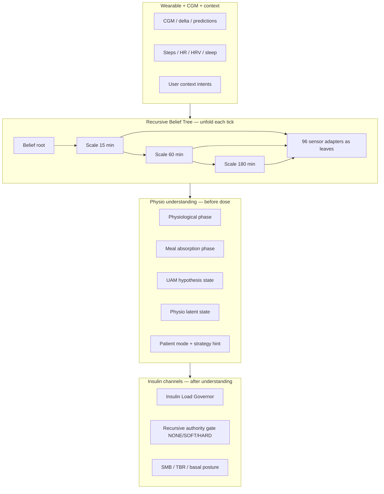
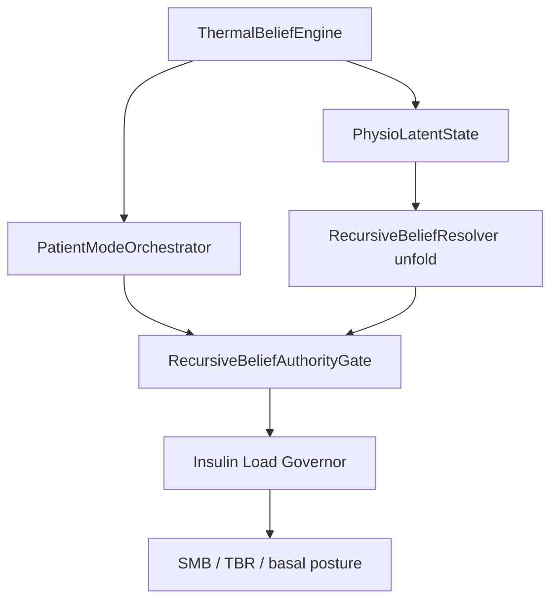

# AIMI — Hormonitor Study Notes (4–6 Jun 2026)

**Audience:** Hormonitor study / clinical replay reviewers  
**Branch:** `dev_OAPSAIMI`  
**Hormonitor schema:** `1.1.0` → **`1.2.0`** → **`1.3.0`** (additive)  
**Status:** implemented in code — field validation required before claiming production readiness

---

## 1. Executive summary — what changed in two days

AIMI moved from a **dose-first** loop to a **body-state-first** loop.

Previously, many parallel modulators (scenario projection, trajectory guard, stacking, HTR, physio factors) adjusted insulin without a single shared causal story. The last two days added:

1. **Recursive Belief Tree (RBT)** — one nested tree unfolded every tick; existing engines become **sensors (leaves)**, not silent competing deciders.
2. **Physiological state before action** — phase, meal absorption, UAM hypotheses, latent physio probabilities, and patient mode are evaluated **before** SMB/TBR channels are resolved.
3. **Patient story in Hormonitor** — human-readable `patient_story` plus live wearable context, so study replay can follow *why* AIMI chose a posture, not only *how much* insulin was delivered.

**Study framing:** Hormonitor rows are no longer “BG + IOB → dose”. They are **“body interpretation → therapeutic posture → dose adjustment”**, with the tree tension exported in JSONL and the patient narrative exported in Hormonitor `1.2.0`.

---

## 2. Paradigm — unfold the tree, then read the body

### 2.1 Old implicit ontology

> Stack heuristics until an acceptable dose emerges.

Symptoms in replay: best terminal BG and SMB can disagree; long-horizon floors can contradict short-horizon BG; TBR and SMB modulators fight without visible arbitration.

### 2.2 New ontology (RBT)

> One recursive structure, same local rule at every scale, **unfold** full tension each tick.



**Key property:** insulin quantity is the **downstream consequence** of resolved belief tension and patient posture — not the primary exported meaning.

---

## 3. Timeline — what landed when

### Phase A — Physio runtime + tree authority (≈ 5 Jun)

| Deliverable | Role in study |
|-------------|----------------|
| `PhysioLatentState` | Shared probabilities: meal, endogenous drive, resistance, sleep debt, sensor confidence |
| `UamHypothesisState` | Multi-hypothesis UAM (meal, dawn, stress, post-hypo, late-fat) |
| `PhysiologicalPatternDetector` | Dominant pattern + meal/hyper suppression flags |
| `RecursiveBeliefResolver` + `unfold` | Tree resolution; JSONL export of inter-scale tension |
| `RecursiveBeliefAuthorityGate` | Progressive authority: `NONE` / `SOFT` / `HARD` + `liftBlend` |
| `InsulinLoadGovernor` (ILG) | Elastic SMB modulation from load budget (TDD + weight) |
| `ReplayQualityExport` | Single replay QA block: patient mode, authority, ILG, safety |

**Hormonitor impact (still 1.1.0):** existing physio trace fields (`physio_state`, factors, safety gate) remain; decision JSONL gains `recursive_belief`, `load_governor`, `replay_quality`.

### Phase B — Patient mode + live visibility (≈ 6 Jun)

| Deliverable | Role in study |
|-------------|----------------|
| `PatientStateSnapshot` + `PatientModeOrchestrator` | Clinical modes: dawn endogenous, fast meal, post-hypo recovery, stress resistance, etc. |
| `PatientStateRuntimeRefresher` | Recompute patient story between loop ticks when steps/HR or user context change |
| Context UI | “Current AIMI Understanding” — narrative, signal gauges, live body signals |
| **Hormonitor `patient_story` (schema 1.2.0)** | Study-facing human layer aligned with UI |

**Fix:** patient state was previously published only on Autodrive/RBT branches (often perceived as “only after SMB”). It now publishes **every `determine_basal` tick** and on physio/context updates.

### Phase C — Thermal belief layer (≈ 6 Jun)

| Deliverable | Role in study |
|-------------|----------------|
| `ThermalBeliefEngine` + `ThermalBaselineStore` | Temperature **evolution vs personal baseline** (not absolute fever) |
| **Source chain (auto):** HC skin → Oura API → HC recovery proxy | Garmin/Oura do **not** export skin temp to HC; proxy uses HC sleep/RHR/HRV; Oura PAT adds measured deviation |
| Noise floor (`0.03 °C` level, `0.01 °C/h` slope) | Ignores wearable tick noise before indices and hypotheses |
| wcycle integration | Cycle BBT rise / ovulation shift / menstrual dip hints |
| Context UI **Thermal rhythm** | 5th signal gauge + narrative in “Current AIMI Understanding” |
| **Hormonitor `patient_story.thermal_belief` (schema 1.3.0)** | Study replay of thermal interpretation |

**Design rule:** temperature does **not** directly command insulin units. It enriches latent resistance / recovery, patient mode, UI, and Hormonitor — upstream of RBT and dose channels.

### Phase D — Live steps / Context refresh (≈ 6 Jun)

| Deliverable | Role in study |
|-------------|----------------|
| `UnifiedActivityProviderMTR.resolveStepsTotalSince` | Fenêtres 15/60 min : si `steps15min`… est **0** mais que la source ne remplit que `steps5min` (ex. **Garmin HTTP delta**), agrégation par buckets 5 min au lieu d’afficher 0 |
| `ContextActivity.refreshPhysioSnapshot()` | À l’ouverture de **AIMI Context**, `HealthContextRepository.fetchSnapshot()` sur IO → steps/FC à jour sans attendre le prochain tick loop |
| Commit `29e42fcec6` | Corrige *Live body signals* bloqué à `0 steps/15m` alors que la FC est à jour |

**Cause racine :** la sync Garmin HTTP (`GarminPlugin.ingestHttpTotalSteps`) ne stocke que le delta dans `steps5min` ; `steps15min` reste à 0. L’agrégateur interprétait ce 0 comme « aucun pas » au lieu de « colonne non renseignée ».

**Impact Hormonitor / replay :** `patient_story.physio_live.steps_last_15m`, `activity_state`, feuilles RBT `STEPS_15M`, gating Autodrive activité — alignés avec le dashboard pas/FC.

### Phase E — Pompes (fork, pas de changement Equil)

| Driver | Changement sur branche | Equil |
|--------|------------------------|-------|
| Medtrum | `47e65888d1` — zombie GATT, watchdog, `forceResetBluetoothGatt` | — |
| Omnipod Dash | `3c2ad4ac5d` — `isConfigured()`, `teardownPodSession()`, garde activation | — |
| Equil | **`teardownEquilSession()`** — disconnect GATT, `unBond`, `clearData` ; `stopConnecting()` réel ; garde activation stale avant re-pair | Durci sur branche (voir commit Equil BLE) |

---

## 4. Hormonitor export — what reviewers should read

**File:** `Documents/AAPS/AIMI_HORMONITOR_event_stream_v1.jsonl`  
**Schema version:** `1.3.0` (thermal additive); `1.2.0` fields unchanged

### 4.1 Existing layers (unchanged keys, richer semantics)

- **Baseline:** `current_bg_mgdl`, `cob_g`, `iob_u`, profile ISF/basal
- **Wearable:** `steps_*`, `hr_*`, `hrv_rmssd_ms`, `sleep_debt_minutes`, `activity_state`
- **Physio trace:** `physio_state`, `isf_factor`, `basal_factor`, `smb_factor`, `reactivity_factor`, `physio_veto_reason`
- **Safety:** `safety_gate`, `safety_composite_min_mgdl`, `predictive_hypo_suppressed`

### 4.2 New block — `patient_story` (1.2.0)

```json
"patient_story": {
  "patient_mode": "DAWN_ENDOGENOUS",
  "patient_mode_confidence": 0.88,
  "patient_strategy_hint": "BASAL_BRIDGE",
  "patient_narrative": "AIMI sees more endogenous drive than meal evidence and favors basal bridging.",
  "patient_reason_codes": ["LATENT_ENDOGENOUS", "FALSE_MEAL_SUPPRESS"],
  "physio_live": {
    "steps_last_15m": 120,
    "hr_now_bpm": 78,
    "activity_state": "WALKING",
    "sleep_debt_minutes": 45,
    "thermal_hypothesis": "INFLAMMATORY_DRIFT",
    "thermal_delta_vs_baseline_c": 0.22,
    "thermal_inflammation_index": 0.58,
    "thermal_narrative": "AIMI sees a progressive skin warming ...",
    "source": "Merged(Unified+HC)"
  },
  "thermal_belief": {
    "hypothesis": "INFLAMMATORY_DRIFT",
    "delta_vs_baseline_c": 0.22,
    "slope_6h_c": 0.05,
    "inflammation_index": 0.58,
    "recovery_burden": 0.12,
    "confidence": 0.72,
    "wcycle_hint": null,
    "data_origin": "OURA_API",
    "source_tier": "MEASURED"
  }
}
```

**Interpretation for study:**

| Field | Meaning |
|-------|---------|
| `patient_mode` | Dominant clinical reading of the body this tick |
| `patient_strategy_hint` | Therapeutic **posture** (bridge basal, SMB priority, conservative observe, …) — not a raw U amount |
| `patient_narrative` | Plain-language summary for non-developer review |
| `patient_reason_codes` | Traceable codes linking to latent/UAM/pattern/context logic |
| `physio_live` | Wearable snapshot at export time — supports “body moved before next dose” analysis |
| `thermal_belief` | Structured thermal hypothesis, deltas vs baseline, inflammation/recovery indices, wcycle hint |

### 4.3 Thermal noise floor (product truth)

Wearables often resolve skin deltas at **0.01 °C**. AIMI applies a **deadband before belief math**:

| Constant | Value | Effect |
|----------|-------|--------|
| `NOISE_FLOOR_DELTA_C` | **0.03 °C** | \|Δ vs baseline\| &lt; 0.03 → treated as **0** for indices and hypotheses |
| `NOISE_FLOOR_SLOPE_C_PER_H` | **0.01 °C/h** | 6h/24h slopes below this → **0** |
| Nightly baseline update | **0.03 °C** | New nocturnal median only if shift &gt; 0.03 °C |

Cycle wcycle hints use **raw** deltas with higher thresholds (≥ 0.10 / 0.15 °C) — above noise by design.

Sub-noise ticks should read as `BASELINE_STABLE`, not inflammatory drift.

### 4.4 Impact on RBT and insulin decisions

Thermal data is a **leaf sensor** feeding shared physio state — not a parallel dose engine.



**Step 1 — Latent state (`PhysioLatentState`):**

- `inflammationIndex` boosts `inflammationRecoveryMerged` (×0.55) and `transientResistanceProb` (×0.40)
- `recoveryBurden` boosts recovery side of inflammation/recovery merge (×0.35)
- Effect: higher apparent resistance or recovery load **before** tree unfold — influences readiness and caution, not a fixed +X% SMB

**Step 2 — Patient mode (`PatientModeOrchestrator`):**

| Thermal signal | Patient mode | Strategy | Typical reason codes |
|----------------|--------------|----------|----------------------|
| `inflammationIndex ≥ 0.62` + illness or resistance | `STRESS_RESISTANCE` | `CONSERVATIVE_OBSERVE` | `THERMAL_INFLAMMATORY_DRIFT`, `CTX_ILLNESS` |
| `CYCLE_BBT_RISE` + inflammation &lt; 0.70 | `STRESS_RESISTANCE` (cycle-aware) | `CONSERVATIVE_OBSERVE` | `THERMAL_CYCLE_BBT` |
| `recoveryBurden ≥ 0.60` + sleep debt | `POOR_SLEEP_DAY` | `CONSERVATIVE_OBSERVE` | `THERMAL_RECOVERY_COOLING`, `LATENT_SLEEP_DEBT` |

**Step 3 — RBT authority (`RecursiveBeliefAuthorityGate`):**

- Thermal never sets authority directly
- Modes triggered by thermal (`STRESS_RESISTANCE`, `POOR_SLEEP_DAY`) cap RBT at **`SOFT`** when confidence ≥ 0.60
- `protectionBias` from patient mode lowers `readinessScore` (up to −0.10) and protective modes add up to −0.08 — reducing `liftBlend` and aggressive tree release
- **No direct SMB multiplier from temperature** — dose change is mediated through belief tension + authority + ILG

**Step 4 — What thermal does *not* do:**

- No fever threshold bolus
- No replacement for user illness context or CGM
- No hard veto by itself — requires fusion with HR, sleep, resistance, or wcycle

### 4.5 Companion JSONL (not Hormonitor file, same tick)

For full tree replay, pair Hormonitor events with `AIMI_Decisions.jsonl`:

- `adjustments.recursive_belief` — unfolded tree, channel tensions, authority
- `adjustments.load_governor` — ILG tier and multiplier `g`
- `adjustments.replay_quality` — patient mode, authority effective vs requested, quality tags
- `adjustments.patient_state` / `adjustments.patient_mode` — structured state mirror

---

## 5. How to narrate a tick in Hormonitor study language

**Recommended reading order for one event:**

1. **Wearable + CGM context** — BG, delta, steps, HR, sleep debt (`physio_live` + baseline fields)
2. **`thermal_belief`** — skin rhythm vs personal baseline (Garmin/Oura); check noise floor before over-interpreting small deltas
3. **Physio trace** — AIMI’s physiological modulation factors and veto
4. **`patient_story`** — what AIMI *believes* the body is doing and which posture it prefers
5. **Decision JSONL `recursive_belief`** — how multi-scale beliefs agreed or conflicted (tree unfold)
6. **`load_governor` + final loop decision** — how much insulin was actually allowed after understanding

**Example narrative (study caption):**

> At 06:42, BG 142 mg/dL rising +8 mg/dL/5m with 420 steps/15m and HR 98 bpm. UAM and latent state favor endogenous dawn drive over undeclared meal (`FALSE_MEAL_SUPPRESS`). Patient mode `DAWN_ENDOGENOUS`, strategy `BASAL_BRIDGE`. RBT authority `SOFT`; ILG `g=0.72`. SMB capped modestly — insulin follows body interpretation, not the reverse.

---

## 6. Study hypotheses enabled by this pass

1. **Reduced false meal aggression at dawn** — compare `patient_mode=DAWN_ENDOGENOUS` vs historical SMB spikes without `patient_story`.
2. **Post-hypo protection coherence** — `POST_HYPO_RECOVERY` should correlate with authority `NONE` and high `protection_bias` in replay quality.
3. **Activity without dose trigger** — `physio_live` changes with stable loop trigger (`Routine_Cycle`) prove body state updates decoupled from SMB events.
4. **Tree tension vs outcome** — correlate `recursive_belief` channel tensions with TIR segments in daily outcomes file.
5. **Thermal vs false illness** — sub-0.03 °C noise should stay `BASELINE_STABLE`; inflammatory drift should correlate with illness context or rising resistance, not normal circadian wrist cooling.
6. **Cycle BBT** — `THERMAL_CYCLE_BBT` during luteal should **not** stack with `THERMAL_INFLAMMATORY_DRIFT` at high inflammation index.

---

## 7. Validation checklist (study go / no-go)

- [ ] `schema_version` = `1.3.0` on new installs after merge
- [ ] Every loop event has non-empty `patient_story.patient_mode` when loop runs
- [ ] `patient_narrative` matches dominant `patient_reason_codes`
- [ ] `physio_live` consistent with same-tick wearable fields
- [ ] `thermal_belief` present when Garmin/Oura skin temperature granted in Health Connect
- [ ] Sub-0.03 °C deltas do not flip hypothesis away from `BASELINE_STABLE`
- [ ] No `POST_HYPO_RECOVERY` with effective RBT authority `HARD` in shadow replay
- [ ] UI “Current AIMI Understanding” matches Hormonitor `patient_story` on same timestamp (±1 tick)
- [ ] Context UI **Thermal rhythm** narrative matches `thermal_belief.narrative`
- [ ] **Live body signals** : `steps/15m` > 0 après marche (Garmin HTTP ou HC) ; cohérent avec `physio_live.steps_last_15m` au même instant
- [ ] Ouverture **AIMI Context** rafraîchit steps/FC sans tick loop intermédiaire (suffixe *Updated just now* + pas non nuls si activité récente)

See also: [AIMI_PATIENT_MODE_REPLAY_CHECKLIST_2026-06-06.md](AIMI_PATIENT_MODE_REPLAY_CHECKLIST_2026-06-06.md), [AIMI_PHYSIO_RUNTIME_ACTIVATION_2026-06-06.md](AIMI_PHYSIO_RUNTIME_ACTIVATION_2026-06-06.md), [AIMI_RECURSIVE_BELIEF.md](AIMI_RECURSIVE_BELIEF.md).

---

## 9. Equil pump driver — régression fork (revue 6 Jun)

**Verdict initial :** aucune modification Equil sur `dev_OAPSAIMI` depuis `origin` avant durcissement BLE — **pas de régression accidentelle** introduite par les commits Medtrum / Dash / AIMI.

**Durcissement ajouté (aligné Medtrum/Dash) :**

| Changement | Fichiers |
|------------|----------|
| `teardownEquilSession()` | `EquilPumpPlugin` — disconnect + unBond + `clearData` |
| Unpair wizard | `EquilWizardViewModel.confirmUnpair()` appelle teardown avec MAC capturée |
| Garde activation stale | `EquilOverviewViewModel` avant nouveau pair |
| `stopConnecting()` | `EquilPumpPlugin` → `EquilBLE.stopConnecting()` |
| Timeout connect keepalive | `EquilBLE.connect()` — 15 s via `EquilConst.EQUIL_BLE_CONNECT_TIMEOUT_MS` |
| GATT services failure | `onServicesDiscovered(false)` → `disconnect()` |

**Toujours volontaire :** `isConfigured() = true` (wizard / émulateur) — mitigé par `isInitialized()` et garde activation.

---

## 8. One-sentence pitch (for Hormonitor study abstract)

**AIMI now unfolds glycemic decisions as a recursive belief tree, interprets physiological and wearable state (including thermal rhythm from Garmin/Oura) before adjusting insulin, and exports that clinical story in Hormonitor `patient_story` and `thermal_belief` so study replay can follow body understanding — not only delivered units.**
