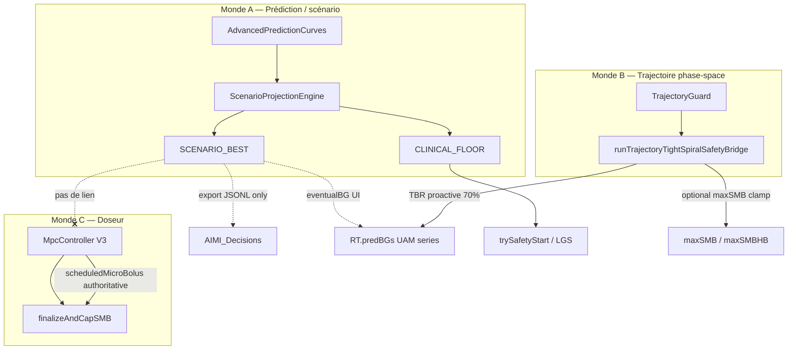

# AIMI — Hyper Trajectory Release (HTR)

**Statut :** Implémenté phases 0–4 + **plateau sustain** (hyper installée, projection plate) — validation terrain utilisateur requise  
**Date :** 2026-06-01 (rev. seuils hyper dynamiques)  
**Branche de référence :** `dev_OAPSAIMI_mergeDEV`  
**Données terrain :** `AIMI_Support_Package_1780321706128` (déjeuner 1er juin, BG → 257 mg/dL)  
**Documents liés :** [AIMI_SCENARIO_PROJECTION.md](AIMI_SCENARIO_PROJECTION.md), [AIMI_TUNING_AND_ADVISOR.md](AIMI_TUNING_AND_ADVISOR.md), [AIMI_RISK_ENVELOPE_SPEC.md](AIMI_RISK_ENVELOPE_SPEC.md) (si présent)

---

## 1. Verdict exécutif

Les **prédictions** et la **trajectoire** confirment déjà une fin en hyper (terminal `SCENARIO_BEST` / UAM souvent **350–401 mg/dL** pendant la montée), mais le **doseur final** (Autodrive V3 MPC + finalize SMB) ne reçoit **aucun ordre unifié** du type « libérer le SMB ».

Résultat observé : à BG **226–251** et IOB **~9–10 U**, le système livre **0,15–0,21 U** de SMB alors que `MaxSMB` effectif est **5,0 U** et que les logs affichent une montée rapide V3.

**HTR (Hyper Trajectory Release)** est la brique produit manquante : un **pont autoritaire** entre `ScenarioProjectionPair` + `TrajectoryAnalysis` et la **proposition SMB** avant `finalizeAndCapSMB`, sans casser le plancher hypo (`CLINICAL_FLOOR`).

**Principe révisé (terrain) :** ne pas ancrer la logique sur un seuil absolu type **200 mg/dL**. À 200 mg/dL, l’hyper est déjà **installée** (physio d’absorption / résistance différente). HTR doit s’activer **en amont** sur la **projection** (best / trajectoire / montée), puis **adapter l’intensité** via une **échelle de sévérité** relative à la cible — pas une constante figée.

---

## 2. Preuve terrain (vérification sur JSONL)

Période critique : **12:26–13:01**, repas non déclaré (`COB = 0`), `meal_rise_confirmed = true`.

| Heure | BG | IOB | Terminal best / UAM (logs) | SMB optimal V3 | SMB livré | Signal manquant |
|-------|-----|-----|---------------------------|----------------|-----------|-----------------|
| 12:26 | 152 | 2,5 | montée | 1,84 U | 0,88 U | throttle meal chain |
| 12:46 | 202 | 7,5 | eventual **401** | 1,78 U | 0,73 U | Traj-Bridge 70 % basale |
| 12:51 | 226 | 8,8 | eventual **401** | **0,50 U** | **0,21 U** | MPC + authoritative V3 |
| 12:56 | 248 | 9,5 | — | **0,37 U** | **0,15 U** | idem |
| 13:06 | 253 | 10,2 | — | — | **0** (Basal only) | V3 + hypo paths |

**Paradoxe documenté :** même tick 12:51 — narrative `COB: 0 … UAMpredBG 401 … Eventual BG 401` et `SMB Optimal: 0.50U`.

À **13:16** : BG **243** mais `minPredBG = 39` → `Hypo protection … → SMB=0` et log erroné `LGS: BG=243 ≤ 70`. La trajectoire « hyper » et le plancher « hypo » **se contredisent** ; le doseur suit le **minimum pessimiste**, pas le **best**.

---

## 3. Analyse conceptuelle — pourquoi « trajectoire confirmée » ne libère pas

### 3.1 Trois mondes qui ne partagent pas la même variable de décision



| Monde | Question qu’il résout | Utilise `SCENARIO_BEST` ? | Impact SMB direct |
|-------|---------------------|---------------------------|-------------------|
| A | « Où va la glycémie si on croit repas/UAM/trajectoire ? » | Le construit | `eventualBG`, safety meal-rise, graph UAM |
| B | « Y a-t-il un spiral / énergie / IOB empilé ? » | Modulation légère dans `ScenarioProjectionEngine` | **Basale proactive**, clamp SMB spiral |
| C | « Quelle dose insuline maintenant (coût MPC) ? » | **Non** — `estimatedRa`, IOB simulé | **Proposition SMB** → finalize |

Le proto scénario ([AIMI_SCENARIO_PROJECTION.md](AIMI_SCENARIO_PROJECTION.md) §7.2) dit explicitement : *« Autodrive V3/V2 inchangés en signature »*. C’est la **cause racine architecturale** du gap actuel.

### 3.2 Sémantique inverse du Traj-Bridge en montée hyper

`TIGHT_SPIRAL` avec énergie élevée et IOB élevé est interprété comme **risque d’empilement** :

- `basalFraction` → **70 %** de basale proactive si `mealPriorityAlign` (vos logs : `TRAJ_TIGHT_SPIRAL: E=7,6U … IOB=8,77U → Basale proactive 70% [MEAL_PRIORITY_RELAX]`).
- `applyTrajectoryTightSpiralStandardSmbCapIfNeeded` : **réduit** `maxSMB` vers `OApsAIMIMaxSMB` sauf si `MEAL_PRIORITY_ALIGN` (skip du clamp — **ne booste pas** la dose MPC).

Donc la trajectoire **confirme** une dynamique forte, mais le pont **déplace le canal** vers TBR, pas vers SMB rapide.

### 3.3 Autodrive V3 MPC : anti-stacking sans lecture du « best terminal »

`MpcController.calculateOptimalDose` :

- Coût sur horizon 180 min avec poids décroissant (anti-stacking long terme).
- `estimatedRa` faible si `COB = 0` → pas le mode agressif `estimatedRa > 3.0`.
- À IOB ~9 U, la simulation voit une **forte clairance** → optimal total **~0,4–0,5 U**.
- Split : `smbU = bestDose - (tbrUph / 12)` → presque tout en TBR, micro-SMB.

`OApsAIMIautoDriveAuthoritative` : la proposition V3 **remplace** le blender legacy et l’alignement UAM (~1,8 U dans vos logs).

### 3.4 Safety / hypo : le plancher gagne sur le best en plateau

- `SafetyPredictionTerminalsResolver` : uplift meal-rise du **best** vers safety **si** `mealRiseConfirmed`.
- En aval, `minPredictedAcrossCurves`, `sanitizePredictionValues`, et guards OpenAPS classiques peuvent réintroduire **39 mg/dL** alors que BG > 240.
- `InsulinStackingStance` : `trajectoryEnergy > 2` en **plateau** → surveillance (×0,32, cap 0,38 U) — pertinent en descente, pas pendant Δ fort (vos ticks montée : `CORRECTION_ACTIVE`).

**Conclusion produit :** « Trajectoire vers hyper » et « Trajectoire vers hypo » coexistent ; **aucune règle de priorité** ne dit : *si best credible et montée active, ignorer minPred incohérent pour le doseur*.

### 3.5 Piège des seuils BG absolus (200 mg/dL et consorts)

Le code AIMI mélange déjà des repères **relatifs** et **absolus** :

| Repère | Exemple dans le code | Sémantique réelle |
|--------|---------------------|-------------------|
| Relatif cible | `mealPriorityContext` si `bg ≥ 145` | Interception repas / montée |
| Pref utilisateur | `OApsAIMIHighBg` (souvent **140**) | Zone « haute » personnalisée |
| Absolu legacy | `MAXSMB_PLATEAU_MODERATE` si **200–250** et Δ stable | Hyper **installée**, SMB plafonné à 75 % HB |
| Absolu critique | `bg ≥ 250` | Plateau catastrophique |

À **200 mg/dL**, on n’est plus en « pré-hyper » : on est dans la branche **plateau modéré** (souvent Δ faible) — physiologie d’absorption SC et sensibilité **déjà altérées** (déshydratation relative, stress, glycosurie). Utiliser **200** comme seuil d’**activation** HTR serait **tardif** ; l’utiliser comme seuil unique de **release** serait **incohérent** avec la montée Thomas (**152 → 248**), où le blocage commence bien avant 200.

**Conséquence spec :** tous les paramètres HTR (`HYPER_LEAD`, planchers SMB, crédibilité minPred) doivent être des **fonctions** de :

- `devAboveTarget = bg - targetBg`
- `projectedDev = bestT - targetBg`
- `gap = bestT - floorT`
- pente (`Δ`, `sΔ`, `combinedDelta`)
- **palier** `HyperSeverityTier` (voir §4.0)

---

## 4. Échelle d’hyper dynamique (`HyperSeverityTier`)

### 4.0 Paliers (pas de constante 200)

| Palier | Condition indicative (concept) | Physio / produit | Rôle HTR |
|--------|-------------------------------|------------------|----------|
| **OFF** | Pas de montée crédible **et** projection non hyper | — | Pas de release |
| **ANTICIPATORY** | `bestT ≥ target + lead` **ou** `gap ≥ gapMin` **avec** montée active, **même si** `bg` encore modéré (ex. **152**) | Repas / glucides non vus ; **prévenir** l’installation | **Release principal** — cas Thomas 12:26–12:41 |
| **EMERGING** | `devAboveTarget ≥ highBgBand` (`OApsAIMIHighBg - target`, typ. ~40 si cible 100 et highBg 140) **et** montée | Zone haute personnalisée ; absorption en accélération | Release renforcé |
| **ESTABLISHED** | `devAboveTarget ≥ establishedDev` (ex. **+70 à +90** au-dessus cible) **ou** durée > N min au-dessus de `highBgBand` | Hyper **installée** — ne plus traiter comme simple « correction » | Plancher SMB ↑ ; PKPD moins « stacking » |
| **DEEP** | `devAboveTarget ≥ deepDev` (ex. **+120**) **ou** aligné `MAXSMB_PLATEAU_*` (≥220–250) | Résistance, plateau, absorption SC imprévisible | Release **modulé** (pas aveuglé) : priorité trajectoire + pas de faux hypo ; éviter double TBR+micro-SMB incohérent |

Les seuils `establishedDev` / `deepDev` sont des **defaults TDD-scaled** (comme `tightSpiralSmbCapEnergyThresholdU`), overridables par pref — **pas** des mg/dL universels gravés dans le marbre.

```text
devAboveTarget = bg - targetBg
projectedDev   = bestT - targetBg
effectiveDev   = max(devAboveTarget, wProj * projectedDev)   // wProj ≈ 0.35–0.55 si montée
tier           = classifyHyperSeverity(effectiveDev, projectedDev, gap, Δ, dwellAboveHighBg)
```

**`dwellAboveHighBg` :** minutes consécutives avec `bg ≥ target + highBgBand` (mémoire tick → évite de traiter un pic instantané comme hyper installée).

### 4.0.2 Plateau sustain (hyper prolongée, COB=0)

Quand `dev ≥ establishedDev` **ou** `dwellAboveHighBg ≥ 30 min` **et** la projection/Δ sont calmes (`!riseActive && !projectionHyper`), le classifieur ne retombe plus en **OFF** ni en **DEEP** bridé :

- Palier forcé **ESTABLISHED** (`plateauSustain=true` dans les logs : `plateauSustain` dans `reason`).
- Plancher SMB minimal TDD-scaled (~**0,65–0,72 × smbBase**), `projectionFactor` plancher **0,90**, pas de haircut absorption DEEP.
- Renfort dwell : **×1,06** après 45 min, **×1,12** après 90 min au-dessus de `highBgBand`.
- Mode agressif en plateau sustain : **×1,08** (pas ×1,15) pour limiter l’empilement tout en corrigeant.

Cas terrain : repas non déclaré (KFC ~14h), BG **220–260** plusieurs heures avec `HTR off (tier)` → corrigé sans pref dev mg/dL.

### 4.0.1 Lien avec la sélection `maxSMB` existante

HTR ne duplique pas `MAXSMB_SLOPE_HIGH` / `PLATEAU_MODERATE` : il **complète** le doseur quand le plafond est déjà haut (`maxSMBHB = 5`) mais la **proposition** reste à 0,2 U. En **DEEP** + Δ stable, HTR peut être **faible** (surveillance IOB légitime) ; en **ANTICIPATORY** + `bestT` très haut, HTR doit être **fort** même si `bg < 200`.

---

## 5. Invariant produit — Hyper Trajectory Credibility (HTC)

> **Si le scénario best et la dynamique actuelle décrivent une montée hyper crédible, le doseur ne doit pas proposer moins d’insuline rapide qu’un plancher clinique dérivé de cet écart — sauf si le plancher hypo est lui-même crédible au même instant.**  
> La crédibilité hyper est évaluée sur **`tier ≥ ANTICIPATORY`**, pas sur `bg ≥ 200`.

### 5.1 Définitions (entrées tick)

| Symbole | Source code | Description |
|---------|-------------|-------------|
| `bg` | tick CGM | Glycémie actuelle |
| `Δ`, `sΔ` | `delta`, `shortAvgDelta` | Pentes 5 min |
| `floorT`, `floorMin` | `scenario.clinicalFloor` | Terminal + min path plancher |
| `bestT`, `bestMin` | `scenario.scenarioBest` | Terminal + min path scénario |
| `gap` | `bestT - floorT` | Écart hyper (vos logs 12:46 : gap large) |
| `traj` | `trajectoryGuard.getLastAnalysis()` | Type + `energyBalance`, curvature |
| `mealRise` | `SafetyPredictionTerminalsResolver` / `meal_rise_confirmed` | Repas / montée |
| `iob` | IOB actif | Empilement |
| `v3Smb` | `adCommand.scheduledMicroBolus` | Proposition MPC avant finalize |
| `minPred` | `minPredictedAcrossCurves(rT.predBGs)` | Minimum courbes OpenAPS |
| `tier` | `HyperSeverityTier` | Palier §4.0 (OFF → DEEP) |
| `devAboveTarget` | `bg - targetBg` | Écart à la cible thérapeutique |
| `highBgBand` | `OApsAIMIHighBg - targetBg` | Bande « haute » utilisateur |

### 5.2 HTC — conditions d’activation (concept)

Toutes **obligatoires** (AND) :

1. **Montée ou projection active :** `Δ ≥ 1.8` OU `sΔ ≥ 1.5` OU `combinedDelta ≥ 3.0` **OU** (`projectedDev ≥ highBgBand` **ET** `gap ≥ gapMinMgdl`).
2. **Palier hyper :** `tier ≥ ANTICIPATORY` (voir §4.0) — **pas** `bg ≥ 200`.
3. **Crédibilité best :** `bestT` fini, `bestT > floorT + 15`, pas de label sanity « aberrant » sur best (réutiliser `sanitizePredictionValues` / bornes `SafetyNet`).
4. **Pas de hypo crédible simultanée :** test sur `minPred` / `floorMin` **relatif à `bg` et `tier`** (voir §5.3) — rejeter `bg=243 & minPred=39`.

Conditions **renfort** (OR, augmentent `severityWeight` sans bloquer seules) :

- `mealRise == true`
- `traj.classification == OPEN_DIVERGING`
- `traj.classification == TIGHT_SPIRAL` **avec** `tier ≥ EMERGING` (spiral **hyper**, pas spiral empilement hypo — Phase 2)

### 5.3 HTC — action (release) — paramètres dynamiques

**Pas de `HYPER_LEAD_MGDL` fixe.** Utiliser :

```text
leadMgdl(tier, highBgBand) = highBgBand * leadFactor(tier)
  // ex. ANTICIPATORY: leadFactor 1.2 → si highBgBand=40 → lead 48 mg/dL au-dessus cible
gapMinMgdl(tdd24h) = scale avec TDD (comme spiral energy thresholds)

projectionLead = max(0, bestT - bg)
devEffective     = max(devAboveTarget, wProj * (bestT - targetBg))

severityWeight = tierWeight(tier) * riseUrgency(Δ, sΔ)   // 0..1.4
```

Plancher SMB :

```text
excessForDosing = wBest * (bestT - targetBg) + wNow * devEffective - absorptionOffset(tier)
absorptionOffset: ANTICIPATORY=0, EMERGING=small, ESTABLISHED=medium, DEEP=higher
  // à DEEP: partie de l'écart est "déjà installée" → ne pas mapper 1:1 mg/dL → U
  // sans annuler le release si v3Smb << besoin projection

smbFloorU = min(
    maxSMBEffective,
    max(0, maxIOB - iob),
    smbBaseU(tdd24h) * severityWeight * f(projectionLead, gap)
)
```

| Palier | `tierWeight` indicatif | Note physiologie |
|--------|------------------------|------------------|
| ANTICIPATORY | 0.85–1.0 | Priorité **prévenir** l’installation |
| EMERGING | 1.0–1.15 | Aligné `OApsAIMIHighBg` |
| ESTABLISHED | 1.1–1.25 | Hyper installée ; monter plancher si MPC sous-dose |
| DEEP | 0.9–1.1 × modulateur plateau | Si Δ≈0 : ne pas forcer gros SMB ; si `bestT` encore très haut : garder plancher |

- **Plancher minimal :** `max(v3Smb, smbFloorU)` avant `finalizeAndCapSMB`.
- **Crédibilité hypo dynamique :**  
  `hypoCredDropMgdl(tier) = baseDrop + k * devAboveTarget` (ex. base 35, k 0.1)  
  → à BG 243, minPred 39 est **non crédible** ; à BG 130 en montée, minPred 95 peut l’être.

**Coordination Traj-Bridge :** si HTC actif et `v3Smb < smbFloorU * 0.5` :

- Ne pas appliquer `basalFraction` agressif **ou** plafonner la basale proactive pour laisser au moins `smbFloorU` au canal bolus (produit : « spiral hyper » ≠ « spiral hypo »).

**Coordination hypo :** si HTC actif, utiliser pour `finalizeAndCapSMB` / guards :

- `minPredEffective = max(minPred, floorMin)` **uniquement si** `minPred` passe le test de crédibilité ; sinon ignorer pour le cap SMB (toujours appliquer Tier-1 safety réel BG < 70).

---

## 6. Architecture cible — module HTR

### 6.1 Nouveau package (pur Kotlin, testable)

```
plugins/aps/.../openAPSAIMI/release/
  HyperSeverityTier.kt
  HyperSeverityClassifier.kt          // dev / projectedDev / dwell → tier
  HyperTrajectoryReleaseInput.kt
  HyperTrajectoryReleaseResult.kt
  HyperTrajectoryReleaseEvaluator.kt   // object, zero side effect
```

**Responsabilité unique :** à partir du scénario + trajectoire + tick, retourner :

- `active: Boolean`
- `tier: HyperSeverityTier`
- `severityWeight: Double`
- `reason: String` (audit)
- `smbFloorU: Double`
- `suppressTrajBasalShift: Boolean` ou `maxTrajBasalFraction: Double`
- `hypoMinPredIgnored: Boolean` (pour logs)
- `absorptionOffsetMgdl: Double` (transparence physiologie)

### 6.2 Points d’intégration (ordre pipeline inchangé pour invariant 5)

Ordre actuel (extrait `determine_basal`) :

```
runTrajectoryContextModuleTddIsfAndDynamicPbolusPrep   // Traj-Bridge ici
runAdvancedPredictionsAndPredPipePrep                    // ScenarioProjection
runPredPipelineSafetyHaltOrReturn
runMealAdvisor…
runAutodriveV3MultiVariableBranch → finalizeAndCapSMB(v3Smb)
… legacy blender si non authoritative
```

**Wiring proposé :**

| Étape | Modification |
|-------|----------------|
| Après `runAdvancedPredictionsAndPredPipePrep` | Stocker `lastScenarioProjection` (déjà fait) ; optionnel : premier passage HTR **informatif** pour logs |
| `runAutodriveV3MultiVariableBranch` | Après `adCommand`, appeler `HyperTrajectoryReleaseEvaluator.evaluate(...)` ; `proposed = max(v3Smb, result.smbFloorU)` ; passer `decisionSource = "AutodriveV3+HTR"` |
| `runTrajectoryTightSpiralSafetyBridge` | Lire `lastHyperTrajectoryRelease` ; si actif, appliquer `suppressTrajBasalShift` ou relever fraction plancher |
| `finalizeAndCapSMB` | Accepter param optionnel `hyperReleaseFloorU` pour la chaîne `MEAL_PRIORITY_CHAIN` (ne pas throttle en dessous du floor) |
| `runUamModelCalHypoGuardPostHypo…` / hypo guards | Si `hypoMinPredIgnored`, log + ne pas zero SMB pour minPred seul |

**⚠️ ASYNC IMPACT :** aucun — évaluation synchrone sur snapshot tick ; pas de changement signatures moteurs ML.

### 6.3 Préférence utilisateur (recommandée)

| Clé proposée | Type | Défaut | Rôle |
|--------------|------|--------|------|
| `OApsAIMIHyperTrajectoryRelease` | Boolean | `true` | Master switch |
| `OApsAIMIHyperTrajectoryReleaseAggressive` | Boolean | `false` | Planchers plus hauts (TDD-scaled) |
| *(existant)* `OApsAIMIHighBg` | Double | 140 | **Ancre** `highBgBand = HighBg - target` — pas un seuil HTR isolé |
| `OApsAIMIHyperEstablishedDevMgdl` | Double | TDD-scaled ~80 | `devAboveTarget` pour palier ESTABLISHED |
| `OApsAIMIHyperDeepDevMgdl` | Double | TDD-scaled ~120 | Palier DEEP (alternative à absolu 220+) |

Documenter dans Compose : expliquer que **200 mg/dL n’est pas le déclencheur** — la montée dès **~140+ au-dessus de la cible / projection best** peut déclencher HTR.

### 6.4 Journalisation & JSONL

Étendre `AimiDecisionContext` :

```json
"hyper_trajectory_release": {
  "active": true,
  "tier": "ESTABLISHED",
  "dev_above_target_mgdl": 126,
  "projected_dev_mgdl": 301,
  "severity_weight": 1.18,
  "absorption_offset_mgdl": 25,
  "reason": "HTC bestT=401 gap=362 Δ=20 tier=ESTABLISHED iob=8.77",
  "smb_floor_u": 1.25,
  "v3_smb_before_u": 0.50,
  "v3_smb_after_u": 1.25,
  "traj_bridge_suppressed": true,
  "hypo_min_pred_ignored": true
}
```

Narrative loop :

```text
🚀 HTR[ESTABLISHED]: floor=1.25U dev/+126 proj/+301 absOff=25 lifted V3 0.50→1.25U
```

---

## 7. Règles de non-régression (ce que HTR ne doit pas faire)

| Situation | Comportement attendu |
|-----------|---------------------|
| BG < 100 ou Δ fortement négatif | HTR **off** |
| `bestT` aberrant (> 450 sans COB/UAM) | HTR **off** — `SafetyNet.sanitizeEventualMgdlForSmbZones` |
| Hypo réelle BG < 70 ou Tier-1 safety halt | HTR **off** — invariant 5 |
| Post-hypo lookback < 70 sans repas | HTR **off** — réutiliser `applyHypoRecoveryRaDampening` |
| Plateau hyper stable, Δ faible, `tier = DEEP` | `severityWeight` bas — surveillance IOB / plateau caps |
| Exercice / lockout | HTR **off** si `exerciseInsulinLockoutActive` |
| `tier = OFF` malgré `bg = 210` et Δ négatif | Pas de release (hyper installée mais correction descendante) |

---

## 8. Phase de vérification (avant merge)

### 8.1 Tests unitaires (obligatoires)

Fichier : `HyperTrajectoryReleaseEvaluatorTest.kt`

| Cas | Entrée | Attendu |
|-----|--------|---------|
| Thomas **12:26** anticipatory | bg=**152**, target=100, bestT=401, Δ=23, iob=2.5 | `tier=ANTICIPATORY`, `active=true`, `smbFloorU ≥ 0.8` (**sans** attendre bg≥200) |
| Thomas 12:51 established | bg=226, bestT=401, iob=8.77, Δ=20 | `tier≥ESTABLISHED`, `smbFloorU ≥ 1.0` |
| Hypo incohérent | bg=243, minPred=39, bestT=120 | `hypoMinPredIgnored=true` ; pas de boost si best non hyper |
| Plateau 13:06 deep | bg=253, Δ=2, bestT=226 | `tier=DEEP`, floor modéré vs 12:51 |
| COB déclaré 30 g | meal intent, bestT élevé | floor modéré (pas double compte UAM) |
| Master switch off | pref false | `active=false` |
| highBgBand utilisateur | HighBg=130, target=100, bg=145, montée | `tier≥EMERGING` à +45 dev, pas besoin de 200 |

Réutiliser les courbes synthétiques de `ScenarioProjectionEngineTest` + JSONL fixtures du package support.

### 8.2 Replay JSONL (intégration manuelle)

Script / procédure :

1. Rejouer `AIMI_Decisions_Last24h.jsonl` sur la branche HTR.
2. Fenêtre **12:11–13:01** : vérifier `hyper_trajectory_release.active` sur ≥ 80 % des ticks montée.
3. `outcome.amount` médian en montée **> 0,6 U** (objectif produit — à calibrer avec vous).
4. Aucun tick avec `tier ≥ ESTABLISHED` et `amount > 1.5` si `minPred` **crédible** (`minPred ≥ bg - hypoCredDrop(tier)`).

### 8.3 Critères terrain (checklist)

- [ ] Déjeuner non déclaré : **dès ~150** (anticipatory), pas seulement après 200, SMB > 0,6 U médian en montée  
- [ ] Graph : courbe UAM (best) et SMB livrés **cohérents** (pas 401 affiché + 0,2 U)  
- [ ] Pas de régression nuit (`isNight` → HTR off)  
- [ ] `AIMI_Decisions.jsonl` : champ `hyper_trajectory_release` présent  
- [ ] Log faux LGS `BG=243 ≤ 70` traité à part (correctif crédibilité minPred — peut être livré avec HTR ou juste avant)

### 8.4 Métriques de succès (quantitatives)

| Métrique | Avant (package 1780321706128) | Cible HTR v1 |
|----------|------------------------------|--------------|
| SMB médian 12:26–12:45 (bg 152–202) | ~0,75 U plafonné | ≥ 0,9 U ; HTR actif sur JSONL |
| SMB médian 12:45–13:00 | ~0,2 U | ≥ 0,7 U (à valider utilisateur) |
| Temps `devAboveTarget > highBgBand` | ~90 min | réduction ≥ 25 % (terrain) |
| IOB pic | ~10 U | ≤ 11 U (pas d’empilement débridé) |
| Épisodes minPred non crédible @ tier≥EMERGING | plusieurs | 0 |

---

## 9. Plan d’implémentation par phases

### Phase 0 — Correctifs crédibilité (prérequis, petit diff)

- **MinPred incohérent :** si `tier ≥ EMERGING` et `minPred < bg - hypoCredDrop(tier)`, exclure `minPred` du hypo guard SMB (garder Tier-1 BG réel < 70).
- **Log LGS :** ne pas afficher `BG=243 ≤ 70` quand le test est sur `minPred` — message distinct `minPred below threshold`.

Fichiers probables : `DetermineBasalAIMI2.kt` (guards hypo), `SafetyNet.kt`, strings reason.

### Phase 1 — HTR core (MVP)

- `HyperSeverityClassifier` + `HyperTrajectoryReleaseEvaluator` + tests (incl. bg=152 anticipatory).
- Intégration dans `runAutodriveV3MultiVariableBranch` uniquement.
- Pref `OApsAIMIHyperTrajectoryRelease` (défaut on).
- Export JSONL + log narrative.

### Phase 2 — Coordination Traj-Bridge

- `lastHyperTrajectoryRelease` sur la classe / tick state.
- `runTrajectoryTightSpiralSafetyBridge` : branche « hyper spiral » vs « stacking spiral ».

### Phase 3 — finalize & Advisor

- `finalizeAndCapSMB` : respect `hyperReleaseFloorU` dans `MEAL_PRIORITY_CHAIN`.
- Carte Advisor : « Hyper trajectory release » + lien vers ce doc.
- Tuning Context `MEAL_RISE` : note de complémentarité.

### Phase 4 — MPC feed-forward (optionnel, plus lourd)

- Injecter `tier`, `projectedDev`, `bestT - bg` dans `AutoDriveState` ; relever `estimatedRa` plancher quand `tier = ANTICIPATORY` (repas non vu) ; moduler `activeRInsulin` par palier — évite le double `max()` en aval et aligne MPC avec physiologie **installée** vs **anticipée**.

---

## 10. Risques et mitigations

| Risque | Sévérité | Mitigation |
|--------|----------|------------|
| Double comptage UAM + HTR + meal priority | 🟠 | Plafond `min(smbFloor, highBgMaxSMB, maxIOB-iob)` ; un seul « lift » par tick |
| Best trop optimiste → hypo | 🔴 | HTC exige floor hypo non crédible ; Tier-1 inchangé |
| Conflit Autodrive authoritative | 🟠 | HTR modifie **entrée** finalize, pas le blender legacy |
| Traj-Bridge + HTR tous deux boostent TBR | 🟡 | Phase 2 `suppressTrajBasalShift` |
| Surveillance IOB en plateau post-HTR | 🟢 | Inchangée si Δ faible |
| Release trop tôt (bg proche cible) | 🟠 | Exiger `gap` + `bestT` crédible ; `tier` OFF si pas de montée |
| Release trop fort en DEEP (absorption lente) | 🟠 | `absorptionOffset(tier)` + `tierWeight` DEEP modéré si Δ≈0 |

---

## 11. Liens code (référence rapide)

| Comportement actuel | Fichier / symbole |
|--------------------|-------------------|
| Construction floor / best | `ScenarioProjectionEngine.build` |
| Tick wiring scénario | `DetermineBasalAIMI2.runAdvancedPredictionsAndPredPipePrep` |
| Safety meal-rise | `SafetyPredictionTerminalsResolver.resolveFromScenario` |
| Traj-Bridge basal 70 % | `runTrajectoryTightSpiralSafetyBridge` |
| Clamp SMB spiral | `applyTrajectoryTightSpiralStandardSmbCapIfNeeded` |
| MPC optimal + split TBR/SMB | `MpcController.calculateOptimalDose` |
| V3 authoritative | `runAutodriveV3MultiVariableBranch` + `OApsAIMIautoDriveAuthoritative` |
| Chaîne meal + throttle | `finalizeAndCapSMB` / `MEAL_PRIORITY_CHAIN` |
| Surveillance IOB | `InsulinStackingStance.evaluate` |
| Zones maxSMB absolues 200/250 | `DetermineBasalAIMI2` sélection `maxSMB` (~L1718) — à ne pas confondre avec paliers HTR |
| Ancre high BG utilisateur | `DoubleKey.OApsAIMIHighBg` |

---

## 12. Questions ouvertes (validation produit)

1. **Poids par palier** : plancher SMB à **ANTICIPATORY** (bg ~150, best 400) — 0,8 / 1,0 / 1,2 U ?
2. **`establishedDev` / `deepDev`** : defaults +80 / +120 mg/dL **au-dessus cible**, ou dérivés uniquement de `OApsAIMIHighBg` ?
3. HTR doit-il **couper** HyperKicker TBR quand SMB est relevé, ou cumuler ?
4. En **DEEP** + absorption ralentie : favoriser TBR, SMB, ou mix dépendant de `trajectory` ?
5. Livraison Phase 0 (minPred dynamique) **sans** attendre Phase 1 ?

---

## 13. Synthèse

**Si la trajectoire et le scénario best confirment l’hyper, le système devrait libérer** — en particulier **avant** que la glycémie n’atteigne une hyper **installée** (~200 mg/dL et au-delà), où la physio d’absorption change déjà.

Aujourd’hui : documentation dans `SCENARIO_BEST`, dose via MPC **sans** ce signal, Traj-Bridge vers basale, minPred fantasme en plateau.

**HTR v2 (spec)** : palier dynamique `HyperSeverityTier` + plancher SMB fonction de `devAboveTarget`, `projectedDev`, `gap`, et offset physiologie — **aucun seuil 200 figé**.

**Prochaine étape :** Phase 0 + Phase 1 ; calibrer `HyperSeverityClassifier` sur replay **12:26** (bg 152) et **12:51** (bg 226), pas sur une constante mg/dL.
