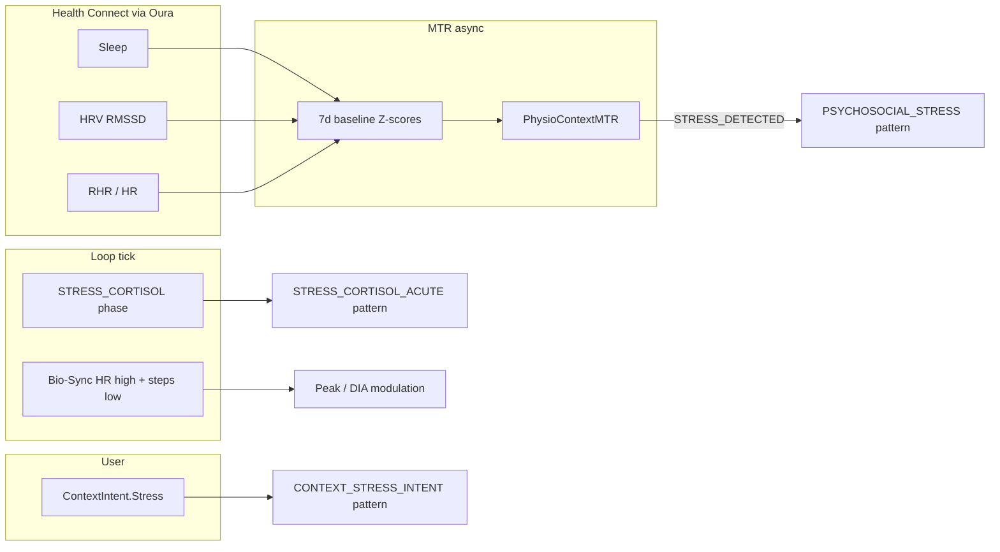

# AIMI Physiological Pattern Catalog

Companion to [AIMI_RECURSIVE_BELIEF.md](./AIMI_RECURSIVE_BELIEF.md) §15 (meta leaves) and
[AIMI_PHYSIOLOGICAL_PHASE.md](./AIMI_PHYSIOLOGICAL_PHASE.md) (single-label phase classifier).

## Purpose

AIMI must **understand the patient's body**, not only instantaneous BG geometry. The pattern
catalog bridges:

- **Tick-sync signals** — CGM deltas, IOB, meal absorption phase, physiological phase classifier
- **MTR async context** — sleep debt, HRV deviation, physio state (`PhysioContextMTR`)
- **User context intents** — illness, stress, activity

into a **multi-label snapshot** consumed by RBT (leaf credibility, paradoxes) and HTR merge
(SMB caps, meal/hyper suppression).

```
Signaux (CGM, HR, HRV, sleep, COB, IOB, context, chrono)
  → PhysiologicalPatternDetector
  → PhysiologicalPatternSnapshot (dominant + policies)
  → RBT τ=480 meta leaves + meal/hyper/wavelet scale
  → MR-7 RESOLVE → SMB/TBR caps (with physio phase + IOB stacking)
```

## Package layout

| File | Role |
|------|------|
| `PhysiologicalPatternId.kt` | 28 pattern enum values |
| `PhysiologicalPatternCatalog.kt` | Static definitions (caps, suppress flags, leaf scales) |
| `PhysiologicalPatternDetector.kt` | Multi-signal detection |
| `PhysiologicalPatternPolicy.kt` | Aggregate active readings → snapshot |
| `PhysiologicalPatternHysteresis.kt` | 20 min hold on sticky endocrine/recovery patterns |
| `PhysiologicalPatternInputBuilder.kt` | Tick input assembly |
| `PhysiologicalPatternExport.kt` | JSONL export |

## Pattern categories

### Endocrine / circadian

| Pattern | Typical trigger | Policy |
|---------|-----------------|--------|
| `DAWN_CORTISOL` | Phase classifier, 5–10h rise | SMB cap 0.55 U, suppress hyper + wavelet |
| `MALE/FEMALE_CIRCADIAN_HORMONAL` | W-cycle / chrono | SMB cap 0.60 U |
| `ENDOGENOUS_COUNTER_REGULATORY` | Post-hypo rebound, low IOB meal misread | SMB cap 0.50 U, suppress meal/hyper/wavelet |
| `NGR_NIGHT_GROWTH` | Night Δ+, no COB | Moderate hyper damp |

### Meal / absorption

| Pattern | Trigger | Notes |
|---------|---------|-------|
| `MEAL_*`, `LATE_FAT_PROTEIN` | Meal absorption engine | **Confirmed meal wave (≥0.70)** clears meal suppression |

### Stress / recovery / sleep

| Pattern | Trigger | Policy |
|---------|---------|--------|
| `POOR_SLEEP_MORNING_RISE` | 5–11h, Δ≥1.5, COB<1, sleep/HRV burden | **SMB cap 0.50 U**, suppress meal/hyper/wavelet |
| `SLEEP_DEBT`, `HRV_DEPRESSED`, `RECOVERY_NEEDED` | Wearable + MTR context | Recovery caps |
| `STRESS_CORTISOL_ACUTE`, `PSYCHOSOCIAL_STRESS` | Phase / MTR state | Hyper damp |

### Activity / insulin / context

Exercise lockout, IOB stacking surveillance, post-hypo rebound, compression artifact, context
intents — each mapped in `PhysiologicalPatternCatalog.kt`.

## RBT integration

### Meta leaves (τ = 480 min)

- `SLEEP_QUALITY`, `HRV_DEVIATION`, `SLEEP_DEBT`, `PHYSIO_MTR_STATE`, `PATTERN_RISK`

### Leaf credibility scaling

`PhysiologicalPatternSnapshot.credibilityScaleFor()` down-weights meal, hyper, and wavelet leaves
when a suppressing pattern is active (e.g. dawn cortisol → `PKPD_BEST`, `HTR_RELEASE`).

### Paradoxes

| Paradox | Resolution |
|---------|------------|
| `SLEEP_DEBT_VS_HYPER` | Pattern suppresses hyper release |
| `HRV_CRASH_VS_MEAL` | Pattern suppresses meal interpretation |
| `RECOVERY_VS_AGGRESS` | Pattern caps correction aggression |
| `EXERCISE_VS_CORRECTION` | Exercise lockout + pattern cap |

## Loop wiring (`DetermineBasalAIMI2`)

Each RBT resolve tick:

1. `PhysiologicalPatternInputBuilder.build()` — phase, MTR context, stacking, context intents
2. `PhysiologicalPatternDetector.detect()` — hysteresis + policy
3. `RecursiveBeliefTickContext.physiologicalPatterns` + `physioContext`
4. HTR merge: `min(lifted, physioCap, stackingCap, patternCap)`
5. JSONL: `adjustments.physiological_patterns`
6. Console: `🧬 PATTERN: dominant=...`

## Production incident (reference)

Morning post-hypo + cortisol + poor sleep → BG rise misread as meal/hyper → SMB stacking.

**Target behaviour:** `POOR_SLEEP_MORNING_RISE` + `ENDOGENOUS_COUNTER_REGULATORY` + IOB
surveillance → pattern SMB cap **0.50 U**, meal suppression, wavelet boost gated, RBT authority
capped (not overridden by V3 `max()`).

## Settings

No separate toggle — active when RBT runs (same prefs as recursive belief). Wavelet remains
**ON** with contextual gating via `suppressWaveletBoost`.

---

## Evidence and clinical rationale

This section maps **AIMI concepts** to published physiology — not a claim that every threshold
(0.50 U cap, 20 min hysteresis, etc.) was validated in a prospective APS trial.

### Design principle

AIMI does **not** model plasma cortisol directly. It models **observable consequences** of
endocrine and autonomic state on glycaemia and insulin sensitivity, then applies **conservative
dose policy** when meal/hyper geometry is ambiguous.

| AIMI construct | Physiological basis | Role in loop |
|----------------|---------------------|--------------|
| Dawn / hormonal phases | Dawn phenomenon — early-morning EGP rise (GH, cortisol, catecholamines) | Block meal-like HTR on slow ramps without COB |
| `ENDOGENOUS_COUNTER_REGULATORY` | Counter-regulatory response after hypoglycaemia (glucagon, epinephrine, cortisol) | Post-hypo rebound ≠ meal; cap SMB |
| `POOR_SLEEP_MORNING_RISE` | Sleep restriction → morning hyperglycaemia and insulin resistance | Multi-signal morning guard (not clock-only) |
| `HRV_DEPRESSED` / `STRESS_DETECTED` | Reduced HRV + elevated RHR → sympathetic dominance (stress/fatigue proxy) | Damp hyper release, pattern `PSYCHOSOCIAL_STRESS` |
| `SLEEP_DEBT` | Cumulative sleep debt vs personal baseline | Recovery patterns, morning rise composite |
| IOB stacking cap | Pharmacological stacking / hypoglycaemia risk with active insulin | Safety when geometry says “correct hyper” |
| Meal wave override | Confirmed absorption kinetics | Preserves true meal delivery when COB/kinetics dominate |

### Selected references (orientation, not exhaustive)

1. **Dawn phenomenon** — early-morning glucose rise independent of breakfast; distinct from
   Somogyi rebound in classic teaching. See reviews on dawn phenomenon in T1D management.
2. **Counter-regulatory hormones** — hypoglycaemia triggers glucagon/epinephrine/cortisol;
   subsequent hyperglycaemia can persist without exogenous carbs (DCCT-era physiology, modern CGM
   case reports).
3. **Sleep and glycaemia** — experimental sleep restriction increases insulin resistance and
   morning BG in healthy and T1D cohorts (Spiegel et al.; later T1D sleep studies).
4. **HRV as autonomic marker** — RMSSD suppression associated with stress, illness, poor
   recovery; used in wearables as indirect load marker (not diagnostic).
5. **Closed-loop meal misclassification** — geometry-only hyper treatment under endogenous rise
   causes over-delivery; motivation for **credibility gating** (RBT) rather than single-threshold
   SMB.

### What is engineered vs evidenced

| Evidenced concept | AIMI-specific parameter (needs personal / cohort validation) |
|-------------------|---------------------------------------------------------------|
| Post-hypo rebound exists | `POST_HYPO_REBOUND` cap 0.55 U, ordinal from `PostHypoState` |
| Poor sleep worsens morning control | `POOR_SLEEP_MORNING_RISE` Δ≥1.5, sleep debt ≥45 min |
| Sympathetic load reduces predictable ISF | `STRESS_DETECTED` brake 0.8×, `PSYCHOSOCIAL_STRESS` pattern |
| Dawn ≠ undeclared meal when COB≈0 | Phase priority + extended dawn guard (see `AIMI_PHYSIOLOGICAL_PHASE.md`) |

**Validation path:** export via `adjustments.physiological_patterns` + Hormonitor study JSONL;
correlate pattern activation with SMB outcomes and morning excursions (n=1 → cohort).

---

## Wearables — Oura and Health Connect

### What AIMI reads today

All wearable data enters through **Google Health Connect** (`AIMIPhysioDataRepositoryMTR`), not
the Oura API directly.

| Health Connect record | Used for | Code |
|-----------------------|----------|------|
| `SleepSessionRecord` | Duration, stages, efficiency, sleep debt | Feature extractor + snapshot |
| `HeartRateVariabilityRmssdRecord` | Nocturnal RMSSD (Oura night HRV prioritized) | `AIMIPhysioFeatureExtractorMTR` |
| `RestingHeartRateRecord` / `HeartRateRecord` | RHR, HR now, HR avg | Context engine + tick |
| `StepsRecord` | Activity / sedentary vs exercise | Pattern + Bio-Sync |
| `SkinTemperatureRecord` | Skin temperature **deltas** (Garmin, Oura wrist/finger) | `ThermalBeliefEngine` via `AIMIPhysioDataRepositoryMTR` |
| `BasalBodyTemperatureRecord` | Cycle basal temperature (BBT) | wcycle hints + `CYCLE_BBT_RISE` hypothesis |

Permissions are centralized in `AIMIHealthConnectPermissions.kt` — **no stress-specific record**.  
Thermal permissions: **Skin Temperature** and **Basal Body Temperature** (required for thermal rhythm in Context and Hormonitor `thermal_belief`).

**Thermal noise floor:** AIMI ignores skin delta variations below **0.03 °C** and slopes below **0.01 °C/h** before computing beliefs — wearable 0.01 °C ticks alone do not trigger inflammatory drift.

### What Oura exports to Health Connect (official)

Per [Oura Member Care — Health Connect integration](https://support.ouraring.com/hc/en-us/articles/10786105824531-Health-Connect-by-Android-Integration):

- **Exported:** HR, HRV, sleep, steps, workouts, SpO₂ (device-dependent), etc.
- **Not exported as standard HC types:** Oura **Daytime Stress**, **Readiness**, **Resilience**
  scores (proprietary indices stay inside Oura unless a future HC data type exists).

Health Connect itself does not standardize vendor-specific stress/recovery scores; third-party
apps generally cannot read Oura’s native “Stressed” label.

### How AIMI detects stress anyway (reconstructed, not Oura-native)

Stress enters the loop through **several parallel paths**, all derived from signals Oura *does*
sync (or from user/context/tick logic):



| Path | Condition (summary) | Output |
|------|---------------------|--------|
| **`AIMIPhysioContextEngineMTR`** | RHR elevated **and** HRV depressed vs 7d baseline | `PhysioStateMTR.STRESS_DETECTED` → `PSYCHOSOCIAL_STRESS` |
| **`PhysiologicalPhaseClassifier`** | Acute Δ + HR, COB≈0 (tick) | `STRESS_CORTISOL` → `STRESS_CORTISOL_ACUTE` |
| **`DetermineBasalAIMI2` Bio-Sync** | HR > 95, steps < 100 | Peak slowed ×1.25, DIA stretch (legacy path) |
| **`HealthContextSnapshot.toSNSDominance()`** | Steps + HR elevation + low HRV | SNS score for decision context |
| **`CosineTrajectoryGate`** | Kernel `STRESS` vs activity/sleep | Trajectory relevance / ISF gate |
| **Context module** | User preset / LLM stress intent | `CONTEXT_STRESS_INTENT` |

So: **yes, Oura contributes to stress detection indirectly** (sleep + HRV + RHR feeding MTR),
but **no, AIMI does not consume Oura’s Daytime Stress score**.

### Gap and possible extensions

| Option | Pros | Cons |
|--------|------|------|
| **Keep reconstructed stress (current)** | Consistent across Oura/Garmin/Samsung; maps to patterns + RBT | Not identical to Oura UX “Stressed” moments |
| **Oura API v2** (`daily_stress`, `daily_readiness`) | Native vendor semantics | OAuth, background sync, privacy review, non-Oura users excluded |
| **Future HC stress data type** | Standard Android path | Not available for Oura stress today |

**Recommendation:** keep MTR reconstruction as primary; if you wear Oura exclusively and want
parity with the app’s stress timeline, a **Phase 2 Oura API adapter** could feed a new pattern
(e.g. `OURA_DAYTIME_STRESS`) without replacing baseline Z-score logic.

### Diagnostic checklist (Oura → AIMI)

1. Health Connect permissions granted in AIMI (`AIMIHealthConnectPermissionActivityMTR`).
2. Oura app → Settings → Health Connect → export sleep, HRV, HR enabled.
3. Physio probe / logs: `probeHealthConnect()` shows non-zero sleep/HRV counts.
4. Loop console: MTR state / `🧬 PATTERN` includes `HRV_DEPRESSED`, `SLEEP_DEBT`, or
   `PSYCHOSOCIAL_STRESS` when autonomic load is high — **not** a literal “Oura Stress” field.

