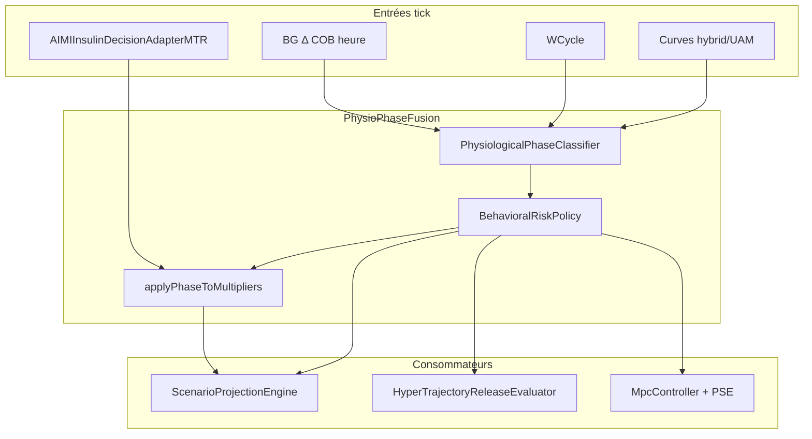

# AIMI — Phase physiologique et risque comportemental

**Statut :** Implémenté — classifieur, fusion Physio MTR, scénario, HTR, MPC, JSONL  
**Lié :** [AIMI_HYPER_TRAJECTORY_RELEASE.md](AIMI_HYPER_TRAJECTORY_RELEASE.md), [AIMI_SCENARIO_PROJECTION.md](AIMI_SCENARIO_PROJECTION.md), [research/TRAJECTORY_SIGNATURE_CLASSIFICATION.md](research/TRAJECTORY_SIGNATURE_CLASSIFICATION.md)

---

## 1. Objectif

Éviter de traiter une **montée hormonale** (cortisol matinal, profil circadien masculin, cycle féminin) comme un **repas non déclaré** (gros SMB HTR + V3 agressif + UAM scénario), tout en conservant HTR pour les vraies montées repas (KFC, etc.).

Deux couches partagent la même **`PhysiologicalPhase`** :

1. **Doseur** — HTR, MPC, cap terminal après coup  
2. **Scénario + Physio MTR** — fusion en amont dans `ScenarioProjectionEngine` et `PhysioMultipliersMTR`

---

## 2. Phases

| Phase | Contexte | Politique doseur |
|-------|----------|------------------|
| `OFF` | Aucune phase dominante | HTR / MPC / scénario inchangés |
| `DAWN_CORTISOL` | 4h–10h, COB≈0, rampe lente, proche cible | HTR **OFF**, bestT cap **+50**, UAM off, Dawn Guard étendu |
| `MALE_CIRCADIAN_HORMONAL` | WCycle off ou ménopause, même signature | Idem |
| `FEMALE_CYCLE_HORMONAL` | WCycle actif, lutéale/ovulation, matin | Idem |
| `STRESS_CORTISOL` | FC↑, Δ aigu, COB=0 | HTR max **EMERGING**, SMB cap **0,75 U** |
| `ENDOGENOUS_COUNTER_REGULATORY` | Rampe lente R_HGP / cortisol, COB=0, UAM gonflé sans gap repas | HTR **OFF**, SMB cap **0,30 U**, **basal bridge** uniquement |
| `MEAL_DECLARED` | COB ≥ 5 g | Pas de restriction |
| `MEAL_UNDECLARED` | Δ/gap/projection type repas | HTR plein, UAM actif |
| `HYPER_INSTALLED` | Plateau / tier établi + dwell | HTR `plateauSustain` |

**Priorité :** MEAL_DECLARED → **garde dawn proche cible** (4h–10h) → **ENDOGENOUS_COUNTER_REGULATORY** (4h–11h, rampe persistante COB=0) → MEAL_UNDECLARED (`mealLike` puis `mealDominant` avec bestT cap discriminant) → STRESS → HYPER_INSTALLED → hormonal matin (slowRamp) → OFF.

**Hystérésis :** une fois `ENDOGENOUS_COUNTER_REGULATORY` ou phase hormonale matin, la phase est maintenue **4 ticks** contre flip `MEAL_UNDECLARED` / `OFF` (sauf COB≥5).

---

## 3. Discriminants repas vs hormonal

### Garde dawn proche cible (avant `mealLike`)

En **4h–10h**, si **dev &lt; 0,45 × highBgBand** (proche cible, ex. BG ~109 pour cible 100) et **pas** de pic repas aigu (`isAcuteMealSurgeAtDawn`) :

- classer **hormonal** même si UAM gonfle `bestT` après une nuit basse ;
- évite `MEAL_UNDECLARED` + HTR anticipatoire sur rampe cortisol (terrain 04:11–04:21).

Un **vrai repas matin** reste `MEAL_UNDECLARED` si dev ≥ 0,45×bande, combinedΔ ≥ 4,5, ou Δ ≥ 4 avec projection très haute **et** dev déjà significatif.

### Repas non déclaré

**`mealLike`** : COB &lt; 1 g, montée rapide, projection + gap crédibles (inchangé).

**`mealDominant`** : même montée rapide, lead ≥ 0,85×bande (sans exiger le gap) — prioritaire sur **STRESS** pendant les montées type déjeuner (FC↑ + Δ aigu).

**Hormonal (slowRamp)** : COB &lt; 1 g, dev &lt; highBgBand, rampe lente, projection non « repas » (`bestT ≤ BG + 55` ou lead modéré).

---

## 4. Architecture fusion (suite logique)



| Fichier | Rôle |
|---------|------|
| `PhysiologicalPhase.kt` | Enum phases |
| `PhysiologicalPhaseClassifier.kt` | Classification tick |
| `BehavioralRiskPolicy.kt` | Plafonds HTR / SMB / scénario / Dawn |
| `PhysioPhaseFusion.kt` | **Point unique** classify + fuse multipliers |
| `HormonalScenarioTerminalCap.kt` | Cap `bestT` (HTR + redondance scénario) |

### 4.1 `PhysioMultipliersMTR` enrichi

Champs ajoutés (pas de nouvelle pref) :

- `physiologicalPhase`  
- `phaseConfidence`  
- `source` peut devenir `Deterministic+Phase`

En phase hormonale : **SMB× ≤ 0,92**, **react× ≤ 0,90**, **basal× ≥ 1,02** (léger renfort basale vs micro-bolus).

### 4.2 `ScenarioProjectionContext` enrichi

- `physiologicalPhase`  
- `suppressMealLikeUam` — ne fusionne pas UAM « momentum » si faux repas  
- `scenarioBestCapAboveBgMgdl` — plafond terminal (ex. **50**)

Couche scénario : `ScenarioContributorId.PHYSIOLOGICAL_PHASE` — damp courbe + cap terminal.

### 4.3 Ordre dans `DetermineBasalAIMI2`

1. **T9** — `AIMIInsulinDecisionAdapterMTR` → `PhysioMultipliersMTR` (Health Connect / état physio MTR)  
2. **Pred pipe** — preview `bestT` (hybrid ou rampe) → `classifyAndFuse` → `ScenarioProjectionEngine.build` avec contexte fusionné  
3. **Post-scénario** — `refreshPhysiologicalPhase` (terminaux réels + tier HTR)  
4. **Autodrive V3** — `physioExtendedDawnGuard` + HTR avec même `BehavioralRiskPolicy`

---

## 5. Pic de cortisol — traitement concret

| Étape | Comportement |
|-------|----------------|
| Détection | 4h–10h + COB=0 + rampe lente + BG proche cible + pas de signature repas |
| Scénario | **Pas d’uplift UAM** ; `bestT ≤ BG+50` ; couche PHYSIOLOGICAL_PHASE |
| Physio assistant | SMB/react dampés dans `PhysioMultipliersMTR` |
| HTR | **OFF** (tier max OFF) |
| MPC | Dawn Guard même **avec activité** (pas &lt; 200 pas) |
| PSE | Ra meal-like dampé (comme avant, élargi) |

**Pas de mesure cortisol** — risque comportemental explicite dans les logs et JSONL.

---

## 6. Lien avec Physio MTR existant

| Composant | Lien |
|-----------|------|
| `AIMIInsulinDecisionAdapterMTR` | Entrée **base** des multiplicateurs (état OPTIMAL/STRESS, cosine gate, etc.) |
| `PhysioPhaseFusion` | Applique la **phase** par-dessus (ne remplace pas l’adapter) |
| `CosineTrajectoryGate` / inflammation | Inchangés — phase ajoute une couche **hormonale matin** |
| `AimiPhysioAssistantEnable` | Si OFF → multiplicateurs NEUTRAL, mais **classifieur phase** tourne quand même pour HTR/scénario |

---

## 7. Consommateurs doseur (rappel)

| Module | Effet |
|--------|--------|
| `ScenarioProjectionEngine` | UAM off + cap + damp (source) |
| `HormonalScenarioTerminalCap` | Cap `bestT` (filet HTR) |
| `HyperTrajectoryReleaseEvaluator` | HTR off / plafonné |
| `MpcController` | Dawn Guard étendu |
| `ContinuousStateEstimator` | PSE Dawn élargi |

---

## 8. JSONL

```json
"physiological_phase": {
  "phase": "MALE_CIRCADIAN_HORMONAL",
  "confidence": 0.84,
  "behavioral_risk": "MALE_CIRCADIAN_HORMONAL",
  "reason": "maleCircadian h=7",
  "extended_dawn_guard": true,
  "scenario_best_capped": true,
  "max_htr_tier": "OFF",
  "smb_floor_cap_u": 0.55,
  "physio_smb_factor_fused": 0.92,
  "physio_phase_source": "Deterministic+Phase"
}
```

`scenario_projection.contributors` peut contenir `PHYSIOLOGICAL_PHASE`.

Logs : `🌅 PHYSIO_FUSE:` (fusion), `🌅 PHYSIO_RISK:` (autodrive).

---

## 9. Options utilisateur

**Aucune nouvelle pref.** Tout est automatique si :

- `AimiPhysioAssistantEnable` (modulation ISF/basal/SMB adapter — optionnelle mais fusion phase toujours active pour scénario/HTR)  
- `OApsAIMIHyperTrajectoryRelease` + Autodrive actif  

---

## 10. Validation terrain

- Matin ~120, Δ modéré (+2 à +3), COB=0, UAM bestT gonflé : `ENDOGENOUS_COUNTER_REGULATORY` (ou hormonal si dev très faible), **pas** `MEAL_UNDECLARED`, pas de SMB HTR 2+ U, basale `Endogenous basal bridge` ≤ ~2× profil.  
- KFC : `MEAL_UNDECLARED`, UAM contributor présent, HTR actif.  
- JSONL : `physiological_phase.phase`, `ENDOGENOUS_BRIDGE`, `iob_surveillance` sans `meal_absorption_rise_priority` en endogène.

---

## 12. ENDOGENOUS_COUNTER_REGULATORY (stress endogène / R_HGP)

**Modèle :** \(dBG/dt \approx R_{HGP}(t) - S \cdot I_{eff}(t)\), COB≈0. Livraison cible : **basale lisse** (fraction 0,25 du déficit naïf sur 90 min), pas de pulse SMB.

| Fichier | Rôle |
|---------|------|
| `EndogenousCounterRegulatoryDetector.kt` | Signature rampe + UAM sans gap repas |
| `EndogenousPhaseHysteresis.kt` | 4 ticks de maintien |
| `EndogenousBasalBridgePolicy.kt` | Calcul `target_basal_rate_uph` bridge |
| `InsulinStackingStance.kt` | IOB floor réduit ×0,35 ; pas de bypass meal-priority |

Logs : `🌅 ENDOGENOUS_BRIDGE`, `phase=ENDOGENOUS basal bridge`.

---

## 11. AIMI Context — activité déclarée + hyper montante

**Fichier :** `activity/ExerciseHyperOverridePolicy.kt`

Par défaut, une **activité déclarée** (Contexte AIMI ou note sport) active `exerciseInsulinLockout` : **SMB = 0**, basale réduite (pas/FC), parfois **0 U/h** si BG ≤ 220 mg/dL. Adapté à l’hypo post-effort, **pas** à « marche + hyper + thyroïde » (EGP↑).

**Override automatique** (pas de nouvelle pref) si :

- lockout exercice actif **et**
- BG ≥ ~92 % de `OApsAIMIHighBg` ou écart cible important **et**
- montée (Δ, combinedΔ ou shortΔ) **ou**
- thyroïde : `egpMultiplier ≥ 1,10` + BG déjà au-dessus de la cible.

Effets :

| Élément | Sans override | Avec override |
|---------|---------------|---------------|
| SMB | 0 (inchangé) | 0 (priorité hypo) |
| Basale (pas/FC) | ×0,6–0,8 | **≥ ×1,02** (montée forte **×1,10**) |
| Retour 0 U/h (BG≤220) | Oui | **Non** si hyper montante |
| Context `preferBasal` | Coupe SMB | **Ignoré** |

Logs : `🏃 HYPER_EXERCISE_OVERRIDE`, `HYPER_EXERCISE_OVERRIDE: basal x0.60 → x1.10`.

**Profils différents :** femme + WCycle + thyroïde utilisent le même seuil avec biais EGP thyroïde ; le classifieur de **phase** reste distinct (cycle féminin vs circadien masculin).
