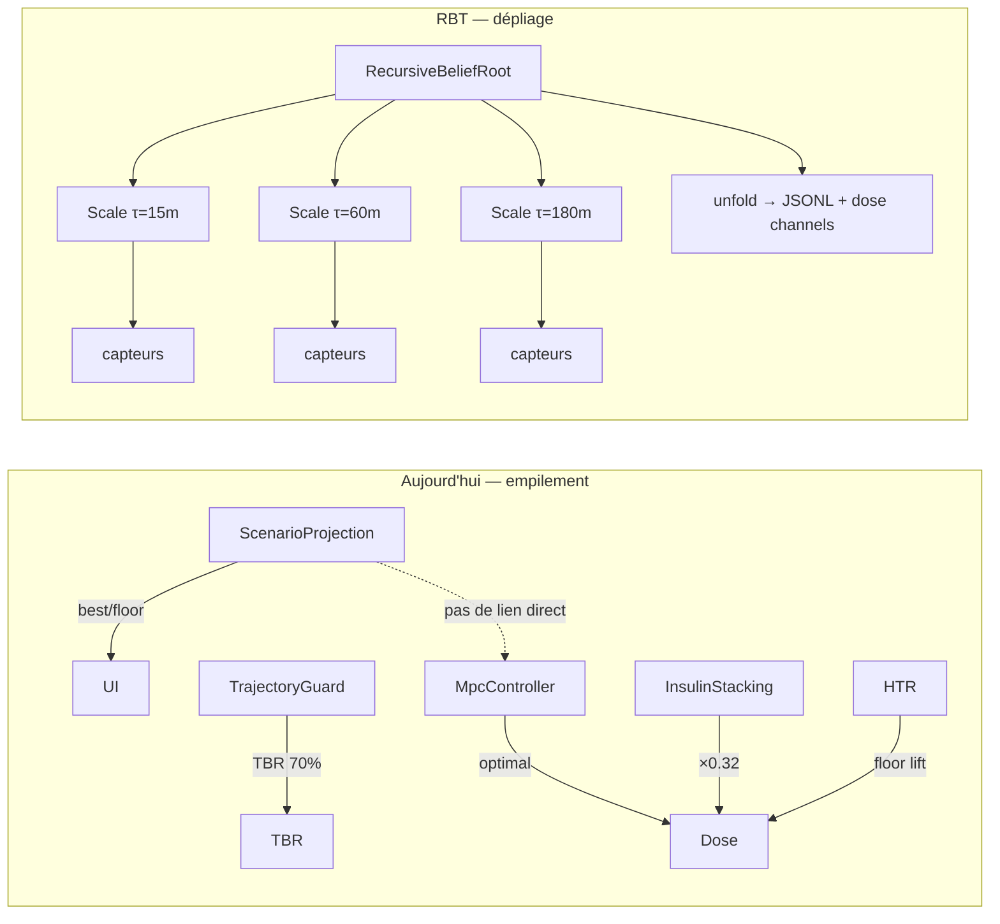
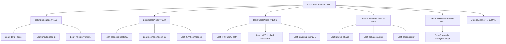
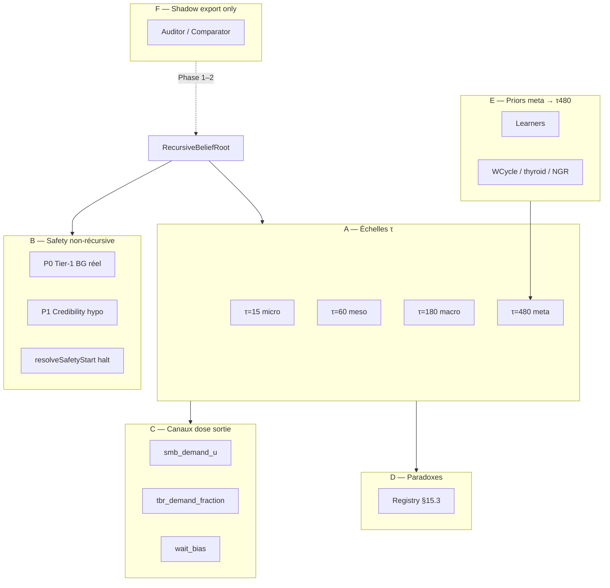

# AIMI — Recursive Belief Tree (RBT)

**Statut :** IMPLÉMENTÉ (code) sur `feature/recursive-belief-tree` — 96 adaptateurs §15, shadow + authority + wavelet, export JSONL, carte Advisor unfold ; **validation terrain + replay JSONL réel requis** avant merge `dev_OAPSAIMI_mergeDEV`  
**Date :** 2026-06-05 (rev. audit pipeline 2026-06-05)  
**Branche cible :** `dev_OAPSAIMI_mergeDEV`  
**Documents liés :** [AIMI_HYPER_TRAJECTORY_RELEASE.md](AIMI_HYPER_TRAJECTORY_RELEASE.md), [AIMI_SCENARIO_PROJECTION.md](AIMI_SCENARIO_PROJECTION.md), [AIMI_MEAL_ABSORPTION_PHASE.md](AIMI_MEAL_ABSORPTION_PHASE.md), [AIMI_PHYSIOLOGICAL_PHASE.md](AIMI_PHYSIOLOGICAL_PHASE.md), [AIMI_PHYSIO_RUNTIME_ACTIVATION_2026-06-06.md](AIMI_PHYSIO_RUNTIME_ACTIVATION_2026-06-06.md), [AIMI_RISK_ENVELOPE_SPEC.md](AIMI_RISK_ENVELOPE_SPEC.md)

---

## 1. Thèse — ce que personne n'a encore osé coder

Les systèmes APS open source (OpenAPS, AndroidAPS, Loop) partagent une ontologie implicite :

> **Empiler des heuristiques** jusqu'à obtenir une dose acceptable.

AIMI a poussé cette logique plus loin que la moyenne — trajectoire phase-space, scénarios dual-authority, belief repas, HTR — mais **la topologie reste horizontale** : N modules parallèles qui modulent des variables différentes (`maxSMB`, `tbrFraction`, `eventualBG`, `minPred`) sans jamais **déplier** la dimension causale engagée à chaque tick.

**Recursive Belief Tree (RBT)** propose une rupture :

1. **Une seule structure récursive** — arbre multi-échelle — remplace la tour de modulateurs.
2. **Une règle minuscule locale** (MR-7) — 7 lignes de sémantique — itérée à chaque nœud et à chaque échelle.
3. **Un opérateur de dépliage** (`unfold`) — exporte, à chaque interaction loop, **toute la tension inter-échelles**, pas seulement la dose finale.
4. **Les moteurs existants deviennent des capteurs** (feuilles), plus des décideurs silencieux qui se contredisent.

Ce n'est pas une fractale décorative. C'est un **formalisme de cohérence** : la glycémie est un phénomène nested (Δ → vague → repas → journée) ; le code doit refléter cette imbrication ou continuer à produire des paradoxes mesurables (best terminal 401 mg/dL + SMB 0,21 U).

---

## 2. Diagnostic — pourquoi empiler ne suffit plus

Le doc HTR §3.1 identifie **trois mondes** disjoints. RBT les unifie sous un seul espace d'état.



| Symptôme terrain | Cause structurelle | Réponse RBT |
|------------------|-------------------|-------------|
| Best 401, SMB 0,2 U | Mondes A et C sans variable partagée | `releaseDemand` unifié, résolu par MR-7 |
| minPred 39 @ BG 243 | Floor long-échelle non crédible court-échelle | `credibilityCascade` exclut feuille incohérente |
| Traj-Bridge TBR + HTR SMB | Deux modulateurs sans tension explicite | `channelTension(TBR vs SMB)` visible et arbitrée |
| 6 portes repas indépendantes (avant MAP) | Pas de belief partagé | Feuilles alimentent un seul `belief(τ)` |

---

## 3. Fondements — fractale, récursion, règle minuscule

### 3.1 Auto-similarité physiologique (pas mandelbrot)

Une fractale classique reproduit la même forme à toute loupe. En glycémie, la **forme** change, mais la **question** est homologue :

| Échelle `τ` | Fenêtre | Question homologue |
|-------------|---------|-------------------|
| **Micro** | 15 min (3 ticks) | « La dynamique immédiate diverge-t-elle de la cible ? » |
| **Meso** | 60 min (12 ticks) | « Une vague d'absorption / correction est-elle en cours ? » |
| **Macro** | 180 min (36 ticks) | « L'insuline embarquée suffira-t-elle sans empilement ? » |
| **Méta** | 480 min (contexte journée) | « Le profil hormonal / activité modifie-t-il la crédibilité des échelles inférieures ? » |

RBT instancie **le même nœud** `BeliefScaleNode(τ)` à chaque échelle. Les feuilles changent ; la règle de fusion non.

### 3.2 Règle minuscule MR-7

Inspirée des automates élémentaires (Wolfram) : une loi **locale** suffisamment expressive pour produire un comportement global complexe — **si** la topologie est récursive.

```
MR-7 (sémantique, 7 clauses) :

1. OBSERVE  — chaque feuille produit (signal, weight, credibility ∈ [0,1])
2. BELIEVE  — belief(τ) = Σ wᵢ·signalᵢ·credibilityᵢ / Σ wᵢ·credibilityᵢ  (si Σ>0)
3. PROJECT  — terminal(τ) = f_projection(belief, bg, curves@τ)
4. DEVIATE  — dev(τ) = terminal(τ) − target ; urgency(τ) = g(dev, Δ@τ, belief)
5. TENSION  — pour tout parent P, enfant C : tension(P,C) = |urgency(C) − urgency(P)|
6. RESOLVE  — action channel = argmin_cost(smb, tbr, wait | tensions, safety_tier1)
7. REMEMBER — push (belief, terminal, action, tension) dans scale memory ring[τ]
```

**Propriété clé :** MR-7 est **identique** à τ=15 et τ=180. Seuls les capteurs et les poids changent. C'est la récursivité.

### 3.3 Opérateur unfold — comprendre toute la dimension

À chaque tick, `unfold(root)` produit un artefact **complet** :

```
UnfoldSnapshot {
  scales: [ ScaleView(τ, belief, terminal, urgency, leaves[], credibility_min) ]
  tensions: [ EdgeTension(parent_τ, child_τ, magnitude, dominant_channel) ]
  resolutions: [ ChannelDecision(channel, magnitude_u, reason_code) ]
  paradoxes: [ Paradox(id, description, suppressed) ]   // ex. minPred non crédible
  mr7_trace: [ clause_id, inputs_hash, output_summary ]  // audit
}
```

L'utilisateur, l'analyste, le replay test **voient** pourquoi 0,2 U a été choisi — pas seulement le résultat.

---

## 4. Architecture RBT

### 4.1 Graphe



### 4.2 Feuilles — mapping depuis le code existant (aperçu)

Les moteurs actuels **ne sont pas supprimés**. Ils deviennent des adaptateurs `BeliefLeaf`.

Le tableau ci-dessous est un **aperçu des 12 feuilles centrales**. Le registre exhaustif (**88 feuilles actives + 8 shadow**) est en **§15**.

| Leaf ID | Source actuelle | Signal normalisé | Crédibilité par défaut |
|---------|-----------------|------------------|------------------------|
| `PKPD_IOB` | `AdvancedPredictionCurves.iob` | terminal floor mg/dL | 1.0 si IOB > 0 |
| `PKPD_BEST` | `ScenarioProjectionPair.scenarioBest` | terminal best mg/dL | `mealAbsorption.belief` |
| `PKPD_UAM` | `curves.uam` | terminal UAM mg/dL | `uamConfidence` |
| `TRAJ_GEOM` | `TrajectoryAnalysis.metrics` | urgency from κ, E, ρ | `trajectoryRelevanceScore` |
| `MEAL_PHASE` | `MealAbsorptionPhaseEngine` | phase ordinal → urgency | `belief` |
| `MEAL_MEMORY` | `MealAbsorptionMemory` | waveCount, gap trend | memory_active ? 0.9 : 0.3 |
| `HTR_TIER` | `HyperSeverityClassifier` | tier → release demand | tier eligible ? 1.0 : 0 |
| `MPC_IMPLIED` | `MpcController` (read-only) | optimal SMB implied | 0.85 (long horizon bias) |
| `STACK_SURV` | `InsulinStackingStance` | damp factor | 1.0 si plateau credible |
| `PHYSIO_PHASE` | `PhysiologicalPhaseClassifier` | damp / cap flags | 0.8 |
| `CTX_ACTIVITY` | `ContextInfluenceEngine` | smbFactor | 0.7 |
| `HYPO_FLOOR` | `SafetyPredictionTerminalsResolver` | compositeMin mg/dL | **credibility via HTC** |

**Invariant :** une feuille ne peut **jamais** écrire directement dans `maxSMB` ou `tbrUph`. Elle publie `(signal, weight, credibility)`.

### 4.3 Nœud d'échelle — structure Kotlin proposée

```kotlin
// Package cible : app.aaps.plugins.aps.openAPSAIMI.recursive

data class BeliefScaleNode(
    val horizonMinutes: Int,
    val belief: Double,              // [0, 1] post MR-7 clause 2
    val terminalMgdl: Double,        // clause 3
    val urgency: Double,             // clause 4, signed: + hyper risk, − hypo risk
    val leaves: List<BeliefLeafReading>,
    val childTensions: List<ScaleTension>,  // vs parent
)

data class BeliefLeafReading(
    val id: BeliefLeafId,
    val signal: Double,              // normalisé échelle-dépendant
    val weight: Double,
    val credibility: Double,
    val rawSummary: String,          // debug / JSONL
)

data class RecursiveBeliefSnapshot(
    val scales: List<BeliefScaleNode>,
    val resolutions: DoseChannelResolution,
    val paradoxes: List<BeliefParadox>,
    val mr7Trace: List<Mr7TraceStep>,
)
```

---

## 5. Algorithme — fusion, tension, résolution

### 5.1 Construction bottom-up (feuilles → racine)

Pour chaque échelle `τ` :

1. **Collect** — instancier les feuilles pertinentes à cette échelle (table §4.2 ; pas toutes à τ=15).
2. **Credibility gate** — si `credibility < 0.15`, feuille exclue du dénominateur (pas du trace).
3. **Believe** — belief(τ) selon MR-7 clause 2.
4. **Project** — terminal(τ) :
   - τ=15 : extrapolation Δ + court PKPD
   - τ=60 : `scenarioBest.pointAt(60)` ou blend hybrid
   - τ=180 : min/max envelope IOB vs best selon belief
   - τ=480 : cap par physio phase (pas de projection numérique forte)
5. **Deviate** — `dev(τ) = terminal(τ) − target` ; `urgency(τ) = dev(τ)/band(τ) + α·Δ_τ + β·belief(τ)`.

### 5.2 Tension inter-échelles

```
tension(τ_parent, τ_child) = |urgency(τ_child) − urgency(τ_parent)| × min(belief(child), belief(parent))
```

**Interprétation :**

| Tension | Signification | Action typique |
|---------|---------------|----------------|
| Faible (< 0.25) | Cohérence multi-échelle | Confiance accrue dans release |
| Moyenne (0.25–0.55) | Désaccord modéré | Privilégier canal TBR (macro prudence) |
| Forte (> 0.55) | Paradoxe structurel | Exposer `paradox` ; appliquer règle de priorité §5.4 |

**Exemple terrain (package 1780321706128, 12:51) :**

| Échelle | terminal | urgency | Notes |
|---------|----------|---------|-------|
| τ=15 | ~260 | +1.8 | Δ fort, montée crédible |
| τ=60 | 401 | +2.4 | best terminal |
| τ=180 | ~120 (MPC view) | −0.3 | IOB clearance → « tout va bien » |
| **tension(60,180)** | | **~2.7** | **PARADOX_HYPER_VS_CLEARANCE** |

Sans RBT, seul le monde C (MPC) gagne. Avec RBT, la tension force une **arbitration explicite**.

### 5.3 Règle de priorité (paradox resolution)

Ordre **non récursif** pour la sécurité (Tier-1 inchangé) :

```
P0 — Tier-1 hypo : BG < lgsThreshold → SMB=0, TBR≤0  (NON négociable)
P1 — Credibility floor : minPred non crédible @ short-scale hyper → exclure du hypo guard (HTC existant)
P2 — Short-scale dominance : si belief(15)≥0.6 ET urgency(15)>0.8 ET tension(60,180)>0.5
     → release channel autoritaire (successeur de HTR, pas patch parallèle)
P3 — Macro prudence : si belief(180)>0.5 ET urgency(180)<0 ET IOB>TDD_fraction
     → favoriser TBR sur SMB (successeur Traj-Bridge empilement)
P4 — Default : MPC optimal modulé par belief-weighted blend, pas remplacement brut
```

### 5.4 DoseChannelResolution — sortie unifiée

RBT ne produit pas « encore un facteur ». Il produit **trois canaux explicites** :

```kotlin
data class DoseChannelResolution(
    val smbDemandU: Double,          // demande avant finalize cap
    val tbrDemandFraction: Double,   // fraction basale (1.0 = 100%)
    val waitBias: Double,            // [0,1] préférence attendre
    val dominantScaleMinutes: Int,   // quelle échelle a gagné l'arbitrage
    val releaseAuthority: ReleaseAuthority,  // NONE | SOFT | HARD
    val reasonCodes: List<String>,
)
```

**Wiring cible (remplace empilement) :**

| Consommateur actuel | Entrée RBT |
|--------------------|------------|
| `runAutodriveV3MultiVariableBranch` | `max(smbDemandU, v3Optimal)` si `releaseAuthority ≥ SOFT` |
| `runTrajectoryTightSpiralSafetyBridge` | `tbrDemandFraction` au lieu de 0.7 hardcodé |
| `finalizeAndCapSMB` | plancher = `smbDemandU` quand `releaseAuthority == HARD` |
| `InsulinStackingStance` | feuille only ; résolution via P3 |
| `SafetyPredictionTerminalsResolver` | floor leaf crédibilité, pas override silencieux |

---

## 6. Ingéniosité — mécanismes que personne n'a formalisés

### 6.1 Belief Echo (mémoire récursive)

Chaque échelle maintient un anneau `MemoryRing[τ]` de 12 entrées (1 h @ τ=15, etc.).

```
echo(τ) = correlation(belief(τ)_now, belief(τ)_history)
```

Si echo → 1.0 : dynamique **stable** → réduire gain release (éviter oscillation spiral).  
Si echo chute brutalement : **transition de phase** → autoriser release anticipatoire (successeur FIRST_WAVE).

### 6.2 Credibility Cascade (anti minPred 39)

Propagation top-down :

```
cred(parent) = min(cred(parent), max(cred(child) · (1 − tension(parent,child)))
```

Si floor long-échelle tire credibilité parent vers 0 → feuille `HYPO_FLOOR` **silencieuse** dans RESOLVE, mais **visible** dans paradoxes. Exactement le bug HTR §3.4, formalisé.

### 6.3 Wavelet Belief (option Phase 3)

Décomposition en 3 bandes sur l'historique BG (Haar simplifié, sans lib externe) :

- **H** (high freq) : Δ, accélération → τ=15
- **M** (mid) : vague 30–90 min → τ=60
- **L** (low) : tendance 2–4 h → τ=180

Chaque bande alimente une feuille native. **Même MR-7.** C'est la version « fractale stricte » — implémentation optionnelle après MVP.

### 6.4 Channel Interference (TBR × SMB exclusivité douce)

Au lieu de TBR 70 % **et** SMB 0,2 U simultanés sans dialogue :

```
interference = smbDemandU · (1 − tbrDemandFraction)   // énergie injectée totale
cost = α·|BG−target|² + β·interference² + γ·tension_sum
```

Résolution par **descente discrete** sur 9 couples (SMB ∈ {0, 0.5, 1, 2, max}, TBR ∈ {0.7, 1.0, 1.3}) — assez léger pour Android, assez expressif pour éviter le double canal aveugle.

### 6.5 Paradox Registry (catalogue extensible)

Cinq paradoxes fondateurs (MVP) ; **douze au total** avec feuilles en conflit explicites — voir **§15.3**.

| ID | Condition | Suppression |
|----|-----------|-------------|
| `HYPER_VS_CLEARANCE` | urgency(15)>0.8 ∧ urgency(180)<0 | P2 short-scale dominance |
| `BEST_VS_MPC` | bestT>target+80 ∧ mpcSMB<0.3 | releaseAuthority SOFT |
| `FLOOR_VS_REALITY` | floorT<70 ∧ bg>target+60 | credibility cascade |
| `SPIRAL_VS_RISE` | TIGHT_SPIRAL ∧ Δ>2.0 | meal phase FIRST_WAVE bypass |
| `STACK_VS_WAVE` | IOB high ∧ SECOND_WAVE | InsulinStacking leaf cred → 0 |

Chaque paradoxe exporté JSONL → replay testable.

---

## 7. Pipeline intégré (remplacement cible)

### 7.1 Ordre tick proposé

```
applyTrajectoryAnalysis + applyContextModule
    → runAdvancedPredictionsAndPredPipePrep
        → ScenarioProjectionEngine.build          // inchangé v1
        → MealAbsorptionPhaseEngine.evaluate      // inchangé
        → RecursiveBeliefEngine.build             // NOUVEAU
        → RecursiveBeliefResolver.resolve         // MR-7
        → ScenarioProjectionApplicator.applyToRt  // UI : annoter avec unfold
    → trySafetyStart (Tier-1 P0 only)
    → Autodrive V3 (lit DoseChannelResolution)
    → finalizeAndCapSMB (lit releaseAuthority + smbDemandU)
    → export AIMI_Decisions.jsonl (section recursive_belief)
```

### 7.2 Coexistence avec HTR

**Phase 1–2 :** HTR reste ; RBT tourne en **shadow mode** (export only, dose inchangée).  
**Phase 3 :** `HyperTrajectoryReleaseEvaluator` devient adaptateur feuille `HTR_TIER` ; logique release migrée vers P2.  
**Phase 4 :** HTR deprecated flag ; RBT seul authority.

Pas de big-bang — shadow d'abord, preuve JSONL, puis bascule.

---

## 8. Export JSONL — schéma `recursive_belief`

Section ajoutée à `AIMI_Decisions.jsonl` :

```json
{
  "recursive_belief": {
    "version": 1,
    "scales": [
      {
        "tau_min": 15,
        "belief": 0.82,
        "terminal_mgdl": 258,
        "urgency": 1.74,
        "leaves": [
          {"id": "MEAL_PHASE", "signal": 0.91, "weight": 1.2, "credibility": 0.88, "summary": "FIRST_WAVE B=0.91"}
        ]
      },
      {
        "tau_min": 60,
        "belief": 0.76,
        "terminal_mgdl": 401,
        "urgency": 2.41,
        "leaves": [
          {"id": "PKPD_BEST", "signal": 401, "weight": 1.0, "credibility": 0.76, "summary": "SCENARIO_BEST terminal"}
        ]
      },
      {
        "tau_min": 180,
        "belief": 0.44,
        "terminal_mgdl": 118,
        "urgency": -0.28,
        "leaves": [
          {"id": "MPC_IMPLIED", "signal": 0.37, "weight": 0.9, "credibility": 0.85, "summary": "V3 optimal 0.37U clearance view"}
        ]
      }
    ],
    "tensions": [
      {"parent_tau": 180, "child_tau": 60, "magnitude": 2.69, "dominant": "HYPER_VS_CLEARANCE"}
    ],
    "paradoxes": [
      {"id": "HYPER_VS_CLEARANCE", "suppressed": false, "resolution": "P2_SHORT_SCALE_DOMINANCE"}
    ],
    "resolution": {
      "smb_demand_u": 0.92,
      "tbr_demand_fraction": 1.0,
      "wait_bias": 0.12,
      "dominant_scale_min": 15,
      "release_authority": "HARD",
      "reason_codes": ["P2", "MEAL_FIRST_WAVE", "TENSION_60_180"]
    },
    "mr7_trace": ["OBSERVE:11", "BELIEVE:0.76@60", "TENSION:2.69", "RESOLVE:HARD"]
  }
}
```

---

## 9. Fichiers — plan d'implémentation

| Fichier | Rôle |
|---------|------|
| `recursive/BeliefLeafId.kt` | Enum feuilles |
| `recursive/BeliefScaleNode.kt` | Nœud + MemoryRing |
| `recursive/BeliefLeafAdapter.kt` | Interface + adaptateurs par moteur existant |
| `recursive/RecursiveBeliefEngine.kt` | Build scales bottom-up |
| `recursive/RecursiveBeliefResolver.kt` | MR-7 clauses 5–6 |
| `recursive/RecursiveBeliefParadox.kt` | Registry §6.5 |
| `recursive/DoseChannelResolution.kt` | Sortie unifiée |
| `recursive/UnfoldExporter.kt` | JSONL + narrative string |
| `recursive/RecursiveBeliefPreferences.kt` | Pref shadow / authority |
| `DetermineBasalAIMI2.kt` | Wiring shadow → authority |
| `RecursiveBeliefJsonlReplayTest.kt` | Replay package 1780321706128 |

**Pref keys proposées :**

- `OApsAIMIRecursiveBeliefShadow` (défaut **on** en dev)
- `OApsAIMIRecursiveBeliefAuthority` (défaut **off** jusqu'à validation terrain)
- `OApsAIMIRecursiveBeliefWavelet` (défaut off, Phase 3)

---

## 10. Phases de livraison

### Phase 0 — Spec + types (1 PR, zero behavior change)

- Data classes + MR-7 trace stub
- Tests unitaires MR-7 sur scénarios synthétiques

### Phase 1 — Shadow engine (2 PR)

- Tous adaptateurs feuilles
- `RecursiveBeliefEngine.build` + export JSONL
- **Aucune** modification dose
- Replay : corréler `tensions` avec ticks paradoxe connus

### Phase 2 — Credibility cascade + paradox registry (1 PR)

- Brancher HTC existant comme credibility gate
- Valider suppression faux LGS log

### Phase 3 — Authority partielle (1 PR)

- P2 short-scale dominance → remplace HTR floor quand `release_authority HARD`
- Channel interference pour TBR/SMB
- Flag `RecursiveBeliefAuthority` off par défaut

### Phase 4 — Full authority + HTR deprecation (1 PR)

- Migrer Traj-Bridge, InsulinStacking, finalize caps sous RBT
- Advisor card « Recursive belief unfold »
- HTR → feuille legacy

### Phase 5 — Wavelet belief (optionnel)

- Haar 3 bandes sur historique BG
- Feuilles natives remplaçant extrapolation Δ simple

---

## 11. Tests & métriques de succès

### 11.1 Replay obligatoires

| Dataset | Assertion RBT |
|---------|---------------|
| `1780321706128` (déjeuner 1er juin) | `HYPER_VS_CLEARANCE` détecté 12:45–13:00 ; `smb_demand_u ≥ 0.7` median si authority on |
| `1780638240029` (MAP doc) | `MEAL_PHASE` leaf cred ≥ 0.85 sur FIRST_WAVE ; pas SURV paradox |
| Nuit stable | belief(15) < 0.3 ; release_authority NONE |
| Hypo réel BG<70 | P0 déclenché ; RBT n'override jamais |

### 11.2 Métriques quantitatives (authority on, 30 j terrain)

| Métrique | Baseline empilé | Cible RBT |
|----------|-----------------|-----------|
| Paradoxes non résolus / tick hyper | non mesuré | 0 |
| SMB médian montée non déclarée | ~0,2 U | ≥ 0,7 U |
| Temps dev > highBand | ~90 min | −25 % |
| IOB pic | ~10 U | ≤ 11 U |
| Faux LGS log @ BG>200 | plusieurs | 0 |

### 11.3 Test MR-7 isolé

```kotlin
@Test
fun `MR-7 P2 resolves HYPER_VS_CLEARANCE`() {
    val scales = listOf(
        scale(15, belief = 0.82, urgency = 1.8),
        scale(60, belief = 0.76, urgency = 2.4),
        scale(180, belief = 0.44, urgency = -0.3),
    )
    val snapshot = RecursiveBeliefResolver.resolve(scales, safetyTier1 = false)
    assertThat(snapshot.paradoxes.map { it.id }).contains(BeliefParadoxId.HYPER_VS_CLEARANCE)
    assertThat(snapshot.resolutions.releaseAuthority).isEqualTo(ReleaseAuthority.HARD)
    assertThat(snapshot.resolutions.smbDemandU).isAtLeast(0.7)
}
```

---

## 12. Risques

| Risque | Sévérité | Mitigation |
|--------|----------|------------|
| Complexité audit/regulatory | 🟠 | Shadow mode prolongé ; mr7_trace complet |
| Double comptage RBT + HTR | 🟠 | Phase 3 migration explicite ; flag mutual exclusion |
| Latence tick | 🟡 | ≤ 5 ms budget ; pas de wavelet en MVP |
| Over-release | 🔴 | P0 Tier-1 ; IOB cap global inchangé |
| Tuning MR-7 opaque | 🟠 | Paradox registry + replay ; pas de magic floats cachés |

---

## 13. Ce qui nous distingue — pitch une phrase

> **OpenAPS empile des règles ; AIMI-RBT déplie un arbre de croyances multi-échelle où chaque dose est la résolution explicite d'une tension mesurable — exportée, replayable, et enfin alignée avec la projection que l'utilisateur voit.**

---

## 14. Prochaine action recommandée

1. **Terrain :** activer RBT shadow + Autodrive V3 ; laisser tourner 48 h ; corréler `recursive_belief` JSONL + carte Advisor « Recursive belief unfold » avec ressenti clinique.
2. **Replay :** valider lignes JSONL réelles (ex. timestamps audit) via `RecursiveBeliefJsonlReplayTest` étendu si besoin.
3. **Authority :** n'activer `OApsAIMIRecursiveBeliefAuthority` qu'après shadow validé ; HTR dose est déjà leaf-only quand authority RBT est active.
4. **Merge :** `feature/recursive-belief-tree` → `dev_OAPSAIMI_mergeDEV` après validation utilisateur.

**Feuilles encore approximatives si signal absent au tick RBT :** `SHADOW_COMPARATOR`, `SHADOW_VIRTUAL_BG`, `HIGH_BG_OVR`, `DECISION_MOD`, `DYN_ISF_TRAJ`, `ONLINE_LEARN`, `ATTENTION` (partiellement downstream Autodrive).

---

## 15. Registre exhaustif — branches & feuilles (audit pipeline)

**Source audit :** inventaire `DetermineBasalaimiSMB2.runDetermineBasalTick()` — ~90 producteurs de signaux, consolidés en **88 feuilles actives** + **8 shadow** = **96 `BeliefLeafId`**.

**Légende matrice τ :** ✓ = feuille calculée à cette échelle ; ○ = crédibilité héritée du parent (credibility cascade §6.2), pas de re-calcul local.

### 15.1 Six familles de branches (topologie complète)

L'arbre RBT n'est **pas** uniquement 4 échelles. Six branches orthogonales :



| Branche | Rôle | Récursive ? |
|---------|------|-------------|
| **A — Échelles τ** | Belief + terminal + urgency par horizon | Oui (MR-7) |
| **B — Safety** | P0/P1, halt LGS | **Non** — coupe l'arbre |
| **C — Canaux dose** | Sortie unifiée RESOLVE | Dérivée de A+D |
| **D — Paradoxes** | Tensions inter-feuilles / inter-τ | Oui |
| **E — Meta priors** | Alimente τ=480, cascade vers enfants | Oui (cred cascade) |
| **F — Shadow** | Export JSONL, zéro dose Phase 1–2 | Non |

### 15.2 Branches de résolution (sorties — pas des feuilles)

Chaque tick, MR-7 produit un **parcours** dans l'arbre de résolution :

| Branche sortie | Valeurs | Consommateur actuel |
|----------------|---------|---------------------|
| `release_authority` | NONE / SOFT / HARD | `finalizeAndCapSMB`, HTR successor |
| `smb_demand_u` | [0, maxSMB] | Autodrive V3, `SmbInstructionExecutor` |
| `tbr_demand_fraction` | [0.5, 1.5] | Traj-Bridge, `BasalDecisionEngine` |
| `wait_bias` | [0, 1] | SMB interval stretch |
| `hypo_guard_mode` | FULL / PARTIAL / IGNORE_MINPRED | `SafetyNet`, `PredictiveHypoEvaluator` |
| `autodrive_mode` | V3 / V2 / SKIP | `AutoDriveGater` |
| `meal_channel` | PRIORITY / NORMAL / SUPPRESS | meal priority chain |
| `dominant_scale_min` | 15 / 60 / 180 / 480 | JSONL audit |

### 15.3 Registre paradoxes (12)

| Paradox ID | Feuilles en conflit | Résolution |
|------------|---------------------|------------|
| `HYPER_VS_CLEARANCE` | `HTR_RELEASE` vs `MPC_HORIZON` | P2 short-scale dominance |
| `BEST_VS_MPC` | `PKPD_BEST` vs `MPC_IMPLIED` | releaseAuthority SOFT |
| `FLOOR_VS_REALITY` | `SAFETY_TERMINALS` vs `DELTA_NOW` | credibility cascade |
| `SPIRAL_VS_RISE` | `TRAJ_GEOM` vs `MEAL_PHASE` | FIRST_WAVE bypass |
| `STACK_VS_WAVE` | `STACK_SURV` vs `MEAL_MEMORY` | STACK cred → 0 |
| `TRAJ_TBR_VS_HTR_SMB` | `TRAJ_BRIDGE` vs `HTR_RELEASE` | Channel interference §6.4 |
| `PHYSIO_DAMP_VS_MEAL` | `SCEN_PHYSIO` vs `MEAL_PHASE` | belief(15) wins if ≥ 0.7 |
| `ENDOG_VS_CORRECTION` | `ENDOG_DETECT` vs `CORR_AGGRESS` | BehavioralRiskPolicy cap |
| `AUDITOR_VS_RELEASE` | `LOCAL_SENTINEL` vs `HTR_RELEASE` | min(smbDemand) if sentinel HIGH |
| `NGR_VS_HYPER` | `NGR` vs `HTR_TIER` | NGR damp releaseAuthority |
| `THYROID_VS_AGGRESS` | `THYROID_GUARD` vs `CORR_AGGRESS` | THYROID_GUARD wins |
| `WCYCLE_VS_STABLE` | `WCYCLE` vs `TRAJ_GEOM` STABLE_ORBIT | suppress release if orbit stable |

### 15.4 Feuilles τ = 15 min (micro) — 22 actives

| Leaf ID | Source Kotlin | Signal RBT |
|---------|---------------|------------|
| `DELTA_NOW` | `glucoseStatus.delta` | Δ mg/dL/5m |
| `DELTA_SHORT` | shortAvgDelta | moyenne courte |
| `DELTA_COMBINED` | combinedDelta | fusion deltas |
| `ACCEL` | `MealAbsorptionPhaseEngine` | accélération Δ |
| `BG_DERIV` | `TrajectoryBgDerivatives` | dérivées BG |
| `INSULIN_STAGE` | `InsulinActionProfiler` | `ActivityStage` |
| `PKPD_TAIL` | `PkpdAbsorptionGuard` | smbFactor, preferTbr |
| `STACK_SURV` | `InsulinStackingStance` | stance, cap, multiplier |
| `STACK_SIGNALS` | `InsulinStackingSignals` | eventualDrop, minPredDrop |
| `HYPO_GUARD` | `HypoGuard`, `PredictiveHypoEvaluator` | block flags |
| `COMPRESSION` | `CompressionReboundGuard` | capteur impossible rise |
| `MEAL_PHASE` | `MealAbsorptionPhaseEngine` | phase + belief |
| `MEAL_AGGR` | `computeMealAggressionWeights` | guard scale |
| `LOCAL_SENTINEL` | `LocalSentinel` | smbFactor advisor |
| `DECISION_MOD` | `DecisionModulator` | verdict modulation |
| `HIGH_BG_OVR` | `HighBgOverride` | ceiling override |
| `TUBE_ADVISOR` | `StraightLineTubeAdvisor` | smbCapScale |
| `IOB_CONSENSUS` | `IobConsensus` | AAPS vs PKPD IOB |
| `REALTIME_IOB` | `RealTimeInsulinObserver` | IOB live |
| `STEPS_15M` | `HealthContextRepository`, `StepService` | steps récents |
| `ACTIVITY_INT` | `ActivityManager` | intensity score |
| `UAM_CONF` | `AimiUamHandler` | UAM confidence |

### 15.5 Feuilles τ = 60 min (meso) — 34 actives

Alignées sur les **13 `ScenarioContributorId`** + modulateurs meso :

| Leaf ID | Source Kotlin | Signal RBT |
|---------|---------------|------------|
| `PKPD_IOB` | `AdvancedPredictionCurves.iob` | floor path terminal |
| `PKPD_BEST` | `ScenarioProjectionPair.scenarioBest` | best terminal |
| `PKPD_UAM` | `curves.uam` | UAM path |
| `PKPD_COB` | `curves.cob` | COB path |
| `PKPD_ZT` | `curves.zt` | zero-temp path |
| `PKPD_HYBRID` | `curves.hybrid` | hybrid base |
| `SCEN_TRAJ_RISE` | `ScenarioContributorId.TRAJECTORY_RISE` | uplift montée |
| `SCEN_TRAJ_SPIRAL` | `TRAJECTORY_SPIRAL_DAMP` | damping spiral |
| `SCEN_TRAJ_CONV` | `TRAJECTORY_CONVERGENCE` | convergence |
| `SCEN_MEAL_CTX` | `MEAL_CONTEXT` | meal intent max |
| `SCEN_ADVISOR_COB` | `MEAL_ADVISOR_COB` | advisor carbs |
| `SCEN_ACTIVITY` | `ACTIVITY_PROTECTION` | protection sport |
| `SCEN_PHYSIO` | `PHYSIO_REACTIVITY` | damp reactivity |
| `SCEN_PHASE_CAP` | `PHYSIOLOGICAL_PHASE` | cap best-T |
| `SCEN_CONTEXT` | `CONTEXT_MODULE` | smb factor context |
| `SCEN_TARGET_BLEND` | `TARGET_BLEND` | blend cible |
| `TRAJ_GEOM` | `TrajectoryGuard` | κ, E, ρ, `TrajectoryType` |
| `TRAJ_MOD` | `TrajectoryModulation` | smbDamp, basalBias |
| `TRAJ_BRIDGE` | `runTrajectoryTightSpiralSafetyBridge` | TBR proactive |
| `TRAJ_SPIRAL_CAP` | `applyTrajectoryTightSpiralStandardSmbCapIfNeeded` | maxSMB clamp |
| `COSINE_GATE` | `CosineTrajectoryGate` | relevance score |
| `HTR_TIER` | `HyperSeverityClassifier` | tier |
| `HTR_RELEASE` | `HyperTrajectoryReleaseEvaluator` | smb floor demand |
| `HTC_HYPO` | `HyperTrajectoryHypoCredibility` | minPred credible? |
| `RISK_ENVELOPE` | `AimiRiskEnvelope` | composite min, bounds |
| `SAFETY_TERMINALS` | `SafetyPredictionTerminalsResolver` | pred/eventual composite |
| `MPC_IMPLIED` | `MpcController` | optimal SMB/TBR |
| `MPC_FEEDFWD` | `HyperTrajectoryMpcFeedForward` | estimatedRa blend |
| `AUTODRIVE_GATE` | `AutoDriveGater` | V3 engage/skip |
| `CBF_SHIELD` | `ControlBarrierShield` | MPC safety shield |
| `MEAL_MEMORY` | `MealAbsorptionMemory` | gap trend, waveCount |
| `ENDOG_BRIDGE` | `EndogenousBasalBridgePolicy` | TBR endogenous |
| `T3C_ANTICIP` | `T3cAnticipation` | nadir/hyper minutes |
| `POST_HYPO` | `classifyPostHypoState` | rebound / meal class |
| `MEAL_ADVISOR` | `runMealAdvisorDecisionOrReturn` | one-shot SMB estimate |

### 15.6 Feuilles τ = 180 min (macro) — 18 actives

| Leaf ID | Source Kotlin | Signal RBT |
|---------|---------------|------------|
| `MPC_HORIZON` | `MpcController` horizon 180 min | clearance view |
| `PKPD_LEARNED` | `AdaptivePkPdEstimator` | DIA/peak appris |
| `ISF_FUSION` | `IsfFusion`, `IsfBlender` | fused ISF |
| `KALMAN_ISF` | `KalmanISFCalculator` | fast ISF + trust |
| `DYN_ISF_TRAJ` | `DynIsfTrajectoryTuning` | ISF trajectoire |
| `PKPD_TAIL_DAMP` | `PkpdSmbTailDamping` | tail damping |
| `PEAK_BIAS` | `TrajectoryPeakBias` | peak shift |
| `PEAK_MISMATCH` | `TrajectoryPeakMismatchScorer` | mismatch score |
| `CORR_AGGRESS` | `CorrectionAggressionGate` | FULL/MODERATE/REBOUND |
| `PHYSIO_FUSION` | `PhysioPhaseFusion` | multipliers fusionnés |
| `PHYSIO_MULT` | `AIMIInsulinDecisionAdapterMTR` | smb/basal/react |
| `ENDOG_DETECT` | `EndogenousCounterRegulatoryDetector` | ramp endogène |
| `HORMONAL_CAP` | `HormonalScenarioTerminalCap` | cap terminal |
| `BEHAVIORAL` | `BehavioralRiskPolicy` | caps HTR/SMB/scenario |
| `NGR` | `NightGrowthResistanceMonitor` | smb/basal NGR mult |
| `INFLAMMATION` | `InflammationAdjuster` | IC/ISF inflam |
| `BASAL_ADAPT` | `AIMIAdaptiveBasal` | adaptive basal |
| `DYN_BASAL` | `DynamicBasalController` | V2 fallback TBR |

### 15.7 Feuilles τ = 480 min (meta) — 14 actives

| Leaf ID | Source Kotlin | Signal RBT |
|---------|---------------|------------|
| `PHYSIO_PHASE` | `PhysiologicalPhaseClassifier` | DAWN, STRESS, MEAL_UNDECLARED… |
| `CHRONO_PRIOR` | `MealAbsorptionPhaseEngine` chrono | π_chrono |
| `CTX_INTENTS` | `ContextInfluenceEngine` | illness, alcohol, sport… |
| `CTX_MANAGER` | `ContextManager` | snapshot intents |
| `WCYCLE` | `WCycleFacade` | basal/smb/ic cycle mult |
| `ENDOMETRIOSIS` | `EndometriosisAdjuster` | cycle-specific |
| `THYROID` | `ThyroidEffectModel` | dia/egp/isf mult |
| `THYROID_GUARD` | `ThyroidSafetyGates` | NORMALIZING block |
| `GESTATION` | `GestationalAutopilot` | grossesse |
| `BASAL_LEARNER` | `BasalLearner` | short/med/long mult |
| `REACTIVITY` | `UnifiedReactivityLearner` | combined factor |
| `ONLINE_LEARN` | `OnlineLearner` | sensitivity factor |
| `ATTENTION` | `MechanismAttentionGate` | autodrive attention |
| `EXERCISE_LOCK` | `ExerciseHyperOverridePolicy`, therapy clock | HTR lockout |

### 15.8 Feuilles shadow (8 — export only, Phase 1–2)

| Leaf ID | Source | Rôle |
|---------|--------|------|
| `SHADOW_COMPARATOR` | `AimiSmbComparator` | dual-engine shadow |
| `SHADOW_VIRTUAL_BG` | `VirtualGlucoseEngine` | virtual loop BG |
| `SHADOW_AUDITOR` | `AuditorOrchestrator` | post-decision audit |
| `SHADOW_SENTINEL_VERDICT` | `AuditorVerdictCache` | cached verdict |
| `SHADOW_ORCH` | `AIMIDecisionOrchestratorShadowMTR` | shadow orchestrator |
| `SHADOW_TUNING` | `TuningContextEngine` | tuning context (UI) |
| `SHADOW_VISION` | meal vision providers | non tick unless triggered |
| `SHADOW_ML_TRAIN` | trainers background | jamais tick live |

### 15.9 Matrice τ × feuilles clés

| Leaf ID | τ15 | τ60 | τ180 | τ480 |
|---------|:---:|:---:|:----:|:----:|
| `MEAL_PHASE` | ✓ | ✓ | ○ | ○ |
| `PKPD_BEST` | ○ | ✓ | ✓ | ○ |
| `PKPD_IOB` | ○ | ✓ | ✓ | ○ |
| `MPC_IMPLIED` | ○ | ✓ | ✓ | ○ |
| `MPC_HORIZON` | ○ | ○ | ✓ | ○ |
| `TRAJ_GEOM` | ✓ | ✓ | ○ | ○ |
| `HTR_RELEASE` | ○ | ✓ | ○ | ○ |
| `STACK_SURV` | ✓ | ✓ | ○ | ○ |
| `PHYSIO_PHASE` | ○ | ○ | ✓ | ✓ |
| `BEHAVIORAL` | ○ | ○ | ✓ | ✓ |
| `WCYCLE` | ○ | ○ | ○ | ✓ |
| `CHRONO_PRIOR` | ○ | ○ | ○ | ✓ |
| `CTX_INTENTS` | ○ | ○ | ○ | ✓ |
| `CORR_AGGRESS` | ○ | ○ | ✓ | ○ |
| `NGR` | ○ | ○ | ✓ | ○ |

### 15.10 Enum `BeliefLeafId` — implémentation Phase 0

```kotlin
enum class BeliefLeafId {
    // τ=15 (22)
    DELTA_NOW, DELTA_SHORT, DELTA_COMBINED, ACCEL, BG_DERIV,
    INSULIN_STAGE, PKPD_TAIL, STACK_SURV, STACK_SIGNALS,
    HYPO_GUARD, COMPRESSION, MEAL_PHASE, MEAL_AGGR,
    LOCAL_SENTINEL, DECISION_MOD, HIGH_BG_OVR, TUBE_ADVISOR,
    IOB_CONSENSUS, REALTIME_IOB, STEPS_15M, ACTIVITY_INT, UAM_CONF,
    // τ=60 (34 incl. scenario contributors)
    PKPD_IOB, PKPD_BEST, PKPD_UAM, PKPD_COB, PKPD_ZT, PKPD_HYBRID,
    SCEN_TRAJ_RISE, SCEN_TRAJ_SPIRAL, SCEN_TRAJ_CONV,
    SCEN_MEAL_CTX, SCEN_ADVISOR_COB, SCEN_ACTIVITY, SCEN_PHYSIO,
    SCEN_PHASE_CAP, SCEN_CONTEXT, SCEN_TARGET_BLEND,
    TRAJ_GEOM, TRAJ_MOD, TRAJ_BRIDGE, TRAJ_SPIRAL_CAP, COSINE_GATE,
    HTR_TIER, HTR_RELEASE, HTC_HYPO, RISK_ENVELOPE, SAFETY_TERMINALS,
    MPC_IMPLIED, MPC_FEEDFWD, AUTODRIVE_GATE, CBF_SHIELD,
    MEAL_MEMORY, ENDOG_BRIDGE, T3C_ANTICIP, POST_HYPO, MEAL_ADVISOR,
    // τ=180 (18)
    MPC_HORIZON, PKPD_LEARNED, ISF_FUSION, KALMAN_ISF, DYN_ISF_TRAJ,
    PKPD_TAIL_DAMP, PEAK_BIAS, PEAK_MISMATCH, CORR_AGGRESS,
    PHYSIO_FUSION, PHYSIO_MULT, ENDOG_DETECT, HORMONAL_CAP,
    BEHAVIORAL, NGR, INFLAMMATION, BASAL_ADAPT, DYN_BASAL,
    // τ=480 (14)
    PHYSIO_PHASE, CHRONO_PRIOR, CTX_INTENTS, CTX_MANAGER,
    WCYCLE, ENDOMETRIOSIS, THYROID, THYROID_GUARD, GESTATION,
    BASAL_LEARNER, REACTIVITY, ONLINE_LEARN, ATTENTION, EXERCISE_LOCK,
    // Shadow (8)
    SHADOW_COMPARATOR, SHADOW_VIRTUAL_BG, SHADOW_AUDITOR,
    SHADOW_SENTINEL_VERDICT, SHADOW_ORCH, SHADOW_TUNING,
    SHADOW_VISION, SHADOW_ML_TRAIN,
}
```

**Comptage :** 22 + 34 + 18 + 14 + 8 = **96 enum entries** (88 actives doseur + 8 shadow).

Adaptateur pattern :

```kotlin
interface BeliefLeafAdapter {
    val id: BeliefLeafId
    val scales: Set<Int>          // horizons where active (15, 60, 180, 480)
    fun read(ctx: RecursiveBeliefTickContext): BeliefLeafReading?
}
```

Chaque classe source existante → **un** adaptateur ; pas de duplication logique.

### 15.11 Couverture vs pipeline — checklist validation

| Catégorie pipeline | Producteurs inventoriés | Feuilles RBT | Couverture |
|--------------------|-------------------------|--------------|------------|
| PKPD / prediction | 15 | 14 | ✓ |
| Scenario projection | 13 contributors + engine | 16 | ✓ |
| Trajectory | 5 | 6 | ✓ |
| HTR / release | 6 | 4 | ✓ |
| Physio / meal | 12 | 10 | ✓ |
| Safety micro | 14 | 8 | ✓ (P0 hors feuilles) |
| Autodrive | 8 | 5 | ✓ |
| Basal / TBR | 7 | 4 | ✓ (via channels) |
| Context / meta | 10 | 14 | ✓ |
| Advisor / shadow | 12 | 8 shadow | ✓ export only |
| Learning background | 6 | SHADOW_ML_TRAIN | ✓ exclu tick |

**Modules infrastructure (pas feuilles) :** `AimiDetermineBasalTickOrchestrator`, `DetermineBasalInvocationCaches`, export JSONL, UI compose — orchestration only.

### 15.12 Bilan v0.1 → v0.2

| Métrique | v0.1 | v0.2 |
|----------|------|------|
| Feuilles documentées | 12 | **88 actives + 8 shadow** |
| Branches topologiques | 4 échelles | **6 familles** |
| Paradoxes | 5 | **12** |
| Branches sortie RESOLVE | 3 | **8** |
| `ScenarioContributorId` | partiel | **13/13** |
| Audit pipeline | non | **oui** |

---

## 16) Documentation in-app (cartographie)

Textes visibles dans l’APK (anglais `values/` uniquement pour les changements fork) — alignés merge dev 2026-06-05.

| Sujet | Où dans l’app | Clés / fichiers |
|-------|----------------|-----------------|
| **Description plugin AIMI** | Config Builder | `plugins/aps/.../strings.xml` → `description_openapsaimi` |
| **RBT shadow / authority / wavelet** | AIMI → Autodrive prefs | `core/keys/.../strings.xml` → `pref_*_aimi_recursive_belief_*` |
| **HTR** | Idem | `pref_*_aimi_hyper_trajectory_release*` |
| **Catalogue patterns (28)** | AIMI → Physiological Assistant | `aimi_physio_*`, `ApsIntentKey.AimiPhysioPatternCatalogInfo` → dialog `aimi_physio_pattern_catalog_detail` |
| **Hypo risk unifiée** | Loop notification + dashboard + AIMI SOS | `hypo_risk_notification_*` (`plugins/aps` + `plugins/main`), `aimi_hypo_risk_alarm_summary`, `NotificationId.HYPO_RISK_ALARM` |
| **RBT unfold (JSONL)** | AIMI Advisor | `aimi_rbt_unfold_*`, section dans `AimiProfileAdvisorActivity` |
| **Parcours advisor RBT** | Advisor recommendations | `aimi_adv_rec_rbt_shadow_*`, `aimi_adv_rec_rbt_authority_*` (`AimiAdvisorService`) |
| **Eversense natif** | Config Builder → BG Source | `plugins/source/.../strings.xml` → `description_source_eversense`, `eversense_plugin_summary`, `EversenseIntentKey.EversenseAbout` |
| **Doc repo patterns** | Hors APK | `docs/AIMI_PHYSIOLOGICAL_PATTERN_CATALOG.md` |
| **Alarm unification AAPS** | Global (pas RBT-specific) | `ALARM_UNIFICATION_PLAN.md`, `AlarmSoundPlayer`, tier `URGENT` |

**Ordre utilisateur recommandé (RBT) :** Autodrive V3 → shadow ON → revue JSONL (`recursive_belief` + `physiological_patterns`) → authority ON (HTR parallèle alors ignoré si release authority active).

**Eversense + AIMI :** glucose via driver BLE natif ; physio assistant = Health Connect séparé ; hypo loop = `HYPO_RISK_ALARM` AIMI, pas les alarmes capteur Eversense (`EVERSENSE_*`).

---

## 17) Insulin Load Governor (ILG) — surveillance élastique RBT

**Statut :** intégré au resolver RBT (v0.2.1). **Appliqué à la pompe** uniquement quand `OApsAIMIRecursiveBeliefAuthority` est ON ; toujours **exporté** en JSONL quand RBT shadow ou authority est actif.

### 17.1 Problème adressé

Le chemin repas/HTR utilisait surtout `maxIob − iob` (headroom préférence) et bypassait stacking/spiral malgré TDD/poids déjà calculés. L’ILG module la **demande SMB RBT** sans mur IOB dur — pour éviter l’effet inverse (sous-doser une montée rapide légitime).

### 17.2 Budget physiologique (réutilise prefs existantes)

| Entrée | Source |
|--------|--------|
| TDD 24h | `tdd24hU` (blend plugin, même que HTR/spiral) |
| Poids | `DoubleKey.OApsAIMIweight` |

```
physBudgetU = max(
  tdd24hU × (8 / 55),
  weightKg × (8 / 75)
)
```

Aligné sur `tightSpiralSmbCapIobThresholdU` — **référence**, pas plafond Max-IOB.

### 17.3 Signaux fusionnés

| Signal | Source code | Rôle |
|--------|-------------|------|
| `stackScore` | IOB/budget, traj E, décélération Δ, stage insuline, ρ trajectoire | Anti-stack |
| `riseScore` | accélération Δ, lead bestT, phase repas, sharp rise | Pro-correction |
| `deltaDecelScore` | `delta < deltaPrev`, `bgDerivShort < 0` | Montée qui s’essouffle |
| Escapes | Δ≥4.5, bestT−bg>80, IOB<budget×0.55 | Limite effet inverse |

Formule continue :

```
rawG = clamp(1.0 − 0.65×stackScore + 0.25×riseScore, 0.35, 1.0)
g = EMA(rawG, priorG)   // prior = tick précédent
```

### 17.4 Paliers produit

| Tier | g typique | SMB tick cap | TBR |
|------|-----------|--------------|-----|
| FULL | ≥0.92 | aucun | normal |
| SOFT | 0.72–0.91 | ~TDD×0.035 | normal |
| SURVEILLANCE | 0.50–0.71 | ~TDD×0.018 | bias ≥1.08× |
| WAIT | <0.50 | ~TDD×0.010 | bias ≥1.08× |

### 17.5 Intégration pipeline

```
HTR floor / RBT smbDemand  →  × g  →  min(cap tier)  →  min(maxSmb, maxIob−iob)
```

- Fichier : `InsulinLoadGovernor.kt` (pure logic, tests unitaires)
- Branché : `RecursiveBeliefResolver.resolveChannels` **après** caps stacking/pattern, **avant** headroom IOB
- Contexte : `RecursiveBeliefTickContext` (+ weight, deltaPrev, eventual, activityNow, lastG)
- Export : `recursive_belief.load_governor` dans JSONL (`UnfoldExporter`)

### 17.6 JSONL — champs `load_governor`

| Champ | Description |
|-------|-------------|
| `tier` | FULL / SOFT / SURVEILLANCE / WAIT |
| `multiplier_g` | g lissé appliqué (ou shadow) |
| `raw_multiplier_g` | g brut tick |
| `phys_budget_u` | budget TDD/poids |
| `stack_score`, `rise_score`, `delta_decel_score` | composantes 0–1 |
| `smb_demand_before_u`, `smb_demand_after_u` | audit demande RBT |
| `applied` | true si authority ON et g<1 |
| `reason_codes` | DELTA_DECEL, TRAJ_ENERGY, SHARP_RISE, ESCAPE_*… |

Console loop : `⚖️ LOAD_GOV …` + `🌳 RBT: … LG=SURVEILLANCE g=0.68✓`

### 17.7 Rollout recommandé

1. RBT **shadow** ON → revue JSONL `load_governor` vs doses réelles  
2. Replay `AIMI_Decisions.jsonl` — vérifier que les ticks IOB 15–18 U + decel Δ auraient `g<0.85`  
3. RBT **authority** ON — valider repas rapide (pas de sous-dose) et repas plateau (moins de stacking)

**Tuning :** pas de nouvelle pref — coefficients dans `InsulinLoadGovernor.kt` ; analystes : `load_governor.tuning_reference` en JSONL.

---

*Document rédigé pour OpenApsAIMI — Recursive Belief Tree v0.2. Contribuer : brancher d'abord en shadow, prouver en JSONL, autoriser ensuite.*
