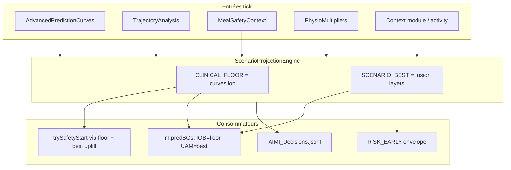

# AIMI Scenario Projection — dual authoritative curves

**Status:** IMPLEMENTED (proto v1) — 2026-05-29  
**Branch:** `dev_OAPSAIMI`  
**Package:** `app.aaps.plugins.aps.openAPSAIMI.scenario`  
**Related:** [AIMI_RISK_ENVELOPE_SPEC.md](AIMI_RISK_ENVELOPE_SPEC.md), [AIMI_PHYSIOLOGICAL_PHASE.md](AIMI_PHYSIOLOGICAL_PHASE.md), [LGS_PREDICTIVE_MEAL_BLIND_CASE_STUDY.md](LGS_PREDICTIVE_MEAL_BLIND_CASE_STUDY.md), [ARCHITECTURE.md](ARCHITECTURE.md)

---

## 1. Vision produit

AIMI accumule des signaux riches (trajectoire phase-space, physio HR/steps, contexte activité/maladie, meal modes, advisor carbs, PKPD IOB). Jusqu’ici ils **modulaient** le dosage (SMB×, intervalle, TBR) sans produire **une projection BG unifiée** partagée entre UI, safety et export.

Ce proto introduit **deux courbes autoritaires** par tick :

| Courbe | Kind | Rôle |
|--------|------|------|
| **Plancher clinique** | `CLINICAL_FLOOR` | Pessimiste — insuline seule (PKPD IOB path). Alimente LGS / composite hypo. |
| **Scénario best** | `SCENARIO_BEST` | Réaliste — fusion repas non déclaré, UAM, trajectoire, activité, physio, contexte. UI + `eventualBG` + narrative décision. |

Philosophie : **ne pas remplacer** TrajectoryGuard (modulation douce) ni Autodrive — **synthétiser** leurs signaux dans une courbe lisible pour l’utilisateur et la safety.

---

## 2. Architecture



### 2.1 Couche phase physiologique (2026-06)

Voir [AIMI_PHYSIOLOGICAL_PHASE.md](AIMI_PHYSIOLOGICAL_PHASE.md). Avant `ScenarioProjectionEngine.build`, `PhysioPhaseFusion` :

1. Classifie `PhysiologicalPhase` (cortisol matin, cycle, repas, …)  
2. Fusionne `PhysioMultipliersMTR` (SMB/react damp, basal léger↑)  
3. Passe dans `ScenarioProjectionContext` : `suppressMealLikeUam`, `scenarioBestCapAboveBgMgdl`  

Contributor stable : `PHYSIOLOGICAL_PHASE` — supprime l’uplift UAM « momentum » en montée hormonale près de la cible.

### Ordre pipeline (invariant 5 conservé)

```
applyTrajectoryAnalysis + applyContextModule
    → runAdvancedPredictionsAndPredPipePrep
        → ScenarioProjectionEngine.build
        → ScenarioProjectionApplicator.applyToRt
    → trySafetyStart (floor composite via SafetyPredictionTerminalsResolver)
    → Meal Advisor / SMB / …
```

---

## 3. Fichiers

| Fichier | Rôle |
|---------|------|
| `scenario/ScenarioProjectionEngine.kt` | Fusion pure Kotlin |
| `scenario/ScenarioProjectionContext.kt` | Entrées contexte tick |
| `scenario/ScenarioProjectionCurve.kt` | Path clampé + terminal + pathMin |
| `scenario/ScenarioProjectionPair.kt` | Paire floor + best + contributors |
| `scenario/ScenarioProjectionApplicator.kt` | Map vers `RT.predBGs` |
| `risk/SafetyPredictionTerminalsResolver.kt` | `resolveFromScenario()` pour LGS |
| `DetermineBasalAIMI2.runAdvancedPredictionsAndPredPipePrep` | Wiring tick |

### Convention graphique (`RT.predBGs`)

| Série | Contenu |
|-------|---------|
| **IOB** | `CLINICAL_FLOOR` — ancre sécurité |
| **UAM** | `SCENARIO_BEST` — scénario autoritaire |
| **COB** | PKPD COB (info) |
| **ZT** | PKPD ZT (info) |

`rT.eventualBG` = terminal **SCENARIO_BEST**.

---

## 4. Couches de fusion SCENARIO_BEST

Ordre d’application dans `ScenarioProjectionEngine` :

1. **Base hybrid** PKPD  
2. **Meal / UAM** — `max(hybrid, UAM, COB)` si meal intent ; sinon uplift UAM si > hybrid + 5  
3. **Trajectoire** — OPEN_DIVERGING / SLOW_DRIFT : bias montée ; TIGHT_SPIRAL : atténuation ; CLOSING / STABLE : blend convergence  
4. **Activité** — protection : cap montée si effort ; coussin hypo si chute  
5. **Physio** — damp reactivity / SMB factor  
6. **Context module** — SMB factor clamp  
7. **Target blend** — léger tirage vers cible (sauf diverging actif)

Chaque couche produit un `ScenarioContributor` auditable (id stable pour JSONL).

---

## 5. Logs production

```text
SCENARIO: floorT=… bestT=… floorMin=… bestMin=… gap=… contrib=[…]
PRED_PIPE: … bestT=… floorT=… floorMin=… th=…
RISK_SAFETY_EARLY: … bestT=… floorT=…
```

Export JSONL : `adjustments.scenario_projection` + `adjustments.safety_risk`.

---

## 6. Tests unitaires

| Test | Fichier |
|------|---------|
| Thomas lunch — best > floor | `ScenarioProjectionEngineTest` |
| OPEN_DIVERGING contributor | idem |
| Activity protection cap | idem |
| Hormonal phase — UAM suppressed | idem |
| resolveFromScenario composite | `SafetyPredictionTerminalsResolverTest` |

Commande :

```bash
./gradlew :plugins:aps:testFullDebugUnitTest --tests "app.aaps.plugins.aps.openAPSAIMI.scenario.*" --tests "app.aaps.plugins.aps.openAPSAIMI.risk.SafetyPredictionTerminalsResolverTest"
```

---

## 7. Analyse effets de bord

### 7.1 Risques identifiés

| # | Effet | Sévérité | Mitigation en place |
|---|--------|----------|---------------------|
| E1 | **SCENARIO_BEST trop optimiste** → UI rassurante mais hypo réel | 🟠 | CLINICAL_FLOOR indépendante ; LGS utilise floor + PredictiveHypoEvaluator |
| E2 | **Graph IOB ≠ ancienne sémantique** (était = hybrid) | 🟡 | Documenté ; IOB = floor explicite ; UAM = best |
| E3 | **Double comptage trajectoire** (modulation SMB + bias courbe) | 🟡 | Bias projection modéré (0.12×Δ×openness) ; trajectoire reste modulation dosages |
| E4 | **T3c brittle path** appelle encore `applyAdvancedPredictions` legacy | 🟢 | Shadow isolé ; pas le tick principal |
| E5 | **DECISION envelope PKPD** post-refresh peut diverger du scenario early | 🟡 | `RISK_SAFETY_RECONCILE` inchangé ; DECISION reste autoritaire SMB guard |
| E6 | **Activity protection** réduit montée projetée **et** maxSMB | 🟢 | Cohérent cliniquement (effort → prudence) |
| E7 | **Contributors absents** si trajectoire warming up | 🟢 | Fallback hybrid + meal ; log `SCENARIO` montre contrib vide |

### 7.2 Ce qui ne change **pas**

- Invariant 5 : safety **avant** Meal Advisor  
- Tier 1 / bruit CGM → halt complet  
- Tier 2/3 → TBR partiel sans halt tick  
- TrajectoryGuard reste modulation douce (pas hard block)  
- Autodrive V3/V2 inchangés en signature  

### 7.3 Ce qui change **visiblement**

- Courbe **UAM** sur le graph = scénario réaliste (plus une copie IOB)  
- Courbe **IOB** = plancher insuline (peut être plus basse)  
- `eventualBG` affiché = terminal **best**, pas hybrid insuline-only  
- PRED_PIPE log inclut `floorT` / `bestT`  

### 7.4 Cas Thomas (repas non déclaré)

| Avant proto | Après proto |
|-------------|-------------|
| eventual ≈ 39 → faux hypo | best terminal ≥ BG ; floor ≈ 39 pour sécurité |
| LGS halt (si sans fix tiers) | Meal context + floor/best split → tick continue |
| Graph 4 courbes identiques | IOB floor / UAM best distinctes |

### 7.5 Critères validation terrain

- [ ] Graph : IOB bas, UAM monte en repas sans COB  
- [ ] Log `SCENARIO: gap=` positif en montée repas  
- [ ] Pas de régression hypo réelle (BG < 70 chute) — Tier 1 actif  
- [ ] JSONL contient `scenario_projection.contributors`  
- [ ] Thomas replay déjeuner 11:48–15:00 OK  

### 7.6 Évolutions v2 (hors scope proto)

- Porter courbes OpenAPS `predUCI` / remainingCATime dans une couche COB dédiée  
- Alimenter SCENARIO_BEST directement depuis Autodrive MPC terminal  
- Pref utilisateur : afficher floor seul / best seul / les deux  
- Fusion DECISION envelope = scenario (single snapshot post-PKPD refresh)  
- **Hyper Trajectory Release (HTR)** — pont scénario + trajectoire → doseur SMB : voir [AIMI_HYPER_TRAJECTORY_RELEASE.md](AIMI_HYPER_TRAJECTORY_RELEASE.md)  

---

## 8. Limites connues (proto v1)

- Fusion **heuristique** (pas MPC complet) — suffisante pour unifier l’information, pas la perfection OpenAPS SMB  
- WCycle / thyroïde : via physio factors seulement, pas de couche cycle dédiée  
- ZT = mirror IOB PKPD (pas zero-temp OpenAPS)  
- Pas de pref UI pour masquer la courbe floor  

---

## 9. Références code

| Élément | Emplacement |
|---------|-------------|
| Engine | `scenario/ScenarioProjectionEngine.kt` |
| Applicator | `scenario/ScenarioProjectionApplicator.kt` |
| Tick wiring | `DetermineBasalAIMI2.runAdvancedPredictionsAndPredPipePrep` |
| Safety bridge | `SafetyPredictionTerminalsResolver.resolveFromScenario` |
| Export | `AimiDecisionContext.ScenarioProjectionExport` |
