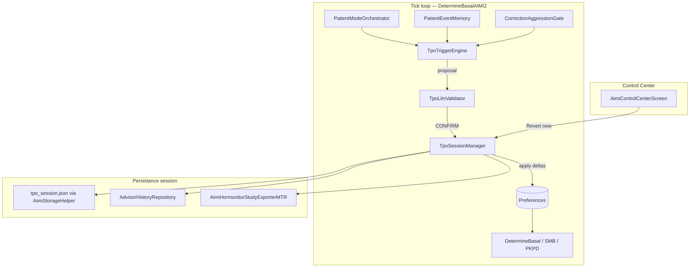
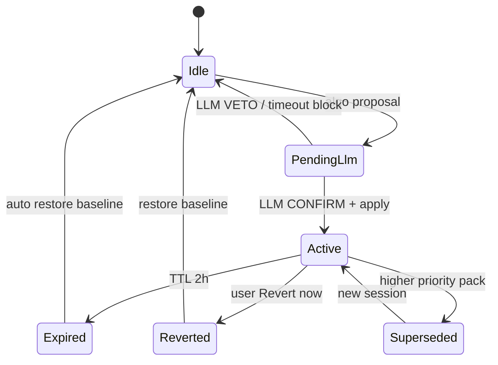

# AIMI — Transient Preference Overlay (TPO)

**Statut :** IMPLÉMENTÉ (P0) — ledger épisodes + deltas ladder + trio + LLM async  
**Date :** 2026-06-16 (rev. ladder/ledger impl)  
**Décisions produit verrouillées :**

| # | Décision |
|---|----------|
| 1 | **Périmètre v1 = trio** : `POST_HYPO_RECOVERY`, `POOR_SLEEP_WINDOW`, `EXHAUSTED_RECOVERY` |
| 2 | **TTL fixe = 2 h** pour tous les packs (pas de table adaptive v1) |
| 3 | **Autonome, sans mode shadow** : application réelle des prefs + **revert garanti** vers l’état d’avant session |
| 4 | **Whitelist clés v1** : réutiliser les clés déjà gouvernées par `TuningContextEngine` + familles **Protection** / **Stability** du Control Center |
| 5 | **Double confirmation** : trigger algo **+** validation LLM structurée (stack Advisor / `AiCoachingService` existante) |

**Documents liés :** [AIMI_TUNING_AND_ADVISOR.md](AIMI_TUNING_AND_ADVISOR.md), [AIMI_CONTROL_CENTER_ADVISOR_BRIDGE_2026-06-14.md](AIMI_CONTROL_CENTER_ADVISOR_BRIDGE_2026-06-14.md), [AIMI_RECURSIVE_BELIEF.md](AIMI_RECURSIVE_BELIEF.md), [AIMI_PRODUCT_HARMONY_CAUSAL_TREE_2026-06-14.md](AIMI_PRODUCT_HARMONY_CAUSAL_TREE_2026-06-14.md), [aimi-harmonia-implementation.md](aimi-harmonia-implementation.md), [aimi-harmonia-simulation-branch.md](aimi-harmonia-simulation-branch.md)

---

## 1. Problème et objectif

Après un hypo, une nuit courte ou un cycle hyper→hypo épuisant, les **mêmes préférences persistantes** produisent une sur-correction ou un empilement d’insuline. Le loop AIMI possède déjà des modulateurs tick-level (RTB, `CorrectionAggressionGate`, `PatientModeOrchestrator`), mais **ne retouche pas temporairement les bornes de prefs** (Max SMB, damping, tube, meal factors…) pendant la fenêtre de fragilité.

**TPO** comble ce gap :

- Ajuste **temporairement** un sous-ensemble whitelisté de préférences AIMI.
- **Ne modifie pas** le profil pompe ni les clés hors AIMI.
- **Revient automatiquement** à l’état capturé au début de session (2 h).
- Laisse l’utilisateur **annuler manuellement** ou **conserver** une clé qu’il a retouchée pendant la session.

TPO est **orthogonal à RTB** : RTB arbitre l’insuline au tick ; TPO élargit ou resserre les **rails de prefs** pendant une fenêtre clinique connue.

TPO est aussi **orthogonal à Harmonia** (§14) : Harmonia harmonise contexte + simulation/production basal-first ; TPO modifie des **préférences** whitelistées. Les deux consomment `PatientEventMemory` / fragilité post-hypo mais n'ont pas la même autorité.

---

## 2. Architecture



### 2.1 Composants (nouveaux fichiers proposés)

| Classe | Rôle |
|--------|------|
| `TpoPackId` | Enum des 3 packs v1 |
| `TpoTriggerEngine` | Évalue éligibilité algo, calcule tier, produit `TpoProposal` |
| `TpoDeltaBuilder` | Mappe pack + tier → liste `TuningChange` (réutilise clamps `TuningContextEngine`) |
| `TpoLlmValidator` | Double confirmation via `AiCoachingService` / prompt structuré JSON |
| `TpoSessionManager` | Snapshot, apply, tick expiry, revert, conflits utilisateur |
| `TpoPreferenceSnapshot` | Baseline + overlay values + ownership flags |
| `TpoRtbAdapter` | Feuilles RTB `EvaluateTpo` / `ApplyTpo` / `RevertTpo` (observabilité) |

### 2.2 Point d’intégration loop

**Ordre proposé** (dans `DetermineBasalAIMI2`, après refresh patient state, avant décision SMB) :

1. `buildPatientEventMemory` + `PatientModeOrchestrator.resolve` (existant)
2. `TpoSessionManager.onTick(...)` — expiry / revert si TTL dépassé
3. Si pas de session active : `TpoTriggerEngine.evaluate` → `TpoLlmValidator.validate` → `TpoSessionManager.startSession`
4. Décision insulinique utilise les prefs **déjà écrites** (pas de reader parallèle v1)

**⚠️ ASYNC IMPACT :** `TpoLlmValidator` appelle le réseau. Exécution **asynchrone avec cache 5 min** sur le même pack ; en attendant la réponse LLM, **pas de nouvelle session** (session en attente `PENDING_LLM`). Pas de blocage du tick décisionnel.

### 2.3 Modèle de persistance

**Principe v1 : write-through + snapshot**

- Au `startSession` : snapshot JSON de **toutes** les clés touchées (`baseline[key] = preferences.get(key)`).
- Apply : écriture directe dans `Preferences` (même mécanisme que `TuningContextApplySupport.applyChange`).
- Session JSON (`aimi/tpo/tpo_session.json`) = métadonnées + baseline + overlay + audit LLM.
- Au revert (auto ou manuel) : `preferences.put(key, baseline[key])` pour chaque clé **non user-owned**.

**Pas de mode shadow** : les valeurs overlay sont réellement actives ; le revert est le filet de sécurité.

---

## 3. Schéma session JSON

```json
{
  "schema_version": 1,
  "session_id": "uuid",
  "pack_id": "POST_HYPO_RECOVERY",
  "tier": "MODERATE",
  "status": "ACTIVE",
  "started_at_ms": 1718534400000,
  "expires_at_ms": 1718541600000,
  "ttl_ms": 7200000,
  "trigger": {
    "algo_confidence": 0.78,
    "reason_codes": ["CAUSAL_POST_HYPO", "REBOUND_GUARD"],
    "patient_mode": "POST_HYPO_RECOVERY",
    "event_memory": {
      "correction_fragility_score": 0.71,
      "post_hyper_exhaustion_score": 0.42
    }
  },
  "llm": {
    "status": "CONFIRM",
    "confidence": 0.82,
    "rationale": "Rising BG after documented low; not meal absorption.",
    "provider": "gemini",
    "latency_ms": 1240,
    "prompt_hash": "sha256:..."
  },
  "baseline": {
    "openapsaimi_maxsmb": 1.30,
    "openapsaimi_highBG_maxsmb": 1.60
  },
  "overlay": {
    "openapsaimi_maxsmb": 1.17,
    "openapsaimi_highBG_maxsmb": 1.44
  },
  "user_owned_keys": [],
  "revert_audit": null
}
```

**Statuts session :** `PENDING_LLM` → `ACTIVE` → `EXPIRED` | `REVERTED` | `SUPERSEDED`

---

## 4. Lifecycle



### 4.1 Démarrage session

**Prérequis cumulatifs :**

| Gate | Condition |
|------|-----------|
| Autonomie | `AimiAutonomyMode >= AssistedApplication` (lu via `readAimiControlCenterDraft`) |
| Master switch | `BooleanKey.OApsAIMITpoEnabled` (nouvelle pref, défaut `true` si autonomie ≥ Assisted) |
| LLM | `BooleanKey.OApsAIMITpoLlmConfirmEnabled` (défaut `true`) ; si off → algo seul |
| Session unique | Aucune session `ACTIVE` ou `PENDING_LLM` |
| Cooldown | ≥ 30 min depuis dernier revert du **même** pack |
| Guards | Voir §8 |

**Flow :**

1. Algo `TpoTriggerEngine` → `TpoProposal(pack, tier, confidence, reasons)`
2. Si `confidence < pack.minAlgoConfidence` → stop
3. LLM validation (§7) → `CONFIRM` requis si LLM enabled
4. Snapshot baseline → apply overlay → persist JSON → log AdvisorHistory → notification utilisateur (non bloquante)

### 4.2 Expiration (2 h)

- `onTick` : si `now >= expires_at_ms` → revert auto + status `EXPIRED`
- Notification discrète : « Protection temporaire terminée — préférences restaurées »

### 4.3 Revert manuel

- Control Center : bandeau session active + bouton **Revert now**
- Restaure baseline pour clés non `user_owned_keys`
- Log `AdvisorHistoryRepository.ActionType.TPO_REVERT`

### 4.4 Conflit édition utilisateur

Pendant session active, si l’utilisateur modifie une clé touchée (Advisor Apply, PKPD screen, legacy prefs) :

1. Détecter via hook `Preferences` listener ou compare-at-tick
2. Ajouter clé à `user_owned_keys`
3. Au revert : **ne pas** écraser cette clé — conserver la valeur utilisateur
4. UI : badge « modifié par vous » sur la clé concernée

### 4.5 Supersession (priorité pack)

Une seule session à la fois. Priorité décroissante :

1. `EXHAUSTED_RECOVERY`
2. `POST_HYPO_RECOVERY`
3. `POOR_SLEEP_WINDOW`

Si un trigger de priorité supérieure arrive en session active de priorité inférieure :

- Revert immédiat session courante (baseline non-owned)
- Nouvelle session pack supérieur (nouveau snapshot)

---

## 5. Packs v1 — triggers algo

### 5.1 `POST_HYPO_RECOVERY`

| Source | Seuil |
|--------|-------|
| `PatientMode.POST_HYPO_RECOVERY` | `confidence >= 0.65` |
| `CausalStateId.POST_HYPO_RECOVERY` | idem |
| `CorrectionAggressionGate.Tier.REBOUND_GUARD` | actif |
| `UamHypothesisId.POST_HYPO` | `confidence >= 0.65` |
| `postHypoReboundProb` | `>= 0.72` |

**Tier mapping :**

| Signal strength | Tier |
|-----------------|------|
| confidence 0.65–0.74 | MICRO |
| 0.75–0.84 | MODERATE |
| ≥ 0.85 ou REBOUND_GUARD + hypo floor < 75 | STRONG |

**minAlgoConfidence :** 0.65

### 5.2 `POOR_SLEEP_WINDOW`

| Source | Seuil |
|--------|-------|
| `PatientMode.POOR_SLEEP_DAY` | `confidence >= 0.55` |
| `sleepDebtScore` | `>= 0.60` |
| `thermalRecoveryBurden >= 0.60` **et** `sleepDebtScore >= 0.45` | combo |
| Physio : `sleepDurationHours < 5.5` | si données dispo |

**Tier mapping :**

| Signal strength | Tier |
|-----------------|------|
| sleepDebt 0.45–0.59 | MICRO |
| 0.60–0.74 | MODERATE |
| ≥ 0.75 ou thermal+sleep combo | STRONG |

**minAlgoConfidence :** 0.55

### 5.3 `EXHAUSTED_RECOVERY`

Pas de `PatientMode` dédié v1 — trigger sur **event memory** :

| Source | Seuil |
|--------|-------|
| `postHyperExhaustionScore` | `>= 0.68` |
| `correctionFragilityScore` | `>= 0.70` |
| Hyper crash récent | `hyperPeak >= 180` **et** `hypoFloor < 85` (cf. `buildPatientEventMemory`) |

**Tier mapping :**

| Score max(exhaustion, fragility) | Tier |
|----------------------------------|------|
| 0.68–0.79 | MODERATE |
| ≥ 0.80 | STRONG |

**minAlgoConfidence :** 0.68

---

## 6. Deltas par pack — échelles Control Center (pas de micro ±0,05)

Les micro-steps Advisor (`±0,05` sur MaxSMB) sont **insuffisants** en overlay aigu : `capSmbDose` ne bind souvent pas. TPO v1 utilise **`TpoLadderSupport`** — mêmes échelles que le Control Center :

| Clé | Échelle (exemple) | Step TPO |
|-----|-------------------|----------|
| MaxSMB | 0,80 → 1,00 → 1,30 → 1,80 → 2,40 | −1 ou −2 crans |
| High BG Max SMB | 1,00 → 1,25 → 1,60 → 2,20 → 3,00 | −1 ou −2 crans |
| Tail damping | bande 0,92 → 0,85 → 0,70 | +1 ou +2 crans « strengthen » |
| Tube aggressiveness | multiplicateur ×0,85 / ×0,72 | si tube actif |

**Tiers → crans (impl `TpoDeltaBuilder`) :**

| Pack | MODERATE | STRONG |
|------|----------|--------|
| POST_HYPO | Protection −1 cran, tail +1 | Protection −2, tail +2, meal −1, booleans OFF, tube |
| POOR_SLEEP | MaxSMB/HighBG −1, tail +1 | + exercise/late-fat damping |
| EXHAUSTED | Protection −2, tail +2, meal −1 | + relief/tube OFF |

### 6.0 Mémoire épisodes — `TpoEpisodeLedger`

Persisté : `aimi/tpo/tpo_episode_ledger.json` (ring 48 h, max 24 épisodes).

| Type | Détection tick |
|------|----------------|
| `HYPO` | BG ou min75 < 70 |
| `HYPER` | BG ≥ 180 |
| `REBOUND_RISE` | REBOUND_GUARD + Δ≥4 + BG 95–170 |
| `HYPER_CRASH` | hyperPeak≥180, hypoFloor<85, exhaustion≥0,55 |

Le pack **EXHAUSTED** exige un `HYPER_CRASH` dans les **4 h** (sauf exhaustion ≥ 0,75). Timeline injectée dans le prompt LLM.

### 6.1 Matrice pack × clé × direction

Légende : **↓** decrease / **↑** increase / **OFF** boolean false / **—** pas touché / **S** Stability family

| Clé (PreferenceKey) | POST_HYPO | POOR_SLEEP | EXHAUSTED |
|----------------------|-----------|------------|-----------|
| `OApsAIMIMaxSMB` | −1 cran | −1 cran | −2 crans |
| `OApsAIMIHighBGMaxSMB` | −1 cran | −1 cran | −2 crans |
| `OApsAIMIPriorityMaxIobFactor` | ↓ | ↓ (micro) | ↓↓ |
| `OApsAIMIPriorityMaxIobExtraU` | ↓ | ↓ (micro) | ↓↓ |
| `OApsAIMIPkpdPragmaticReliefMinFactor` | ↓ | ↓ (micro) | ↓↓ |
| `OApsAIMIRedCarpetRestoreThreshold` | ↓ | ↓ (micro) | ↓↓ |
| `OApsAIMISmbTailDamping` | ↑ S | ↑ S | ↑↑ S |
| `OApsAIMISmbExerciseDamping` | — | ↑ S (MOD+) | ↑ S |
| `OApsAIMISmbLateFatDamping` | — | ↑ S (STRONG) | ↑ S |
| `OApsAIMILunchFactor` | ↓ (si hypo burden) | — | ↓ |
| `OApsAIMIDinnerFactor` | ↓ (si hypo burden) | — | ↓ |
| `OApsAIMIPkpdPragmaticReliefEnabled` | OFF si hypo ≥ 5.5% TIR proxy* | — | OFF |
| `OApsAIMIStraightLineTubeAdvisorEnabled` | OFF si hypo ≥ 4.5%* | — | OFF |
| `AimiTubeAggressiveness` | ↓ (si tube on) | ↓ (si tube on) | ↓↓ |
| `AimiTubeHypoFloorMgdl` | ↑ (si tube on) | ↑ (si tube on) | ↑↑ |

\* Pour TPO tick-level, remplacer métriques 7 j par signaux instantanés : `hypoLoad >= 0.35` ou `minBg75 < 75` → équivalent STRONG disables.

**Clés volontairement hors packs v1** (même si dans registry) :

- MealCapture managed (HTR, max basal, prebolus, hyper dev) — risque de retarder capture repas pendant recovery **sauf** meal factors expert déjà dans hypo guard
- Stability managed booleans (`T3cAdaptiveBasal`, `DynIsfTrajectoryTuning`) — toggles structurels, pas overlay 2 h
- Physio / Autonomy — jamais overlay automatique
- Toute clé expert governance (18+ hold/decay) — AIMI Lab, revert trop risqué

---

## 7. Double confirmation LLM

### 7.1 Objectif

Éviter un overlay post-hypo pendant une **montée repas** ou un overlay sleep pendant **stress cortisol matinal** (dawn). L’algo propose ; le LLM valide le **récit causal**.

### 7.2 Infrastructure réutilisée

| Composant existant | Usage TPO |
|--------------------|-----------|
| `AiCoachingService` | Appel modèle (Gemini/OpenAI/…) |
| `ContextLLMClient` | Pattern : timeout 3 s, JSON strict, fallback |
| `AuditorOrchestrator` | **Non** — l’auditor modulate les doses, pas les prefs |
| `BooleanKey.OApsAIMIContextLLMEnabled` | Gate master LLM (respecter si off) |

Nouveau : `TpoLlmValidator` — prompt dédié, **ne modifie jamais la dose**.

### 7.3 Entrées prompt

```json
{
  "proposed_pack": "POST_HYPO_RECOVERY",
  "tier": "MODERATE",
  "algo_confidence": 0.78,
  "reason_codes": ["REBOUND_GUARD", "LATENT_POST_HYPO"],
  "bg_mgdl": 118,
  "delta_5m": 6,
  "cob_g": 0,
  "iob_u": 1.2,
  "patient_mode": "POST_HYPO_RECOVERY",
  "meal_prob": 0.12,
  "dawn_endogenous_drive": 0.08,
  "sleep_debt_score": 0.22,
  "correction_fragility_score": 0.71,
  "recent_hypo_floor_mgdl": 68,
  "delta_preview": ["Max SMB 1.30→1.17", "Tail damping 0.50→0.58"]
}
```

### 7.4 Sortie LLM (JSON strict)

```json
{
  "verdict": "CONFIRM" | "VETO" | "UNCERTAIN",
  "confidence": 0.82,
  "rationale": "max 240 chars",
  "competing_hypothesis": "meal_rise" | "dawn" | "exercise" | "none"
}
```

### 7.5 Règles de décision

| Verdict LLM | LLM enabled | Action |
|-------------|-------------|--------|
| CONFIRM + confidence ≥ 0.70 | oui | Apply session |
| VETO | oui | Block ; log raison |
| UNCERTAIN | oui | Block (conservateur v1) |
| Timeout / erreur / quota | oui | Block + retry next tick (max 3) |
| LLM disabled | non | Apply si algo seul passe gates |
| `competing_hypothesis != none` + confidence ≥ 0.75 | oui | Force VETO |

**Timeout :** 3 s (aligné `ContextLLMClient`).  
**Cache :** même proposal hash → réutiliser verdict 5 min.

### 7.6 Exemples veto

- POST_HYPO proposé mais `meal_prob >= 0.55` et `cob >= 8` → VETO meal_rise
- POOR_SLEEP proposé mais `PatientMode.DAWN_ENDOGENOUS` dominant → VETO dawn
- EXHAUSTED proposé mais BG monte > 180 sans hypo récent → VETO

---

## 8. Garde-fous sécurité

| Invariant | Règle |
|-----------|-------|
| Whitelist stricte | Refus apply si clé ∉ §9.2 |
| Single session | Max 1 ACTIVE |
| TTL max | 2 h — pas d’extension auto v1 |
| Profil pompe | **Jamais** touché |
| Dawn guard | Block `POOR_SLEEP` si `DAWN_ENDOGENOUS` confidence ≥ 0.60 |
| Meal guard | Block `POST_HYPO` si `FAST_MEAL` / `PROLONGED_MEAL` confidence ≥ 0.65 et `cob >= 5` |
| T3c brittle | Si `OApsAIMIT3cBrittleMode` : pas de tail damping strengthen (déjà dans tuning) |
| Control Center | Afficher session + countdown + Revert |
| Hormonitor | Export champs additifs schema bump (§10) |

---

## 9. Inventaire systématique des préférences

Source canonique : `AimiBehaviorFamilyRegistry.kt` + clés expert touchées par `TuningContextEngine.kt`.

**Légende statut TPO v1 :**

| Code | Signification |
|------|---------------|
| **OVL** | Overlay eligible — peut être modifiée par un pack |
| **EXP** | Expert — overlay seulement si déjà dans HYPO_GUARD tuning (tube, meal factors, booleans PKPD/tube) |
| **NO** | Interdit TPO — jamais modifiée automatiquement |
| **MAN** | Managed Control Center — NO en v1 sauf liste OVL ci-dessus |

### 9.1 Famille Protection

| Clé | CC | TPO v1 | Pack(s) |
|-----|----|----|---------|
| `OApsAIMIMaxSMB` | MAN | **OVL** | All |
| `OApsAIMIHighBGMaxSMB` | MAN | **OVL** | All |
| `OApsAIMIPriorityMaxIobFactor` | MAN | **OVL** | All |
| `OApsAIMIPriorityMaxIobExtraU` | MAN | **OVL** | All |
| `OApsAIMIPkpdPragmaticReliefMinFactor` | MAN | **OVL** | All |
| `OApsAIMIRedCarpetRestoreThreshold` | MAN | **OVL** | All |
| `OApsAIMIPkpdPragmaticReliefEnabled` | EXP | **EXP** | POST_HYPO, EXHAUSTED |
| `OApsAIMIIobSurveillanceGuard` | EXP | **NO** | — |

### 9.2 Famille MealCapture

| Clé | CC | TPO v1 | Pack(s) |
|-----|----|----|---------|
| `OApsAIMIHyperTrajectoryRelease` | MAN | **NO** | toggle structurel |
| `OApsAIMIHyperTrajectoryReleaseAggressive` | MAN | **NO** | |
| `autodriveMaxBasal` | MAN | **NO** | |
| `meal_modes_MaxBasal` | MAN | **NO** | |
| `OApsAIMIMpcInsulinUPerKgPerStep` | MAN | **NO** | |
| `OApsAIMIautodrivePrebolus` | MAN | **NO** | |
| `OApsAIMIautodrivesmallPrebolus` | MAN | **NO** | |
| `OApsAIMIHyperEstablishedDevMgdl` | MAN | **NO** | |
| `OApsAIMIHyperDeepDevMgdl` | MAN | **NO** | |
| `OApsAIMIBFFactor` | EXP | **NO** | |
| `OApsAIMILunchFactor` | EXP | **EXP** | POST_HYPO, EXHAUSTED |
| `OApsAIMIDinnerFactor` | EXP | **EXP** | POST_HYPO, EXHAUSTED |
| `OApsAIMIHCFactor` | EXP | **NO** | |
| `OApsAIMISnackFactor` | EXP | **NO** | |
| `OApsAIMIMealFactor` | EXP | **NO** | |
| `OApsAIMIBFPrebolus` … intervals | EXP | **NO** | 10 clés |

### 9.3 Famille Stability

| Clé | CC | TPO v1 | Pack(s) |
|-----|----|----|---------|
| `OApsAIMISmbTailDamping` | MAN | **OVL** | All |
| `OApsAIMISmbExerciseDamping` | MAN | **OVL** | POOR_SLEEP, EXHAUSTED |
| `OApsAIMISmbLateFatDamping` | MAN | **OVL** | POOR_SLEEP (STRONG), EXHAUSTED |
| `OApsAIMIT3cAdaptiveBasalEnabled` | MAN | **NO** | |
| `OApsAIMIDynIsfTrajectoryTuningEnabled` | MAN | **NO** | |
| `OApsAIMIDynIsfTrajectoryMaxFraction` | MAN | **NO** | |
| `OApsAIMISmbTailThreshold` | EXP | **NO** | |
| `OApsAIMIDynIsfTrajectoryShadowOnly` | EXP | **NO** | |
| `OApsAIMIAdaptiveBasalMaxScaling` | EXP | **NO** | |
| Governance hold/decay (12 clés) | EXP | **NO** | |
| Anticipation (4 clés) | EXP | **NO** | |
| `OApsAIMITrajectoryGuardEnabled` | EXP | **NO** | |
| `OApsAIMIStraightLineTubeAdvisorEnabled` | EXP | **EXP** | POST_HYPO, EXHAUSTED |
| `AimiTubeHypoFloorMgdl` | EXP | **EXP** | All (si tube on) |
| `AimiTubeHyperBandMgdl` | EXP | **NO** | |
| `AimiTubeAggressiveness` | EXP | **EXP** | All (si tube on) |
| `AimiTubeBasalTrimMax` | EXP | **NO** | |
| `AimiTubeKappaSafetyMargin` | EXP | **NO** | |

### 9.4 Famille Physio

| Clé | CC | TPO v1 |
|-----|----|----|
| `AimiPhysioAssistantEnable` | MAN | **NO** |
| `AimiPhysioSleepDataEnable` | MAN | **NO** |
| `AimiPhysioHRVDataEnable` | MAN | **NO** |
| `AimiPhysioLLMAnalysisEnable` | EXP | **NO** |
| `AimiPhysioLLMProvider` | EXP | **NO** |
| `OApsAIMIContextEnabled` | EXP | **NO** |
| `OApsAIMIContextLLMEnabled` | EXP | **NO** (gate only) |
| `ActivitySourceMode` | EXP | **NO** |
| `OuraPersonalAccessToken` | EXP | **NO** |

### 9.5 Famille Autonomy

| Clé | CC | TPO v1 |
|-----|----|----|
| `OApsAIMIautoDrive` | MAN | **NO** |
| `OApsAIMIautoDriveActive` | MAN | **NO** |
| `OApsAIMIRecursiveBeliefShadow` | MAN | **NO** |
| `OApsAIMIRecursiveBeliefAuthority` | MAN | **NO** |
| `OApsAIMIautoDriveAuthoritative` | MAN | **NO** |
| `OApsAIMIRecursiveBeliefWavelet` | EXP | **NO** |
| `OApsAIMIAutodriveV3EnhancedGater` | EXP | **NO** |
| `OApsAIMIMLtraining` | EXP | **NO** |
| `AimiAuditorEnabled` | EXP | **NO** |
| `AimiAuditorMode` | EXP | **NO** |
| `AimiAuditorMaxPerHour` | EXP | **NO** |
| `AimiAuditorTimeoutSeconds` | EXP | **NO** |
| `AimiAuditorMinConfidence` | EXP | **NO** |

### 9.6 Synthèse couverture

| Catégorie | Nb clés registry | OVL/EXP TPO | NO |
|-----------|------------------|-------------|-----|
| Protection | 8 | 7 | 1 |
| MealCapture | 25 | 2 | 23 |
| Stability | 31 | 5 | 26 |
| Physio | 8 | 0 | 8 |
| Autonomy | 12 | 0 | 12 |
| **Total** | **84** | **15 actives** | **69 explicites NO** |

**Vérification :** les 15 clés OVL/EXP ⊆ union(`TuningContextEngine` HYPO_GUARD, Stability damping). Aucune clé Autonomy/Physio/HTR. Toutes les clés registry sont classées.

### 9.7 Nouvelles prefs TPO (hors registry)

| Clé proposée | Type | Défaut |
|--------------|------|--------|
| `OApsAIMITpoEnabled` | Boolean | `true` |
| `OApsAIMITpoLlmConfirmEnabled` | Boolean | `true` |
| `OApsAIMITpoNotifyOnApply` | Boolean | `true` |

---

## 10. Observabilité

### 10.1 AdvisorHistory

Nouveaux `ActionType` :

- `TPO_SESSION_START`
- `TPO_SESSION_REVERT`
- `TPO_LLM_VETO`

### 10.2 RTB feuilles (v1 observabilité)

| Feuille | Export unfold |
|---------|---------------|
| `EvaluateTpo` | proposal, blocked guards |
| `ApplyTpo` | pack, tier, keys count |
| `RevertTpo` | reason: expiry / manual / superseded |

Pas d’autorité insulinique — tension documentaire seulement.

### 10.3 Hormonitor (additif)

Champs proposés par tick si session active :

```json
"tpo": {
  "active": true,
  "pack_id": "POST_HYPO_RECOVERY",
  "remaining_min": 94,
  "keys_overlay_count": 8,
  "llm_verdict": "CONFIRM"
}
```

Schema bump mineur — ne pas casser exports existants.

---

## 11. UI Control Center

Bandeau au-dessus des familles si session active :

- Titre pack (localisé)
- Countdown `remaining_min`
- Liste compacte deltas (max 4 lignes + « +N autres »)
- **Revert now** (destructive confirm)
- Lien Advisor history filtré TPO

Pas de slider pour activer un pack manuellement v1 — triggers automatiques uniquement.

---

## 12. Plan de tests

### 12.1 Unitaires

| Test | Fichier proposé |
|------|-----------------|
| Trigger thresholds per pack | `TpoTriggerEngineTest.kt` |
| Delta builder tiers vs `TuningContextEngine` parity | `TpoDeltaBuilderTest.kt` |
| Snapshot / revert / user_owned | `TpoSessionManagerTest.kt` |
| Priority supersession | idem |
| LLM JSON parse + veto rules | `TpoLlmValidatorTest.kt` (mock) |
| Whitelist reject unknown key | idem |

### 12.2 Replay scénarios

| Scénario | Attendu |
|----------|---------|
| Hypo 68 → recovery BG 110 rising | POST_HYPO session, SMB caps ↓ |
| Meal cob 15 + post hypo signals | LLM VETO, pas de session |
| Sleep debt 0.62, dawn faible | POOR_SLEEP session |
| Hyper 220 → hypo 72 → exhaustion scores | EXHAUSTED STRONG |
| User edit MaxSMB mid-session | revert preserve user value |
| TTL 2 h | baseline restored |

### 12.3 Non-régression

- `:plugins:aps:test` packages openAPSAIMI existants PASS
- Dashboard skin / Hormonitor export / Eversense — checklist standard

---

## 13. Phasing implémentation

| Phase | Contenu |
|-------|---------|
| **P0** | `TpoSessionManager` + `TpoDeltaBuilder` + POST_HYPO only + revert |
| **P1** | Trio packs + LLM validator + Control Center bandeau |
| **P2** | RTB leaves + Hormonitor + notifications |

---

## 14. Relation Harmonia / PhysiologicalTree (vérification 2026-06)

### Rôles distincts

| Couche | Autorité | Horizon | Stabilisation |
|--------|----------|---------|---------------|
| **Harmonia** (arbre + sim + production RBT) | Contexte ; TBR basal-first **conditionnel** (si T3C/SMB idle) | Tick courant | `PROTECTIVE_REDUCTION`, blockers hypo ; pas d'action yoyo dédiée |
| **TPO** (cet overlay) | Deltas **prefs** 2 h | Session post-épisode | Rails Max SMB, damping, tube… après hypo/sommeil/épuisement |
| **RBT / chaos** | SMB demand, canaux basal-first | Tick + mémoire épisodes | Dampen post-hypo, meal suppress |
| **Safety terminals** | `meal_rise_confirmed`, terminals | Tick | Bypass Harmonia — uplift ou cap projections |

### Signaux partagés (sans fusion dose)

- `PatientEventMemory` : `correctionFragilityScore`, `recentHypoLoad`, `postHyperExhaustion` → branche arbre `hypoRisk` / `insulinEffectiveness` **et** triggers TPO.
- Post-hypo : `PostHypoDeliveryAuthority` bloque Harmonia production **et** module SMB ; TPO peut en parallèle resserrer les prefs.

### Alignement vision produit

**Intention :** Harmonia harmonise et sert de 2e vérification ; l'arbre attrape le repas non déclaré ; ensemble ils stabilisent la glycémie.

**État code :** l'arbre **détecte** repas latent et fragilité ; Harmonia **simule** la posture (`MEAL_SUPPORT`, `PROTECTIVE_REDUCTION`) ; mais `meal_rise_confirmed`, `MealCorrectionContextResolver` et Autodrive peuvent **court-circuiter** Harmonia sur le tick réel. La stabilisation anti-yoyo est **surtout TPO + RBT**, pas encore une action Harmonia explicite.

**Lots planifiés** (détail : `aimi-harmonia-implementation.md` §14) : **H4** pont repas non déclaré ; **H5** stabilisation yoyo ; **H6** feuilles → Auditor ; **H0** bug `PostHypoProjectionCap`.

TPO ne duplique pas la logique repas de Harmonia : TPO agit sur les **rails** quand un épisode est reconnu ; Harmonia harmonise la **posture insulinique** du tick. Si TPO `POST_HYPO_RECOVERY` actif, Harmonia production reste bloquée (déjà partiel via `postHypoBlock`).

---

## 15. Activation — synthèse préférences

| Levier | Clé | Défaut | Effet |
|--------|-----|--------|-------|
| **Master TPO** | `OApsAIMITpoEnabled` | **`true`** | Si `false`, aucun trigger, ledger mis à jour mais pas de session |
| **Double confirmation LLM** | `OApsAIMITpoLlmConfirmEnabled` | **`true`** | Si `false`, apply direct quand le trigger algo passe (sans appel LLM) |
| **Notification apply** | `OApsAIMITpoNotifyOnApply` | **`true`** | Notification Android au **démarrage** et à la **fin** de session (si permission accordée) |
| **Autonomie runtime** | Control Center `autonomyMode` | utilisateur | Apply auto **seulement** si ≥ **AssistedApplication** (Observation / Recommendations = TPO inactif même si master ON) |
| **LLM cloud** | `OApsAIMIContextLLMEnabled` + clés Advisor | variable | Si LLM confirm ON mais pas de clé API → session bloquée (`UNCERTAIN`) |

**En pratique out-of-the-box :** TPO est **activé par défaut au niveau pref**, mais **ne s’applique pas** tant que l’autonomie Control Center reste Observation ou Recommendations. C’est le couple **pref master + autonomie** qui pilote le comportement réel.

UI : **User preferences → Transient protection (TPO)** + bandeau **AIMI Control Center** (countdown + Revert now).

1. **Notification** : heads-up obligatoire vs silent en ControlledAuthority ?
2. **Cooldown 30 min** : ajuster par pack ?
3. **Early release** : revert si `PatientMode.STABLE_BASELINE` + fragility < 0.25 pendant 30 min ?
4. **Clé prefs** : valider noms `OApsAIMITpo*` avec convention `OpenAPSAIMIPlugin`

---

*Spec + code P0 dans `plugins/aps/.../tpo/`. Control Center bandeau et RTB leaves = P2.*
