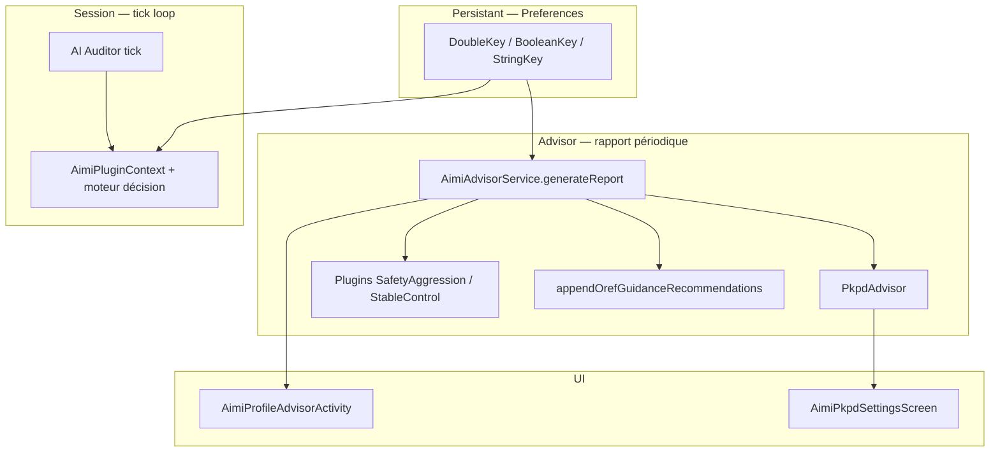

# AIMI — Préférences, tuning et couverture Advisor

**Date :** 2026-05-20  
**Branche de référence :** `dev_OAPSAIMI_mergeDEV`  
**Objectif :** vérifier si l’**AIMI Profile Advisor** reprend les dernières options ajoutées dans les préférences Compose, documenter l’écart, et proposer une feuille de route produit (profils macro + `TuningAdvisor`).

---

## Verdict exécutif

**Non — l’Advisor ne couvre pas toutes les préférences récentes.**

| Catégorie | Nombre approx. de clés UI | Couverture Advisor |
|-----------|----------------------------|--------------------|
| Écran OAPS principal (SMB, DynISF, UAM…) | ~25 | ❌ Aucune recommandation Apply |
| Préférences utilisateur AIMI (hors sous-écrans) | ~15 | ⚠️ Partielle (`MaxSMB`, métriques lues) |
| PKPD + gouvernance SMB | ~25 | ✅ **Bonne** (~12 clés Apply + cartes OREF) |
| Trajectory / Straight-line tube | 7 | ❌ **Gap majeur** (prefs terrain prioritaires) |
| Adaptive basal governance | ~18 | ❌ |
| Modes repas manuels | ~25 | ⚠️ `LunchFactor` seulement (plugin simpliste) |
| Autodrive | ~10 | ℹ️ Guidance MPC uniquement |
| T3c, WCycle, physio, thyroïde, endo, auditor, NGR | ~40 | ❌ |
| Scenario projection (dashboard) | 0 pref UI | N/A (proto v1, pas de tuning) |

**Environ 12 clés** disposent d’un bouton **Apply** explicite dans l’Advisor. **~100+ clés** exposées dans `OpenAPSAIMIPlugin.buildAimiComposePreferenceItems()` n’ont **aucune** recommandation actionnable.

Les ajouts récents les plus impactants côté terrain — **Straight-line tube**, **Trajectory Guard**, **Adaptive basal**, **High BG Max SMB** — sont **absents** du moteur de recommandations.

---

## Architecture : qui fait quoi ?

Quatre mécanismes distincts coexistent ; les confondre explique une partie de la complexité perçue des prefs.

| Rôle | Fichiers clés | Horizonte | Apply utilisateur ? |
|------|---------------|-----------|---------------------|
| **Advisor (coach)** | `AimiAdvisorService.kt`, `PkpdAdvisor.kt`, `AimiProfileAdvisorActivity.kt` | 7–10 j CGM + OREF | ✅ Apply explicite + cooldown 48 h/clé |
| **PKPD settings guidé** | `AimiPkpdSettingsScreen.kt`, `PkpdSettingsSupport.kt` | 7 j (même `PkpdAdvisor`) | ✅ Apply par carte |
| **Plugins décision (legacy refactor)** | `SafetyAggressionPlugin`, `StableControlPlugin` | **Instantané** (BG/delta du tick) | ⚠️ Proposé dans Advisor mais logique ≠ TIR 7 j |
| **OREF guidance** | `appendOrefGuidanceRecommendations` | OREF + métriques | ℹ️ **Pas de Apply** — orientation clinique |
| **AI Auditor** | prefs `AimiAuditor*` | Tick décision | Modulation soft si mode ≠ AUDIT_ONLY |
| **Profils macro (proposé, non impl.)** | — | Bundle one-shot | Apply bundle supervisé |

**Principe produit validé en discussion :** l’Advisor reste un **coach** avec Apply explicite ; pas d’auto-apply massif LLM sur toutes les prefs.

---

## Pipeline de génération du rapport

1. **`collectContext(periodDays)`** — snapshot profil, métriques TIR, sous-ensemble prefs (`AimiPrefsSnapshot`, `PkpdPrefsSnapshot`).
2. **`OrefLocalPipeline.run`** — priorité hypo/hyper, signaux ML optionnels (`OApsAIMIAdvisorPersonalOrefMl`).
3. **`generateRecommendations`** :
   - plugins → `PreferenceUpdate` mappés en cartes ;
   - règles PKPD « pragmatic relief » / Red Carpet / Priority MaxIOB (bidirectionnel hypo/hyper) ;
   - **`appendOrefGuidanceRecommendations`** (ISF, basal, IC, PKPD review, MPC AutoDrive) — **sans action**.
4. **`PkpdAdvisor.analysePkpd`** — règles déterministes DIA/peak/ISF fusion/damping avec garde-fous OREF et Trend Guard.
5. **Filtrage visibilité** — `isRecommendationVisible` : cooldown **48 h par clé**, valeur déjà atteinte, suppression PKPD si **T3c Brittle Mode** actif.

Références code :

- Entrée rapport : `AimiAdvisorService.generateReport` (~L107)
- Snapshot prefs : `collectContext` (~L165–223)
- Apply UI : `AimiProfileAdvisorActivity.applyAction` (~L742)
- Cooldown : `shouldShowRecommendation` (~L999)

---

## Inventaire des clés **Apply** (actionnables)

### Tableau synthétique — 12 clés uniques

| Clé | Source | Condition principale | Direction |
|-----|--------|----------------------|-----------|
| `OApsAIMIPkpdEnabled` | `PkpdAdvisor` | PKPD off + TIR &lt; 70 % | → `true` |
| `OApsAIMIPkpdInitialDiaH` | `PkpdAdvisor` | Hyper ou hypo dominant (mode exclusif) | ±0.5 h |
| `OApsAIMIPkpdInitialPeakMin` | `PkpdAdvisor` | Idem | ±5 min |
| `OApsAIMIIsfFusionMaxFactor` | `PkpdAdvisor` | Hyper → ↑ ; hypo → ↓ | ±0.1 |
| `OApsAIMISmbTailDamping` | `PkpdAdvisor` | Hyper → ↓ damping ; hypo → ↑ | ±0.08–0.1 |
| `OApsAIMIPkpdPragmaticReliefEnabled` | `AimiAdvisorService` | Hyper &gt; 25 %, hypo &lt; 4 % | → `true` |
| `OApsAIMIPkpdPragmaticReliefMinFactor` | `AimiAdvisorService` | Hyper / hypo (bidirectionnel) | → 0.75 ou −0.06 |
| `OApsAIMIRedCarpetRestoreThreshold` | `AimiAdvisorService` | Hyper / hypo (bidirectionnel) | → 0.75 ou −0.05 |
| `OApsAIMIPriorityMaxIobFactor` | `AimiAdvisorService` | Hyper / hypo (bidirectionnel) | → 1.20 ou −0.08 |
| `OApsAIMIPriorityMaxIobExtraU` | `AimiAdvisorService` | Hypo élevé uniquement | −0.5 U |
| `OApsAIMIMaxSMB` | `SafetyAggressionPlugin` | BG &lt; 75 ou chute rapide | ×0.7 |
| `OApsAIMILunchFactor` | `StableControlPlugin` | `lunchFactor &lt; 1.2` (sans métrique TIR réelle) | +0.1 |

### Lacune connue sur Priority MaxIOB (hyper)

La carte `aimi_adv_rec_priority_maxiob_desc` mentionne factor **et** extra (+2.0 U), mais l’action Apply ne met à jour que **`OApsAIMIPriorityMaxIobFactor`** (pas `OApsAIMIPriorityMaxIobExtraU` sur la branche hyper).

---

## Cartes **guidance only** (OREF — pas de Apply)

Affichées si OREF `dataSufficiency` ≠ INSUFFICIENT. Strings EN dans `plugins/aps/src/main/res/values/strings.xml` (`aimi_adv_rec_oref_*`).

| Carte | Sujet | Clés prefs visées manuellement |
|-------|-------|--------------------------------|
| `aimi_adv_rec_oref_isf_hypo_title` | ISF plus doux | Profil ISF (pas une pref AIMI) |
| `aimi_adv_rec_oref_isf_hyper_title` | ISF plus fort | Profil ISF |
| `aimi_adv_rec_oref_isf_mixed_title` | Compromis mixte | Profil ISF |
| `aimi_adv_rec_oref_basal_hypo_title` | Part basale / hypos | Profil basal |
| `aimi_adv_rec_oref_ic_hyper_title` | Ratios repas | Profil IC |
| `aimi_adv_rec_oref_pkpd_review_title` | Revue PKPD globale | Écran PKPD |
| `aimi_adv_rec_oref_autodrive_mpc_title` | MPC plus agressif | `OApsAIMIMpcInsulinUPerKgPerStep` |
| `aimi_adv_rec_oref_autodrive_mpc_hypo_title` | MPC moins agressif | Idem |

---

## Matrice complète : sections prefs Compose → Advisor

Légende : ✅ Apply | ℹ️ Guidance / lecture seule | 📖 Snapshot lu mais pas recommandé | ❌ Non couvert

### Écran OAPS principal (`buildAimiComposePreferenceItems` racine)

| Section / clés | Advisor |
|----------------|---------|
| Max basal, SMB max IOB, DynISF, autosens, LGS, flags SMB/UAM, carbs threshold | ❌ |
| Absorption avancée (short deltas, multipliers) | ❌ |

### Préférences utilisateur — racine

| Clé / groupe | Advisor |
|--------------|---------|
| AI provider + clés API + `OApsAIMIAdvisorPersonalOrefMl` + `OApsAIMIAdvisorLlmRichOref` | ❌ (config Advisor, pas tuning loop) |
| Remote control PIN | ❌ |
| SOS urgence | ❌ |
| Physio assistant (Health Connect, HRV, LLM…) | ❌ |
| `OApsAIMIMLtraining` | ❌ |
| `OApsAIMIMaxSMB` | ✅ (plugin instantané) |
| `OApsAIMIHighBGMaxSMB` | ❌ **Gap terrain repas/hyper** |
| `OApsAIMIweight`, `OApsAIMICHO`, `OApsAIMITDD7` | 📖 partiel (TDD/weight pour métriques export) |
| `OApsxdriponeminute` | ❌ |
| `OApsAIMIpregnancy`, date, `OApsAIMIhoneymoon`, `OApsAIMInight` | ❌ |
| `OApsAIMIUnifiedReactivityEnabled` | 📖 `unifiedReactivityFactor` dans snapshot, pas de rec |

### PKPD (`aimiComposePkpdSubScreen`)

| Clé | Advisor |
|-----|---------|
| `OApsAIMIPkpdEnabled` | ✅ |
| `OApsAIMIPeakGovernorEnabled`, `OApsAIMIPeakGovernorLearnedWeight` | ❌ |
| `OApsAIMIPkpdInitialDiaH`, `OApsAIMIPkpdInitialPeakMin` | ✅ |
| Bounds DIA/peak (4 clés) | 📖 snapshot |
| `OApsAIMIPkpdMaxDiaChangePerDayH`, `MaxPeakChangePerDayMin` | 📖 snapshot ; réglage via écran PKPD (Learning pace), pas Advisor |
| `OApsAIMIIsfFusionMin/Max/MaxChangePerTick` | ✅ max via PkpdAdvisor ; min via slider prudence écran PKPD |
| `OApsAIMIDynIsfTrajectoryTuningEnabled`, `ShadowOnly`, `MaxFraction` | ❌ |
| `OApsAIMISmbTailThreshold` | 📖 snapshot |
| `OApsAIMISmbTailDamping` | ✅ |
| `OApsAIMIPkpdPragmaticReliefEnabled`, `MinFactor` | ✅ |
| `OApsAIMIRedCarpetRestoreThreshold` | ✅ |
| `OApsAIMIIobSurveillanceGuard` | ❌ |
| `OApsAIMIPriorityMaxIobFactor`, `ExtraU` | ✅ (extra surtout réduction hypo) |
| `OApsAIMISmbExerciseDamping`, `SmbLateFatDamping` | 📖 snapshot |

### Trajectory & Straight-line tube (`aimiComposeTrajectorySubScreen`) — **récent**

| Clé | Advisor |
|-----|---------|
| `OApsAIMITrajectoryGuardEnabled` | ❌ |
| `OApsAIMIStraightLineTubeAdvisorEnabled` | ❌ |
| `AimiTubeHypoFloorMgdl` | ❌ |
| `AimiTubeHyperBandMgdl` | ❌ |
| `AimiTubeAggressiveness` | ❌ |
| `AimiTubeBasalTrimMax` | ❌ |
| `AimiTubeKappaSafetyMargin` | ❌ |

**Impact terrain documenté :** montées repas freinées (tube + SafetyNet + MEAL_PRIORITY) alors que l’utilisateur tune tube à la main — l’Advisor ne propose rien sur ce bloc.

### Adaptive basal governance (`aimiComposeAdaptiveBasalSubScreen`)

| Clés (18) : enable + max scaling + hypo rate enter/exit + seuils BG + hold basal/aggressivity floors/decay (normal + severe) + anticipation (4) | ❌ toutes |

### T3c brittle (`aimiComposeT3cSubScreen`)

| `OApsAIMIT3cBrittleMode`, activation, aggressiveness, anticipation | ❌ — mode brittle **supprime** les recs PKPD Advisor |

### Modes repas manuels (`aimiComposeManualModesSubScreen`)

| BF / lunch / dinner / HC / snack / meal / sleep (prebolus, facteurs, intervalles) | ❌ sauf `OApsAIMILunchFactor` ⚠️ |

### Autodrive (`aimiComposeAutodriveSubScreen`)

| `OApsAIMIautoDrive`, active, authoritative, max basal, MPC step, prebolus, variables BG/delta/deviation | ℹ️ MPC step en guidance OREF seulement |

### Cycle femme, inflammatoire, thyroïde, endométriose, AI Auditor, night growth

| ~40 clés string/bool/int/double | ❌ |

### Scenario projection (dashboard)

| Pas de pref utilisateur (proto v1) | N/A — voir `docs/AIMI_SCENARIO_PROJECTION.md` |

### Plugin Calibration (hors arbre AIMI principal)

| No calibration / Linear calibration | ❌ — pipeline `PrepareGraphDataWorker`, pas Advisor |

---

## Ce que `collectContext` lit vs ignore

### `AimiPrefsSnapshot` (5 champs + 2 AutoDrive)

- `OApsAIMIMaxSMB`, `OApsAIMILunchFactor`, unified reactivity learner, `autodriveMaxBasal`, `OApsAIMIautoDrive`, `OApsAIMIMpcInsulinUPerKgPerStep`

**Non lus :** tube, trajectory, HighBGMaxSMB, adaptive basal, modes repas, T3c, modules spécialisés.

### `PkpdPrefsSnapshot` (17 champs)

Couvre l’essentiel PKPD + damping exercise/late fat, **pas** pragmatic relief, Red Carpet, Priority MaxIOB, Peak Governor, DynISF trajectory — ces derniers sont lus **inline** dans `generateRecommendations` ou pas du tout.

---

## Garde-fous et comportements importants

| Mécanisme | Comportement |
|-----------|--------------|
| **Cooldown 48 h** | Après Apply sur une clé, aucune nouvelle carte Apply pour cette clé pendant 48 h (même valeur cible différente). |
| **Trend Guard PKPD** | Si TIR du jour ≥ TIR 7 j, PKPD Advisor silencieux sauf si OREF contredit (signaux hypo/hyper forts). |
| **Mode hypo/hyper exclusif PKPD** | Jamais DIA↑ et DIA↓ dans le même rapport. |
| **T3c Brittle** | Toutes recs domaine `Pkpd` masquées. |
| **SafetyAggressionPlugin** | Déclenche sur **glycémie instantanée** du dummy context Advisor, pas sur `timeBelow70` 7 j — risque de faux positifs dans le rapport. |
| **StableControlPlugin** | Incrémente lunch factor sans vérifier TIR réel (commentaire « simulation » dans le code). |

---

## Écart vs besoins terrain (exemple package support 30/05)

Observations déjà analysées en session :

| Symptôme | Prefs impliquées | Advisor |
|----------|------------------|---------|
| Montée repas lente | `MaxSMB`, `HighBGMaxSMB`, tube, PKPD relief, SafetyNet | ⚠️ Partiel |
| Gap floor/best en hyper post-repas | Scenario engine (pas pref) | N/A |
| Tube agressif (floor 70, agg 1.5) vs scenario SPIRAL | Tube prefs | ❌ |
| Hyper persistant avec hypos rares | Pragmatic relief, MaxIOB, PKPD DIA/peak | ✅ |

---

## Proposition : trois profils macro (non implémentés)

Bundles **supervisés** — une action « Appliquer profil » remplirait plusieurs clés avec garde-fous. À distinguer des recs Advisor unitaires.

### Profil **Prudent**

| Domaine | Valeurs indicatives |
|---------|---------------------|
| SMB | `MaxSMB` ↓, `HighBGMaxSMB` modéré |
| PKPD | Relief off ou min factor 0.65 ; damping tail ↑ |
| Tube | Off ou agg 0.8, hypo floor 80 |
| Priority MaxIOB | factor 1.0, extra 0 |
| Adaptive basal | enable si T3c ; gouvernance hypo stricte |

### Profil **Standard** (défaut recommandé post-install)

| Domaine | Valeurs indicatives |
|---------|---------------------|
| PKPD | Enabled, relief on 0.75, Red Carpet 0.75 |
| Tube | Guard off ; tube advisor off jusqu’à stabilisation TIR |
| Max SMB | defaults clés |
| Trajectory DynISF | shadow only si DynISF actif |

### Profil **Assertif** (hyper dominant, hypos &lt; 3 %)

| Domaine | Valeurs indicatives |
|---------|---------------------|
| Tube | Enable + agg 1.2–1.5, hyper band selon cible |
| Pragmatic relief | 0.75–0.80 |
| Priority MaxIOB | factor 1.20, extra +1.5–2 U |
| PKPD | ISF fusion max ↑, damping tail ↓ si hypos rares |

**Garde-fous communs :** jamais appliquer assertif si `timeBelow70` 7 j &gt; 5 % ; bloquer si T3c brittle sans revue clinician ; cooldown profil 7 j.

---

## Roadmap technique : `TuningAdvisor` (priorisée)

Extension déterministe de `AimiAdvisorService` (ou plugin `TuningAdvisor.kt`), **sans LLM**, réutilisant OREF + métriques 7 j.

| Priorité | Bloc | Clés cibles | Règles esquissées |
|----------|------|-------------|-------------------|
| P0 | Straight-line tube | 5 clés `AimiTube*` + enable flags | Hyper &gt; 20 %, hypo &lt; 4 % → suggérer enable tube + agg step ; hypo &gt; 6 % → ↓ agg / ↑ hypo floor |
| P0 | High BG SMB | `OApsAIMIHighBGMaxSMB` | Si montées &gt; 180 post-repas fréquentes et `MaxSMB` déjà haut → ↑ HighBGMaxSMB par pas 0.1 U |
| P1 | Modes repas | Facteurs lunch/dinner | Si hyper post-prandial + OREF hyper → ↑ facteur mode dominant (pas seulement lunch) |
| P1 | Exercise / late fat damping | `SmbExerciseDamping`, `SmbLateFatDamping` | Si logs exercice / repas gras corrélés aux hypors différées |
| P2 | Adaptive basal | Gouvernance hypo | Si hypo nocturne + hold actif fréquent (logs) → revue seuils enter/exit |
| P2 | Peak Governor | Enable + weight | Si PKPD oscillations peak (state logs) |
| P3 | IOB surveillance | `OApsAIMIIobSurveillanceGuard` | Si dépassements MaxIOB récurrents sans hypo |
| P3 | DynISF trajectory | 3 clés | Si DynISF actif + variance ISF |

**Implémentation suggérée :**

1. Étendre `AdvisorContext` avec `TubePrefsSnapshot`, `MealModeSnapshot`.
2. Ajouter tests unitaires sur seuils (comme `PkpdAdvisor`).
3. Réutiliser `isRecommendationVisible` et strings `aimi_adv_rec_tube_*` (à créer, EN only).
4. Ne pas fusionner avec AI Auditor (rôle tick ≠ coach hebdo).

---

## Strings et i18n

| Préfixe | Usage |
|---------|-------|
| `aimi_adv_rec_*` | Cartes Advisor (EN source dans `values/strings.xml`) |
| `aimi_pkpd_*` | PKPD Advisor + écran guidé |
| `aimi_adv_apply_*` | Dialog Apply |

Les traductions ES/LT contiennent parfois du FR hérité ; ne modifier que **values/** (EN) pour nouvelles clés.

---

## Fichiers de référence

| Fichier | Rôle |
|---------|------|
| `plugins/aps/.../OpenAPSAIMIPlugin.kt` | Arbre prefs Compose complet |
| `plugins/aps/.../advisor/AimiAdvisorService.kt` | Rapport, OREF, pragmatic rules |
| `plugins/aps/.../advisor/PkpdAdvisor.kt` | Règles PKPD déterministes |
| `plugins/aps/.../advisor/AdvisorModels.kt` | Snapshots contexte |
| `plugins/aps/.../advisor/AimiProfileAdvisorActivity.kt` | UI + Apply |
| `plugins/aps/.../compose/AimiPkpdSettingsScreen.kt` | PKPD guidé |
| `plugins/aps/.../plugins/impl/SafetyAggressionPlugin.kt` | MaxSMB instantané |
| `plugins/aps/.../plugins/impl/StableControlPlugin.kt` | Lunch factor |
| `core/keys/DoubleKey.kt`, `BooleanKey.kt` | Définitions clés |
| `docs/AIMI_SCENARIO_PROJECTION.md` | Scenario v1 (hors prefs) |
| `docs/AIMI_RISK_ENVELOPE_SPEC.md` | Enveloppe risque EARLY/DECISION |

---

## Checklist de validation manuelle

Pour confirmer ce document sur device :

- [ ] Ouvrir Advisor avec TIR 7 j stable → cartes PKPD absentes (Trend Guard).
- [ ] Activer T3c brittle → cartes PKPD masquées après refresh.
- [ ] Apply `PragmaticReliefEnabled` → carte disparaît 48 h.
- [ ] Régler tube (agg 1.5, floor 70) → **aucune** carte tube (gap attendu).
- [ ] Hyper post-repas + `HighBGMaxSMB` bas → **aucune** carte (gap attendu).
- [ ] AutoDrive on + hyper → carte guidance MPC sans bouton Apply.
- [ ] Écran PKPD Compose → cartes `PkpdAdvisor` avec Apply indépendant.

---

## Conclusion

L’Advisor actuel est **solide sur PKPD et la gouvernance SMB récente** (pragmatic relief, Red Carpet, Priority MaxIOB, damping tail), avec une couche **OREF prudente** sur profil et AutoDrive.

Il **ne reflète pas** encore tous les blocs prefs via cartes unitaires ; le **Tuning Context** (Advisor UI) comble partiellement l’écart pour tube + SMB repas.

---

## Implémentation Tuning Context (2026-05-20)

| Fichier | Rôle |
|---------|------|
| `advisor/tuning/TuningContextEngine.kt` | Calcul du plan + dosage gradué |
| `advisor/tuning/TuningContextApplySupport.kt` | Apply, résumé, export prefs |
| `advisor/tuning/TuningContextModels.kt` | Enums / DTO |
| `AimiProfileAdvisorActivity.kt` | UI chips + Preview / Apply |
| `StringKey.AimiTuningContextSelection` | Dernier contexte sélectionné |

### Contextes utilisateur

| Contexte | Intent |
|----------|--------|
| `MEAL_RISE` | Montées repas / hyper post-prandial |
| `HYPO_GUARD` | Protection hypo |
| `HYPER_STABLE` | Hyper général modéré |
| `AUTO_BALANCE` | Résolution auto depuis métriques 7 j |
| `MIXED_BALANCE` | *(interne, via Auto)* Hypos + hypers significatifs |

### Logique bidirectionnelle (2026-05-20)

| Situation | Comportement |
|-----------|--------------|
| **Hypo guard** | ↓ MaxSMB, HighBGMaxSMB, MaxIOB, relief min, Red Carpet · ↑ tail damping · ↓ lunch/dinner factors · tube ↓ agg / ↑ hypo floor · si hypos ≥4.5 % **tube off** · si hypos ≥5.5 % **relief off** |
| **Meal rise** + hypos 4–6 % | Palier capé **MICRO** · pas de tube / MaxIOB / relief · **↓ lunch factor** à la place |
| **Meal rise** + hypos >6 % | **Bloqué** → utiliser Hypo guard |
| **Hyper control** + hypos ≥4.5 % | **Bloqué** → Hypo guard ou Auto |
| **Auto → Mixed** | hypo ≥4 % **et** hyper ≥12 % sans dominant clair · ↓ clés agressives (hypo) · relief **on** sans ↑ SMB · Red Carpet ↑ léger si hypos <5 % |

### Dosage (3 paliers)

| Palier | Hyper (% >180) | Hypo (% <70) |
|--------|----------------|--------------|
| **MICRO** | 18–28 % | 3.5–5.5 % |
| **MODERATE** | 28–40 % | 5.5–8 % |
| **STRONG** | ≥40 % | ≥8 % |

Chaque clé utilise des **deltas distincts** par palier (ex. HighBGMaxSMB +0.05 / +0.12 / +0.25 U). Valeurs clampées aux min/max des clés ; pas de changement si déjà à la cible.

### Export post-apply

Si **export non surveillé** + mot de passe valide (Maintenance), `exportSharedPreferencesNonInteractive` est appelé après apply.

---

*Document généré par audit code statique — comportement runtime à confirmer par l’utilisateur sur device.*
