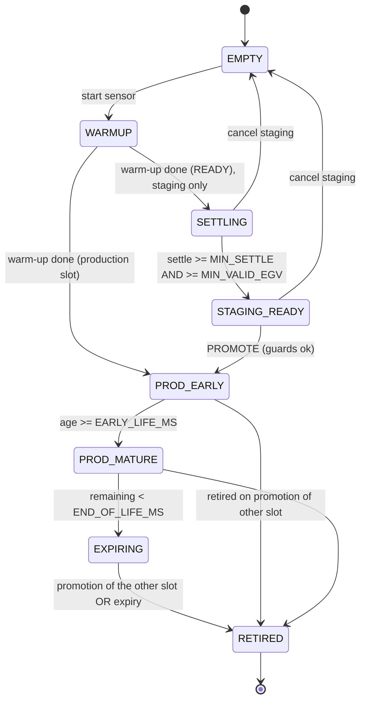

# Plan de conception — Dexcom ONE+ : double capteur (staging / pré-soak) + début de vie au dashboard

> Statut : **PLAN — à valider avant tout développement.**
> ⚠️ La **promotion** d'un capteur staging change la source de glycémie qui **alimente la boucle**
> (dosage insuline) → tâches marquées **safety-critical**, à faire relire par mainteneur + clinicien
> et valider en device avant merge. **Aucune calibration automatique** n'est proposée (voir §9).
> Ce document décrit un comportement logiciel ; ce n'est pas un conseil médical.

---

## 1. Objectif & scénario

Le ONE+/G7 est **bruité (« jumpy »)** pendant ses ~10 premières heures, alors que ses **12 dernières
heures** (capteur mûr) sont stables. On veut **chevaucher** l'ancien et le nouveau capteur : démarrer
le nouveau **pendant que l'ancien tourne encore**, le laisser se stabiliser **sans qu'il alimente la
boucle**, puis **basculer** en production quand il est prêt.

**Scénario nominal (timeline) :**
```
Capteur A (production)      |==================== 10 j ===================|== grâce 12 h ==|  fin
                                                                          ^ démarre B
Capteur B (staging)                                                       |== warm-up 30' + settle ~12h ==|
                                                                                              ^ PROMOTION (bouton)
Boucle alimentée par :      |------------------ A -------------------------------------------|--- B ---|
Publié dans CGM (loop)      : A uniquement                                                    | bascule| B
Collecté sans publier       :                                            B (staging, QA/affichage seulement)
```

**Règles dures :**
- Le staging **ne publie jamais** dans la couche glycémie (aucun `insertCgmSourceData`) tant qu'il
  n'est pas promu.
- La **boucle voit toujours exactement une source** ONE+ (celle en production). Pas de double-source,
  pas de trou à la bascule.
- **Pas de calibration auto** sur l'ancien capteur (§9).
- L'utilisateur voit sur le dashboard **le début de vie** du capteur (âge/jeune/settling) et l'**état
  du staging** (settle restant, « prêt à promouvoir »).

---

## 2. Principes & contraintes

- **Une seule BgSource loop-facing.** `DexcomOnePlusPlugin` reste **l'unique** source vue par la
  boucle (`Sources.DexcomOnePlus`). Le multi-instance est **interne** au plugin : deux instances de
  driver (PRODUCTION + STAGING) ; seule la PRODUCTION appelle `persistenceLayer.insertCgmSourceData`.
  → évite une 2ᵉ source loop, évite un double dosage.
- **Deux sessions BLE concurrentes.** Deux transmetteurs = deux connexions. Notre driver est
  aujourd'hui un **singleton** (`OnePlusCgmDrivers.default()`), utilisé aussi par les activités —
  c'est le refactor central (§4).
- **Réutilise l'acquis warm-up** : `CgmWarmupProvider`/`CgmWarmupStatus`, l'anneau dashboard, la
  notif, la garde basal — étendus par **slot**.
- **Contraintes projet (CLAUDE.md)** : imports explicites, strings EN only, thème en Compose, **aucune
  nouvelle dépendance inter-module** non discutée, compile module par module.

---

## 3. Modèle de données & interfaces (à figer en premier)

### 3.1 Slot
```kotlin
enum class SensorSlot { PRODUCTION, STAGING }
```

### 3.2 Cycle de vie capteur (NOUVEAU — l'info « début de vie » au dashboard)
Dans `:core:interfaces` (générique, pas de ONE+ en dur) :
```kotlin
data class CgmSensorLifecycle(
    val slot: SensorSlot,
    val startedAtEpochMs: Long?,     // début de session capteur
    val expiresAtEpochMs: Long?,     // start + durée nominale (+ grâce)
    val ageMs: Long?,                // now - started
    val remainingMs: Long?,          // expires - now
    val earlyLife: Boolean,          // ageMs < EARLY_LIFE_MS  → « jour 1 / se stabilise »
    val endOfLife: Boolean,          // remainingMs < END_OF_LIFE_MS (ex. 12 h) → « penser à démarrer un capteur »
)

interface CgmSensorStatusProvider {
    /** État warm-up (existant) + cycle de vie, par slot. */
    val warmupStatus: StateFlow<CgmWarmupStatus?>          // slot PRODUCTION (compat existante)
    val lifecycle: StateFlow<CgmSensorLifecycle?>          // slot PRODUCTION
    val stagingWarmupStatus: StateFlow<CgmWarmupStatus?>   // slot STAGING (null si pas de staging)
    val stagingLifecycle: StateFlow<CgmSensorLifecycle?>
    val stagingState: StateFlow<StagingState>
}
```
> `CgmWarmupProvider` existant reste (compat) ; `CgmSensorStatusProvider` l'étend.

### 3.3 Constantes (tunables, revue clinicien)
| Constante | Valeur proposée | Rôle |
|---|---|---|
| `SENSOR_LIFE_MS` | 10 j | durée nominale |
| `SENSOR_GRACE_MS` | 12 h | prolongation de fin de vie |
| `EARLY_LIFE_MS` | 12 h | fenêtre « début de vie / se stabilise » (couvre le jumpy ~10 h) |
| `END_OF_LIFE_MS` | 12 h | fenêtre « penser à démarrer un nouveau capteur » |
| `STAGING_MIN_SETTLE_MS` | 12 h | durée minimale de staging avant promotion autorisée |
| `STAGING_MIN_VALID_EGV` | ex. 6 EGV consécutifs Ok | gage de flux stable avant promotion |

### 3.4 Action de promotion
```kotlin
// Résultat explicite (pour l'UI + l'audit)
sealed interface PromotionResult { object Ok; data class Rejected(val reason: PromotionRejectReason) }
enum class PromotionRejectReason { STAGING_ABSENT, STAGING_NOT_SETTLED, STAGING_NO_VALID_GLUCOSE, LOOP_BUSY }
```

---

## 4. Architecture multi-instance

### 4.1 Registre de drivers (remplace le singleton)
`OnePlusCgmDrivers.default()` → `OnePlusCgmDrivers.forSlot(slot: SensorSlot)`, chaque slot ayant :
- son **`OnePlusCgmDriverReal`** (session BLE, executor daemon dédié) ;
- son **`OnePlusSensorStore` namespacé** (identité / MAC / clé KEKS / session **préfixés par slot** —
  ex. clés SharedPreferences `oneplus.production.*` / `oneplus.staging.*`) ;
- sa **notification** (`DexcomOnePlusWarmupNotification` par slot, ID distinct) ;
- son état `warmup` / `lifecycle`.

### 4.2 Gating d'ingestion par slot (le cœur « collecte sans publier »)
Dans `DexcomOnePlusPlugin` (unique BgSource) :
- glycémie du slot **PRODUCTION** → `insertCgmSourceData(Sources.DexcomOnePlus, …)` (comme aujourd'hui,
  toujours soumis à `isWarmupBlockingIngest`).
- glycémie du slot **STAGING** → **buffer local** (mémoire + éventuel petit store volatil) pour
  l'affichage/QA. **Jamais** `insertCgmSourceData`. Réutilise le pattern `isWarmupBlockingIngest`
  généralisé en `publishPolicy(slot)`.

### 4.3 Promotion (bascule)
`promoteStagingToProduction()` (suspend, safety-gated §8) :
1. Vérifie les gardes (staging settled ≥ `STAGING_MIN_SETTLE_MS`, ≥ `STAGING_MIN_VALID_EGV`, boucle
   pas occupée). Sinon `Rejected(reason)`.
2. **Retire** l'ancien PRODUCTION (stop session, marque le store production comme expiré/retiré).
3. **Ré-affecte** : le driver STAGING **devient** PRODUCTION (swap des références de slot + migration
   du store staging → production, ou simple bascule du pointeur de slot).
4. À partir de maintenant, ce driver **publie** dans la boucle. Le nouveau capteur peut être
   **early-life** → l'anneau dashboard affiche « se stabilise » (§5), et la **garde basal warm-up**
   (déjà en place) couvre tout warm-up résiduel.
5. **Pas de backfill** des valeurs staging non validées dans la boucle (sauf décision explicite en
   revue) — on repart proprement du live.
6. Log UEL/audit `autoForced`/`by user`, notification de confirmation.

### 4.4 Impact activités
`DexcomOnePlusStartActivity` reçoit un **slot cible** : « Démarrer (production) » vs « Démarrer en
staging (pré-soak) ». Le scan/appairage cible le store du slot. Un **écran de gestion double-capteur**
(ou une section de l'écran statut) montre les deux slots + le bouton **Promouvoir**.

---

## 5. Dashboard / zone CGM — « début de vie » + staging (exigence explicite)

Réutilise l'anneau héro (`DashboardComposeHeroUiMapper` / `GlucoseCircleTop`) et les chips.

**a) Capteur PRODUCTION — info début de vie (dans la zone CGM) :**
- `earlyLife == true` → sous l'anneau (ou en badge), mention **« Jour 1 · se stabilise »** + l'âge
  (ex. « capteur 6 h ») — **information**, non alarmante, pour signaler des valeurs potentiellement
  bruitées. La glycémie reste affichée normalement (l'anneau ne passe PAS en warm-up).
- `endOfLife == true` → hint **« Expire dans Xh — démarrer un capteur »**.

**b) Capteur STAGING — carte/chip dédiée :**
- warm-up staging → mini-anneau/chip « Nouveau capteur · réchauffe · fin Xh » (réutilise l'anneau
  warm-up qui **se remplit**, déjà codé).
- settling → « Nouveau capteur · stabilisation · prêt dans Xh » + barre de progression sur
  `STAGING_MIN_SETTLE_MS`.
- `STAGING_READY` → chip **verte « Prêt à promouvoir »** + bouton **Promouvoir** (tap → confirm §8).
- **overlay de comparaison (option, sans cal)** : superposer la courbe staging (grise) sur le graphe
  pour comparaison **visuelle** — jamais d'ajustement des valeurs.

**Générique** : le dashboard lit `CgmSensorStatusProvider` de la source active ; aucun ONE+ en dur.

---

## 6. Machine à états (schéma de validation)

État d'un **slot** :



- **PROD_EARLY** = publie dans la boucle **et** affiche « se stabilise » (début de vie).
- **SETTLING / STAGING_READY** = collecte **sans publier**.
- **PROMOTE** = la seule transition qui change la source de la boucle (safety-gated).

---

## 7. Comportement attendu — matrice de validation

`P` = slot production, `S` = slot staging. « Publié loop » = ce que reçoit la boucle.

| # | État P | État S | Action | Publié loop | Dashboard (zone CGM) | Bouton Promouvoir | Note safety |
|---|---|---|---|---|---|---|---|
| V1 | PROD_MATURE | EMPTY | — | P (glycémie) | glycémie normale | caché | nominal |
| V2 | PROD_MATURE | WARMUP | start S | P | glycémie P + chip « nouveau capteur : réchauffe » | désactivé | S ne publie pas |
| V3 | PROD_MATURE/EXPIRING | SETTLING | — | P | glycémie P + chip « stabilisation, prêt dans Xh » | désactivé | S ne publie pas |
| V4 | EXPIRING | STAGING_READY | — | P | glycémie P (+ « expire dans Xh ») + chip verte « prêt » | **activé** | promotion possible |
| V5 | EXPIRING | STAGING_READY | **PROMOTE** | **bascule P→S** | S devient l'anneau ; « Jour 1 · se stabilise » | caché | **safety** : gardes §8, pas de trou |
| V6 | PROD_EARLY (=S promu) | EMPTY | — | S | glycémie S + **« début de vie / se stabilise »** | caché | garde basal warm-up active si warm-up |
| V7 | any | SETTLING/READY | cancel S | P | chip staging disparaît | caché | S stoppé, rien publié |
| V8 | EXPIRED | EMPTY | — | (rien) | « pas de capteur » | caché | boucle sans donnée → garde basal profil (warm-up) s'applique |
| V9 | PROD_MATURE | STAGING_READY | PROMOTE alors que P encore bon | bascule P→S | idem V5 | — | autorisé mais averti (perte de la fin de vie stable de P) |
| V10 | any | any | PROMOTE si S non settled | **inchangé** | toast « capteur pas encore stabilisé » | — | `Rejected(STAGING_NOT_SETTLED)` |

**Invariants à vérifier (tests) :**
- I1 : à tout instant, **≤ 1** slot publie (`insertCgmSourceData`).
- I2 : le staging n'insère **jamais** de glycémie tant que non promu.
- I3 : la promotion ne crée **ni trou ni double-insert** (continuité de la source loop).
- I4 : après promotion, `earlyLife` du nouveau capteur est **vrai** et affiché.
- I5 : cancel/retire d'un slot n'affecte pas l'autre.

---

## 8. Safety & gardes

- **Promotion (safety-critical)** : autorisée **seulement** si `stagingState == STAGING_READY`
  (settle ≥ `STAGING_MIN_SETTLE_MS`, ≥ `STAGING_MIN_VALID_EGV`) et boucle non occupée. **Dialogue de
  confirmation** obligatoire. Journalisée (UEL).
- **Réutilise la garde basal warm-up** (`DexcomOnePlusWarmupBasalGuard`, option b) : si le capteur
  promu est encore en warm-up/sans glycémie, la garde maintient le basal profil (déjà couvert).
- **Pas de backfill** des valeurs staging non validées dans la boucle (défaut).
- **Deux sessions BLE** : surveiller batterie/stabilité ; le process reste vivant via `DummyService`
  (FGS), pas de nouveau service requis.
- **AUCUNE calibration automatique** (§9).

---

## 9. Hors scope / décisions clinicien (explicite)

- ❌ **Calibration auto sur le capteur fin de vie** : rejetée par conception. Un capteur fin de vie
  n'est pas une référence-or ; calibrer CGM-vs-CGM injecte un biais que la boucle doserait ensuite.
  **Au plus** : overlay de **comparaison visuelle** (staging vs production), jamais d'ajustement des
  valeurs utilisées par la boucle. Toute évolution vers une cal réelle = étude séparée + revue
  clinicien + validation, hors de ce plan.
- Décision clinicien : valeurs de `EARLY_LIFE_MS`, `STAGING_MIN_SETTLE_MS`, `STAGING_MIN_VALID_EGV`.
- Décision : autoriser (V9) la promotion alors que P est encore bon (perte de fin de vie stable).

---

## 10. Découpage par agent (dev — après validation de ce plan)

| Agent | Périmètre | Sortie / critères |
|---|---|---|
| **B1 Contrat** | `:core:interfaces` : `SensorSlot`, `CgmSensorLifecycle`, `CgmSensorStatusProvider`, `PromotionResult` | compile ; interfaces stables |
| **B2 Multi-instance** | Registre `OnePlusCgmDrivers.forSlot`, stores namespacés, sessions/notifs par slot | 2 sessions concurrentes ; I5 |
| **B3 Ingest & promotion** | Gating publish par slot dans `DexcomOnePlusPlugin` ; buffer staging ; `promoteStagingToProduction` + gardes | I1–I4 ; safety |
| **B4 Dashboard début-de-vie + staging** | `DashboardComposeHeroUiMapper`/chips : badge début de vie, carte staging, bouton Promouvoir, overlay compare | additif, générique, non-régression |
| **B5 UI flux** | `StartActivity` slot-aware, écran gestion double-capteur | ergonomie ; confirm promotion |
| **B6 Vérification 🔎** | compile module/module, tests des invariants I1–I5 + matrice V1–V10, audit conventions, **revue safety adversariale** de la promotion | GO/NO-GO par invariant + par ligne de matrice |

---

## 11. Plan de validation (device) & critères d'acceptation

1. **Deux capteurs réels** : A en production, démarrer B en staging (V2) → B réchauffe/settle **sans**
   apparaître dans la glycémie loop ; A continue de doser.
2. Dashboard : chip staging avec settle restant ; capteur A montre « expire dans Xh » à l'approche.
3. À `STAGING_READY` (V4) → bouton **Promouvoir** actif ; promotion (V5) → **bascule sans trou**,
   l'anneau devient B avec **« Jour 1 · se stabilise »** (V6).
4. Vérifier **I1–I5** (logs) : jamais 2 publications, jamais de staging publié, pas de double-insert
   à la bascule.
5. Garde basal : si B promu encore en warm-up → **basal profil** maintenu (option b).
6. Non-régression : capteur unique classique inchangé ; autres sources / overview classique intacts.

---

## 12. Definition of Done
Invariants I1–I5 + matrice V1–V10 satisfaits ; modules compilent ; tests verts ; **revue safety
(promotion) + device signés** ; aucune cal auto ; rien de commité sans validation utilisateur.

*Plan préparé en tant qu'architecte logiciel senior. La promotion (changement de source loop) et toute
logique touchant le dosage sont des livrables de travail à faire valider par un mainteneur/clinicien
avant mise en œuvre en production.*
