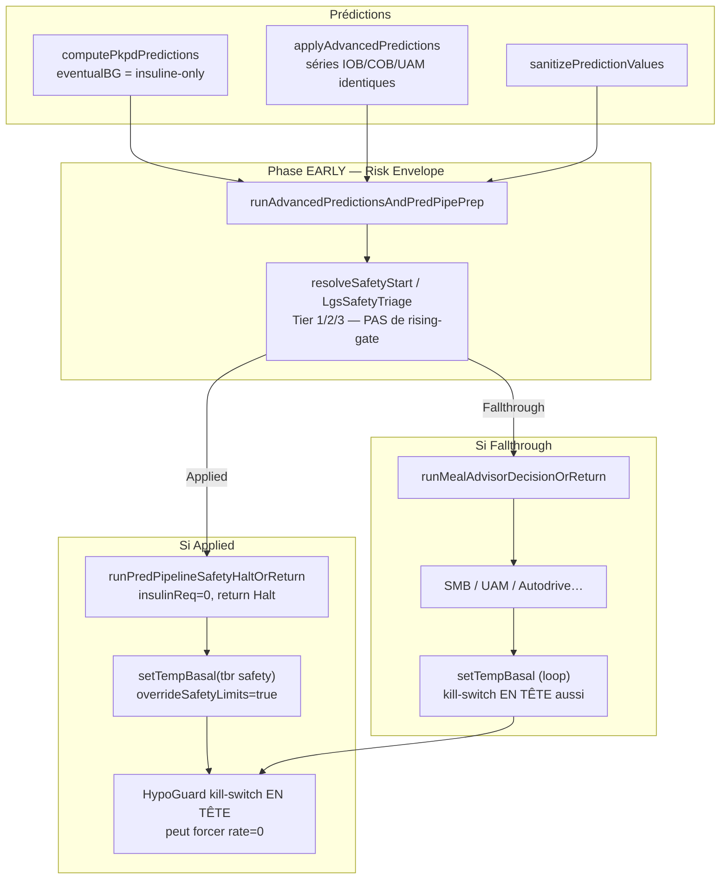

# LGS prédictif « meal-blind » — analyse de cas et plan de correction long terme

**Status:** IMPLEMENTED (Phases 0–5) — 2026-05-29  
**Melder / cas:** Thomas Willems (superbolus manuel sans entrée glucides, pattern AIMI courant)  
**Branch:** `dev_OAPSAIMI`  
**Severity:** 🟠 Haut — sabote la réponse repas ; nécessite réactivations manuelles répétées de meal mode  
**Type:** Asymétrie produit + incohérence interne (pas de crash ; angle mort prédictif)

### Décision produit retenue (2026-05-29)

- **Tier 2 / Tier 3** : réduire la basale (25 % / 50 %) **sans arrêter le tick** — Meal Advisor et SMB peuvent continuer.
- **Tier 1 / bruit CGM** : halt complet conservé (TBR 0, `insulinReq = 0`).
- **Meal mode + BG > hypo** : TBR forcé (`forceExact`) bypass le kill-switch prédictif.
- **Évaluateur unifié** : `PredictiveHypoEvaluator` + `MealSafetyContext`.

**Documents liés:**

| Document | Lien |
|----------|------|
| Checklist non-régression | [NON_REGRESSION_CHECKLIST.md](NON_REGRESSION_CHECKLIST.md) |
| Risk envelope (hypo unification) | [AIMI_RISK_ENVELOPE_SPEC.md](AIMI_RISK_ENVELOPE_SPEC.md) |
| Invariants pipeline | [plugins/aps/.../AIMI_ORCHESTRATION_ROADMAP.md](../plugins/aps/src/main/kotlin/app/aaps/plugins/aps/openAPSAIMI/orchestration/AIMI_ORCHESTRATION_ROADMAP.md) |
| Bypass LGS modes repas (autre chemin) | [MEAL_MODES_LGS_BYPASS_FINAL.md](MEAL_MODES_LGS_BYPASS_FINAL.md) |
| Audit sécurité BG120 | [SAFETY_AUDIT_BG120_COMPLETE.md](SAFETY_AUDIT_BG120_COMPLETE.md) |

---

## 1. Résumé exécutif

Lors d’un **superbolus manuel sans glucides enregistrées** (COB = 0, usage AIMI normal pour certains utilisateurs), la prédiction PKPD **insuline-only** effondre `eventualBG` vers le plancher numérique (**39 mg/dL**). Deux portes LGS réagissent à cette prédiction alors que la glycémie réelle reste confortable, voire monte après le repas :

1. **`LgsSafetyTriage`** (`trySafetyStart`) — tiers prédictifs **sans rising-gate** → halt du tick **avant** Meal Advisor et SMB.
2. **`HypoGuard` dans `setTempBasal`** — kill-switch en tête de fonction → peut forcer **TBR 0** y compris sur un TBR meal-mode ou un Tier 2 « basale −75 % ».

**Ce n’est pas un bug de crash** : le code fait ce pour quoi il a été écrit. C’est une **asymétrie produit** : le dosage (UAM, meal mode, SMB) est conçu pour des repas sans COB explicite ; la couche hypo/LGS prédictive ne l’est pas.

**Correction long terme recommandée :** unifier la logique « quand une prédiction basse est-elle clinique ? » dans une couche partagée, brancher **tous** les consommateurs (LGS tiers, kill-switch, SMB guard), enrichir le contexte repas, et faire évoluer le pipeline prédictif — **pas** seulement coller un patch local sur Tier 2/3.

---

## 2. Pattern produit visé

| Élément | Description |
|---------|-------------|
| **Profil type** | Cible ~100 mg/dL, ISF variable, Lyumjev / insuline rapide, Dexcom |
| **COB** | Structurellement 0 (pas de saisie glucides) |
| **Action utilisateur** | Lunch Mode + bolus manuel important (ex. 7,0 U) **avant** la montée glycémique |
| **Attente** | SMB / meal advisor / TBR repas couvrent la montée post-prandiale |
| **Observé** | LGS prédictif coupe insuline + tick complet pendant la montée ; SMB throttled ; meal modes répétés |

Ce pattern est **distinct** du cas couvert par [MEAL_MODES_LGS_BYPASS_FINAL.md](MEAL_MODES_LGS_BYPASS_FINAL.md) (dégradation P2 en modes repas avec BG bas **avant** repas). Ici, le blocage passe par **`trySafetyStart`** et le **kill-switch global `setTempBasal`**, non traités par ce fix historique.

---

## 3. Chronologie observée (2026-05-29, déjeuner)

Profil : target 100, ISF 50→60 (11h–13h), COB = 0.

| Heure | BG | Δ | IOB | eventualBG | Action / symptôme |
|-------|-----|---|-----|------------|-------------------|
| 11:48 | 119 | +2 | −0,16 | 149 | Lunch Mode 7,0 U (ligne plate) |
| 11:53 | 119 | +0,6 | 6,16 | **39** | 🛑 LGS → TBR 0 (tick stoppé) |
| 11:58–12:03 | 120–122 | ~+0,2–0,4 | ~5,8 | 39 | 🛑 LGS → TBR 0 répété |
| 12:19 | **137** | **montée** | 5,43 | 79 | ⚠ `LGS_PRED_LOW: pred=65 … BG actuel=137 OK — Basale réduite 25%` |
| 12:22→14:42 | 152→335 | ↑↑ | 6–8 | — | SMB 0,15–0,7 U ; 2× meal mode forcés |
| 14:18 | 311 | — | 7,28 | 239 | ⚠ `LGS_PRED_LOW: pred=87 … BG actuel=311 OK` |

Les strings `LGS_PRED_LOW` correspondent **exactement** au template Tier 2 de `LgsSafetyTriage.kt`.  
Les messages `🛑 LGS: BG=119 ≤ 90 → TBR 0U/h` proviennent de **`R.string.lgs_triggered`** (`setTempBasal` kill-switch) — le « ≤ » est **trompeur** (BG affiché vs seuil hypo, pas la condition réelle).

---

## 4. Architecture — deux portes LGS + ordre pipeline



**Invariant roadmap n°5** ([AIMI_ORCHESTRATION_ROADMAP.md](../plugins/aps/src/main/kotlin/app/aaps/plugins/aps/openAPSAIMI/orchestration/AIMI_ORCHESTRATION_ROADMAP.md)) : `trySafetyStart` **avant** Meal Advisor. Un halt ici **court-circuite** toute la pipeline aval (advisor, SMB, UAM). Ce placement est **volontaire** pour la sécurité hypo réelle ; la correction ne doit **pas** inverser l’ordre sans revue clinique, mais **affiner** quand un halt prédictif est légitime.

---

## 5. Analyse root cause (multi-couches)

### 5.1 Prédictions insuline-only sans contrepartie repas

Dans `runPkpdPredictionsBgiDeviationAndNoisyTargetsStage` :

```kotlin
this.eventualBG = pkpdPredictions.eventual
this.predictedBg = pkpdPredictions.eventual.toFloat()
```

`computePkpdPredictions` modélise l’action insuline (IOB, sensibilité). Avec **COB = 0** et **IOB positif élevé** après superbolus :

`bg − iob × sens ≈ 119 − 6 × 50 → plancher 39`

Le repas **n’existe pas** dans ce modèle → effondrement prédictif **mathématiquement cohérent** mais **cliniquement faux** avant la montée.

`NaiveEventualBgSignGuard` ne corrige que **IOB négatif + activité PKPD élevée** — hors cas IOB positif post-bolus.

### 5.2 `LgsSafetyTriage` — tiers sans rising-gate

Fichier : `plugins/aps/.../safety/LgsSafetyTriage.kt`

```kotlin
val tier1BgReal      = bgNow < lgsTh || (bg < 70.0 && delta < 0)
val tier2PredLow     = !tier1BgReal && predNow < lgsTh && bgNow >= lgsTh
val tier3EventualLow = !tier1BgReal && !tier2PredLow && eventualNow < lgsTh
```

Problèmes pour le pattern superbolus sans COB :

| # | Problème |
|---|----------|
| 1 | `predNow` / `eventualNow` issus du modèle insuline-only |
| 2 | Tier 2/3 **ignorent `delta`** — la reason affiche « BG actuel=137 OK » sans l’utiliser |
| 3 | Pas de garde « montée » ni « hyper-artefact » |

### 5.3 `HypoGuard` — rising-gate présent ailleurs, absent ici

Fichier : `plugins/aps/.../safety/HypoGuard.kt`

| Règle | Comportement |
|-------|--------------|
| `strongNow` (BG ≤ hypo−5) | Bloque toujours |
| `delta ≥ 4` | Bypass total prédictions |
| `delta ≥ 2 && bg > hypo` | Bypass `strongFuture` |
| `strongFuture` (pred et eventual ≤ floor) | Bloque si pas rising |
| `fastFall` | Chute rapide + pred basse |

**Consommateurs avec `HypoGuard` :** kill-switch `setTempBasal`, `shouldBlockHypoWithHysteresis`, `HighBgOverride`, Autodrive `isBelowHypo`.

**Seul consommateur sans alignement :** `LgsSafetyTriage` Tier 2/3.

### 5.4 Kill-switch `setTempBasal` — ordre et amplification

Fichier : `DetermineBasalAIMI2.kt` ~6744–6754

```kotlin
val blockLgs = HypoGuard.isBelowHypoThreshold(...)
if (blockLgs) { rT.rate = 0.0; return rT }
// forceExact (meal mode) UNIQUEMENT APRÈS
```

Effets :

| Effet | Conséquence |
|-------|-------------|
| Kill-switch **avant** `forceExact` | TBR meal-mode forcé peut être tué à 0 |
| Kill-switch **avant** `overrideSafetyLimits` | Tier 2 (25 % basal) → souvent **0 %** si `strongFuture` |
| Même `eventualBG` insuline-only | Phase 11:53 (BG plate, Δ≈0,6) : comportement **attendu** par HypoGuard actuel |

**Phase 11:53** : pas d’erreur de gate manquante — c’est le **timing pre-spike** (7 U sur ligne plate, ~20 min avant montée). Correction = contexte repas ou prédiction enrichie, pas seulement rising-gate.

### 5.5 Séries UAM/COB/IOB « cosmétiques »

Dans `applyAdvancedPredictions` (~10040–10058), les quatre séries reçoivent **la même valeur** :

```kotlin
IOBpredBGs.add(v); COBpredBGs.add(v); UAMpredBGs.add(v); ZTpredBGs.add(v)
```

Impact : devicestatus / graphiques ne distinguent pas une montée repas attendue. **Pas la cause directe** du halt, mais **bloque** toute logique aval qui lirait `UAMpredBG` comme signal indépendant.

### 5.6 Risk Envelope — EARLY vs DECISION (dette connue)

[AIMI_RISK_ENVELOPE_SPEC.md](AIMI_RISK_ENVELOPE_SPEC.md) documente déjà :

- **`EARLY`** (post-`runAdvancedPredictionsAndPredPipePrep`) → consommé par `trySafetyStart`
- **`DECISION`** (post-PKPD refresh) → autoritaire pour SMB hypo guard

`trySafetyStart` utilise la phase **EARLY** (`sanity.predBg`, `sanity.eventualBg`) **avant** que le consensus IOB / sign-guard DECISION ne soit pleinement exploité pour la sécurité SMB. Cette **dualité** amplifie les faux positifs prédictifs en hyper / montée repas.

### 5.7 `sanitizePredictionValues` — garde partielle

Fichier : `prediction/PredictionSanity.kt`

Clamp `jumpClamp` si `rising && bg > 140 && drop > 80` — **ne couvre pas** BG 119→137 avec pred 65 (drop 72). Extension possible mais **insuffisante seule** pour une stratégie long terme.

---

## 6. Validation de l’analyse externe (Thomas / message-22)

| Affirmation | Verdict |
|-------------|---------|
| Mécanisme Tier 2/3 meal-blind | ✅ Confirmé dans le code |
| `HypoGuard` a rising-gate, `LgsSafetyTriage` non | ✅ Confirmé |
| Halt avant Meal Advisor (invariant 5) | ✅ Confirmé |
| eventualBG = PKPD insuline-only | ✅ Confirmé |
| UAM séries identiques | ✅ Confirmé |
| 12:19 / 14:18 = Tier 2 sans gate | ✅ Confirmé |
| 11:53 = kill-switch HypoGuard, pas Tier 1 | ✅ Confirmé (BG 119 ≮ lgsTh 90 pour Tier 1) |
| Option 1 seule = suffisant long terme | ❌ **Insuffisant** — voir §7 |
| Commit `5633b51d` ne touche pas safety/LGS | ✅ Confirmé (telemetry / health snapshot) |

**Ajout review interne :** le kill-switch **`setTempBasal`** transforme souvent Tier 2 (25 %) en **TBR 0** — point à traiter dans le plan long terme, pas seulement dans `LgsSafetyTriage`.

---

## 7. Stratégie de correction long terme (phases)

Objectif : **une sémantique clinique unique** — « prédiction basse crédible » vs « artefact insuline-only / repas imminent » — sans affaiblir Tier 1 ni les hypos réelles (cf. [CASE_STUDY_RECURRENT_NIGHT_HYPOS.md](CASE_STUDY_RECURRENT_NIGHT_HYPOS.md)).

### Phase 0 — Garde-fous immédiats (quick win, 1 PR)

**But :** réduire les cas 12:19 / 14:18 sans refonte.

| Action | Fichier(s) |
|--------|------------|
| Introduire `PredictiveHypoSuppression` (ou étendre `HypoGuard`) : `risingModerate`, `risingFast`, `hyperArtifactMargin` | `safety/PredictiveHypoSuppression.kt` (nouveau) ou `HypoGuard.kt` |
| Brancher Tier 2/3 sur cette API | `LgsSafetyTriage.kt` |
| Tests unitaires checklist §8 message-22 | `LgsSafetyTriageTest.kt`, `HypoGuardTest.kt` |
| Log `SAFETY_LGS_RISING_GATE` | `LgsSafetyTriage.kt` |

**Paramètres proposés (alignés HypoGuard + marge configurable) :**

```kotlin
// risingModerate: delta >= 2 && bgNow > hypoThreshold
// risingFast: delta >= 4 → bypass total (déjà dans HypoGuard)
// hyperArtifact: bgNow >= hypoThreshold + marginMgdl (défaut 40, pref future)
```

⚠️ **Ne pas s’arrêter là** — Phase 0 seule laisse 11:53 et le kill-switch inchangés.

### Phase 1 — Unification des consommateurs hypo (1–2 PR)

**But :** une seule source de vérité ; fin de la divergence LGS tiers / HypoGuard / messages.

| Action | Détail |
|--------|--------|
| Extraire `PredictiveHypoEvaluator` | Entrée : `PredictiveHypoInput(bg, delta, pred, eventual, hypoTh, mealContext?, phase)` |
| Sortie sealed | `BlockNow`, `BlockPredictive`, `SuppressPredictive(reason)`, `Pass` |
| Migrer `LgsSafetyTriage` | Tier mapping depuis l’évaluateur |
| Migrer `HypoGuard.isBelowHypoThreshold` | Wrapper vers l’évaluateur (comportement identique + tests existants) |
| Documenter dans `AIMI_RISK_ENVELOPE_SPEC.md` | Section « Hypo guard unification » étendue |

**Fichiers impactés :**

- `safety/HypoGuard.kt`
- `safety/LgsSafetyTriage.kt`
- `safety/PredictiveHypoEvaluator.kt` (nouveau)
- `DetermineBasalAIMI2.kt` (appels inchangés en signature publique si wrapper)
- `safety/HighBgOverride.kt`
- Tests : `HypoGuardTest`, `LgsSafetyTriageTest`, `HighBgOverrideTest`, `SmbDomainHeuristicsTest`

### Phase 2 — Refonte ordre `setTempBasal` (1 PR, ⚠️ ASYNC IMPACT faible)

**But :** le kill-switch ne doit pas annuler une intention **explicitement validée** par la safety tier ou le meal mode.

| Option produit | Description | Risque |
|----------------|-------------|--------|
| **2A** | Si `overrideSafetyLimits == true` **et** source SafetyLGS_T2/T3 → **ne pas** re-bloquer à 0 via kill-switch | Moyen — revue clinique |
| **2B** | `forceExact == true` (meal TBR manuel) → kill-switch **après** branche forceExact, ou bypass si meal mode actif + BG > hypo | Élevé si mal cadré |
| **2C** | Kill-switch utilise `PredictiveHypoEvaluator` avec **même** suppression que Tier 2/3 | Recommandé avec Phase 1 |

**Recommandation :** **2C + 2A** — réutiliser l’évaluateur unifié ; respecter le TBR partiel décidé par Tier 2/3 quand `overrideSafetyLimits`.

**Fichier principal :** `DetermineBasalAIMI2.setTempBasal`

### Phase 3 — Contexte repas pour la safety (1–2 PR)

**But :** couvrir la fenêtre **pre-spike** (11:53) sans affaiblir la nuit.

Entrées `MealSafetyContext` (immutable, construit avant `trySafetyStart`) :

| Signal | Source |
|--------|--------|
| `mealModeActive` | Therapy flags (lunch/dinner/snack/…) |
| `manualBolusAgeMin` | Dernière bolus manuelle |
| `mealAdvisorWindowActive` | Prefs OApsAIMILastEstimatedCarbs + time |
| `explicitMealTrigger` | isExplicitAdvisorRun / modesCondition |
| `deltaTrend` | delta, shortAvgDelta (optionnel phase 3b) |

Règles proposées :

- Si meal context **actif** + BG **≥ hypoTh** + BG **non en chute rapide** (`delta > -2`) → **supprimer tiers prédictifs 2/3** (Tier 1 inchangé).
- Ne **pas** supprimer si BG < hypoTh ou `fastFall` — hypos réelles préservées.
- Aligner philosophie [MEAL_MODES_LGS_BYPASS_FINAL.md](MEAL_MODES_LGS_BYPASS_FINAL.md) sur **toute** la chaîne safety, pas seulement les prebolus legacy.

**Fichiers :**

- `safety/MealSafetyContext.kt` (nouveau)
- `DetermineBasalAIMI2.runPredPipelineSafetyHaltOrReturn` / `trySafetyStart`
- `PredictiveHypoEvaluator`

### Phase 4 — Pipeline prédictif (2+ PR, architecture)

**But :** réduire la génération d’`eventualBG` artefact à la source.

| Action | Détail |
|--------|--------|
| **4A — Courbes UAM/COB distinctes** | `applyAdvancedPredictions` : séries COB/UAM avec pente repas (advisor carbs, delta positif persistant) |
| **4B — Safety minBg composite repas-aware** | Pour `trySafetyStart` uniquement : `min(pred, eventual, bg)` **ou** `min(..., uamTerminal)` si montée confirmée |
| **4C — Risk Envelope DECISION pour safety halt** | Déplacer `trySafetyStart` **après** `runPkpdPredictionsBgiDeviationAndTargetsStage` **ou** alimenter safety avec enveloppe DECISION — **invariant roadmap à revue explicite** |
| **4D — Étendre `jumpClamp` sanity** | BG > 110 + drop > 60 + delta ≥ 0 → atténuation (secondaire) |

Référence : [AIMI_RISK_ENVELOPE_SPEC.md](AIMI_RISK_ENVELOPE_SPEC.md) Phase 4+ et [FIX_SURCORRECTION_UAM_PKPD.md](FIX_SURCORRECTION_UAM_PKPD.md).

⚠️ **Phase 4C** touche l’ordre pipeline (invariant 5) — **decision produit + tests replay obligatoires**.

### Phase 5 — Observabilité & hormonitor

| Action | Détail |
|--------|--------|
| Exporter dans JSONL / hormonitor | `predictiveHypoSuppressed`, `safetyGate`, `mealContext`, `phase EARLY/DECISION` |
| Ne pas casser | Structure export hormonitor ([NON_REGRESSION_CHECKLIST.md](NON_REGRESSION_CHECKLIST.md) § Hormonitor) |
| Métriques acceptance | Reprendre critères `AIMI_RISK_ENVELOPE_SPEC` + cas Thomas replay |

---

## 8. Matrice décisions produit — **validées 2026-05-29**

| Question | Options | Décision |
|----------|---------|-------------------------|
| Pre-spike 11:53 : LGS souhaité ? | A) Oui sécurité / B) Non si meal mode | **B** — Phase 3 (`MealSafetyContext`) |
| Tier 2/3 doit-il stopper le tick ? | A) Oui / B) Réduire basal seulement sans halt SMB | **B** ✅ — `haltRemainingPipeline=false` ; TBR 25 % / 50 %, tick continue |
| Kill-switch vs meal `forceExact` | A) Sécurité absolue / B) Meal bypass | **B** — `forceExact` avant kill si meal mode + BG > hypo |
| `hyperArtifact` +40 mg/dL | Fixe vs pref | Fixe 40 pour l'instant (pref future possible) |
| Invariant 5 (safety avant advisor) | Conserver / assouplir | **Conserver** ; Tier 2/3 n'haltent plus le pipeline |

**Implémenté :** Tier 1 et bruit CGM → halt complet (TBR 0, `insulinReq = 0`). Tier 2/3 → TBR partiel via `allowPartialSafetyTbr`, Meal Advisor et SMB continuent.

---

## 9. Cartographie des fichiers impactés

| Fichier | Rôle | Phase |
|---------|------|-------|
| `safety/LgsSafetyTriage.kt` | Tier 1/2/3 + noise | 0, 1, 3 |
| `safety/HypoGuard.kt` | Guard central SMB/TBR | 1, 2 |
| `safety/HypoThresholdMath.kt` | Seuils | 0–1 |
| `safety/HighBgOverride.kt` | Override hyper | 1 |
| `DetermineBasalAIMI2.kt` | Pipeline, setTempBasal, trySafetyStart | 2, 3, 4C |
| `prediction/PredictionSanity.kt` | jumpClamp | 4D |
| `risk/AimiRiskEnvelope.kt` | Enveloppe EARLY/DECISION | 4C, 5 |
| `orchestration/AIMI_ORCHESTRATION_ROADMAP.md` | Invariants | doc |
| `docs/AIMI_RISK_ENVELOPE_SPEC.md` | Spec hypo | doc |
| `plugins/aps/.../safety/*Test.kt` | Non-régression | 0–3 |
| `physio/AimiHormonitorStudyExporterMTR.kt` | Export étude | 5 |

**Hors scope direct :** dashboard skins, adaptive smoothie, ML permissions — pas impactés si changements limités au package `safety/` + ordre `setTempBasal`.

---

## 10. Plan de tests (obligatoire avant merge)

### 10.1 Unitaires — `LgsSafetyTriage` / `PredictiveHypoEvaluator`

| Cas | Entrées clés | Attendu |
|-----|--------------|---------|
| Montée repas | bg=137, Δ=5, pred=65, ev=79, Th=90 | Fallthrough (suppression prédictive) |
| Hyper-artefact | bg=311, Δ=-1, pred=87, ev=239, Th=90 | Fallthrough |
| Queue hypo | bg=120, Δ=-4, ev=54, Th=90 | Tier 3 ou Tier 1 selon BG |
| Hypo réelle | bg=68, Δ=-2, Th=90 | Tier 1 TBR 0 |
| Pre-spike plate | bg=119, Δ=0.6, ev=39, Th=90 | Tier 3 actif **sans** Phase 3 ; supprimé **avec** meal context Phase 3 |
| Bruit CGM | noise≥3, BG safe | SafetyNoise inchangé |

### 10.2 Unitaires — `setTempBasal` kill-switch

| Cas | Attendu après Phase 2 |
|-----|------------------------|
| Tier 2 Applied + overrideSafetyLimits | TBR ≈ 25 % basal, pas 0 |
| forceExact meal + BG>hypo + meal active | TBR demandé respecté |
| strongNow bg≤floor | TBR 0 toujours |

### 10.3 Replay intégration

- Journal Thomas 2026-05-29 11:48–15:00
- [CASE_STUDY_RECURRENT_NIGHT_HYPOS.md](CASE_STUDY_RECURRENT_NIGHT_HYPOS.md) — pas de régression nocturne
- SMB hyper > target+40 sans bloc hypo abusif ([AIMI_RISK_ENVELOPE_SPEC](AIMI_RISK_ENVELOPE_SPEC.md) critères)

### 10.4 Non-régression checklist

Cocher avant release ([NON_REGRESSION_CHECKLIST.md](NON_REGRESSION_CHECKLIST.md)) :

- [ ] AIMI loop — pas de désactivation SMB accidentelle en hypo réelle
- [ ] Adaptive Smoothie — inchangé (IOB smoothing)
- [ ] Dashboard / skins — N/A
- [ ] ML JSON/CSV — N/A
- [ ] Physio / hormonitor — exports enrichis seulement, pas de rupture schéma
- [ ] Async — pas de `runBlocking` ajouté sur hot path

---

## 11. Roadmap d’implémentation suggérée

| Sprint | Livrable | Risque |
|--------|----------|--------|
| S1 | Phase 0 + tests + doc spec `PredictiveHypoEvaluator` | Faible |
| S2 | Phase 1 unification + migration tests HypoGuard | Moyen |
| S3 | Phase 2 setTempBasal + replay Thomas | Moyen |
| S4 | Phase 3 MealSafetyContext | Moyen |
| S5 | Phase 4A–B prédictions | Élevé |
| S6 | Phase 4C ordre pipeline (si validé produit) | Élevé |
| S7 | Phase 5 observabilité hormonitor | Faible |

**Ordre strict :** 0 → 1 → 2 → 3 avant 4C. Les phases 4A–B peuvent paralléliser S5.

---

## 12. Risques et garde-fous

| Risque | Mitigation |
|--------|------------|
| Sous-protection hypo post-repas hyper → chute | Conserver Tier 1 ; `fastFall` ; pas de suppression si Δ ≤ −2 et pred basse |
| Régression nuit (hypos récurrentes) | Tests CASE_STUDY nuit ; pas de bypass si BG < hypoTh |
| Divergence HypoGuard / LGS tiers | Phase 1 obligatoire — un seul évaluateur |
| Changement invariant 5 | Revue explicite + replay ; documenter dans roadmap |
| Tier 2 halt complet vs TBR partiel | Décision produit §8 avant de modifier sémantique Applied |

---

## 13. Conclusion

| Question | Réponse |
|----------|---------|
| L’analyse Thomas est-elle fondée ? | **Oui**, confirmée par le code @ `62dcc0e` |
| Correction minimale (Option 1 seule) ? | **Utile mais insuffisante** long terme |
| Correction long terme ? | **Unification `PredictiveHypoEvaluator` + setTempBasal + contexte repas + pipeline prédictif + Risk Envelope** |
| Prochaine action code | Phase 0 + 1 en premier PR, avec tests §10 |

---

## 14. Implémentation (2026-05-29)

| Phase | Statut | Fichiers |
|-------|--------|----------|
| 0 — Rising-gate + hyper-artefact | ✅ | `PredictiveHypoEvaluator.kt`, `LgsSafetyTriage.kt` |
| 1 — Unification HypoGuard | ✅ | `HypoGuard.kt` → délègue à `PredictiveHypoEvaluator` |
| 2 — setTempBasal kill-switch | ✅ | `DetermineBasalAIMI2.setTempBasal` : meal `forceExact` avant kill ; `allowPartialSafetyTbr` |
| 3 — MealSafetyContext | ✅ | `MealSafetyContext.kt`, `buildMealSafetyContext()` |
| 2bis — Tier 2/3 sans halt tick | ✅ | `LgsTierRules.haltRemainingPipeline`, `runPredPipelineSafetyHaltOrReturn` |
| 4A — Courbes UAM/COB distinctes | ✅ | `AdvancedPredictionEngine.predictCurves`, `applyAdvancedPredictions`, `computePkpdPredictions` |
| 4B — Safety composite repas-aware | ✅ | `SafetyPredictionTerminalsResolver.kt` → `trySafetyStart` |
| 4C — Reconcile EARLY vs DECISION | ✅ | `RISK_SAFETY_EARLY` / `RISK_SAFETY_RECONCILE` (invariant 5 conservé) |
| 4D — jumpClamp modéré | ✅ | `PredictionSanity.kt` (BG > 110, drop > 60) |
| 5 — Export JSONL / hormonitor | ✅ | `AimiDecisionContext.safety_risk`, `HormonitorDecisionEventMTR` schema 1.1.0 |

**Tests :** packages `safety.*`, `risk.*`, `pkpd.AdvancedPredictionEngineTest`.

**Logs production :** grep `SCENARIO:`, `SAFETY_LGS_RISING_GATE`, `RISK_SAFETY_EARLY`, `PRED_SET … source=AdvancedCurves`.

**Scenario projection (dual curves) :** voir [AIMI_SCENARIO_PROJECTION.md](AIMI_SCENARIO_PROJECTION.md).

| Élément | Fichier:Lignes |
|---------|----------------|
| Tier 1/2/3 | `LgsSafetyTriage.kt:39–41` |
| Rising-gate HypoGuard | `HypoGuard.kt:27–47` |
| Halt pipeline | `DetermineBasalAIMI2.kt:5562–5592` |
| trySafetyStart | `DetermineBasalAIMI2.kt:11317–11338` |
| Kill-switch setTempBasal | `DetermineBasalAIMI2.kt:6744–6754` |
| eventualBG PKPD | `DetermineBasalAIMI2.kt:2988–2989` |
| UAM séries identiques | `DetermineBasalAIMI2.kt:10040–10045` |
| jumpClamp sanity | `PredictionSanity.kt:41–46` |
| Invariant 5 | `AIMI_ORCHESTRATION_ROADMAP.md` § Invariants |

---

## Annexe B — Journal des incidents (template checklist §6)

```
Date: 2026-05-29
Branch/Build: dev_OAPSAIMI @ 62dcc0e
Area: AIMI LGS / safety halt
Symptom: Safety halt prédictif pendant montée repas post superbolus sans COB
Repro: Lunch Mode 7U, COB=0, BG 119→137→335, eventualBG=39
Suspected commit(s): N/A — design asymétrie (LgsSafetyTriage vs HypoGuard)
Root cause: Prédictions insuline-only + tiers LGS sans rising-gate + kill-switch setTempBasal
Fix commit: TBD (Phase 0–5)
Validation done: TBD
Status: OPEN
```
