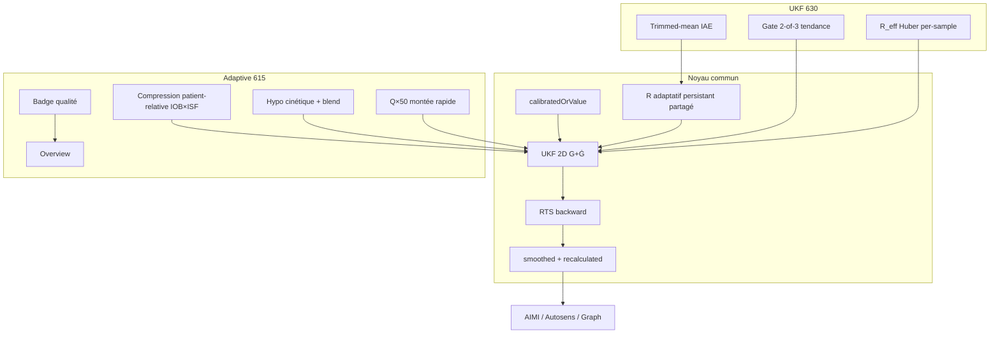

# Smoothing plugins — Adaptive (615) vs Unscented Kalman Filter (630)

> **État :** vérifié contre l'arbre courant (2026-07-10). Le dépôt ne contient pas de plugin « smoothie ». Les
> deux plugins de lissage CGM sont dans `:plugins:smoothing` :
> - **Adaptive Smoothing** — `@IntKey(615)` (`SmoothingPluginsListModule.kt:42`) — le choix production du fork AIMI.
> - **Unscented Kalman Filter** — `@IntKey(630)` (`:54`) — UKF « pur », référence algorithmique.
>
> Les deux implémentent un **UKF 2D + RTS** inline (pas de lib Kalman séparée). Un troisième Kalman existe dans
> AIMI (`KalmanFilter.kt` pour l'ISF, `ContinuousStateEstimator` pour Ra) — ce n'est **pas** du lissage CGM.

---

## 1. Rôle dans la chaîne CGM

Les deux implémentent la même interface :

```kotlin
// core/interfaces/.../smoothing/Smoothing.kt
suspend fun smooth(
    data: MutableList<InMemoryGlucoseValue>,
    context: SmoothingContext = SmoothingContext.NONE
): MutableList<InMemoryGlucoseValue>
```

**Pipeline réel** (`PrepareGraphDataWorker`) :

```
bucket 5 min → calibration → smoothing actif → bucketedData
                                             ↓
                              recalculated = smoothed ?: calibrated ?: value
                                             ↓
                    autosens, IOB/COB, AIMI (delta, prédiction, trajectoire)
```

**Contrat de sortie :** `data[i].smoothed` (mg/dL lissé), `data[i].trendArrow`, et `recalculated` — la valeur
consommée par **tout le loop**.

**Entrée Adaptive uniquement :** `SmoothingContext.cachedTotalIobUnits` (IOB) + désormais l'**ISF profil** (via
`ProfileFunction`) pour la détection de compression patient-relative (§4.1).

---

## 2. Modèle d'état partagé

| Symbole | Signification |
|---------|---------------|
| **x = [G, Ġ]ᵀ** | Glycémie (mg/dL) + vitesse (mg/dL/min) |
| **f(x)** | `[G + Ġ·Δt, Ġ·damping]ᵀ` |
| **h(x)** | `G` (mesure CGM) |
| **Q** | Bruit de processus (fixe + inflation contextuelle) |
| **R** | Bruit de mesure (**adaptatif**, persistant en prefs) |

Sigma-points : formulation **Merwe scaled** (α, β, κ différents entre les deux).

---

## 3. Comparaison algorithmique

### 3.1 Paramètres UKF (Merwe) — *vérifié*

| Paramètre | UKF (630) | Adaptive (615) | Effet |
|-----------|-----------|----------------|-------|
| α | `0.1` (`:87`) | `1.0` (`:84`) | UKF : sigma-points plus serrés |
| β | `2.0` (`:88`) | `0.0` (`:85`) | UKF : meilleure capture non-gaussienne |
| κ | `0.0` (`:89`) | `3.0` (`:86`) | Adaptive : spread plus large |

→ mêmes équations, **comportement numérique différent** sur les non-linéarités.

### 3.2 Bruit de processus Q

| | UKF | Adaptive |
|---|-----|----------|
| Q[G] / Q[Ġ] | 1.0 / 0.35 | 1.0 / 0.40 |
| Damping prédiction | `exp(-dt/30)` par pas | `rateDamping = 0.98` fixe ; `exp(-dt/30)` seulement sur minor gaps |
| Inflation montée | Gate **2-of-3** innovations même signe + \|ν\|>2σ → Q_scale 1–3× | \|ν\|>2.5σ **et** ν>0 → **Q[Ġ] ×50**, Q[G] ×2 (« zero-lag » repas) |
| Philosophie | Prudent : n'accélère que si tendance persistante | Agressif : suit vite les montées physiologiques |

### 3.3 Bruit de mesure R (adaptatif) — *vérifié*

| | UKF | Adaptive |
|---|-----|----------|
| R init | 25.0 (clé prefs `UkfDoubleNonKey.LearnedR`, **partagée**) | 25.0 (même clé) |
| R min / max | 16 / **225** (`:111-112`) | 16 / **196** (`:101-102`) |
| Fenêtre innovations | **18** (~90 min, `:116`) | **48** (~4 h, `:105`) |
| Méthode | **Trimmed-mean IAE** : R̂ = Var(ν) − P_pred, gains asymétriques (k_up 0.18 / k_dn 0.12), caps ±20 %/−10 % | **Médiane** innovations normalisées, EMA 0.06 |
| Pause apprentissage | tendance confirmée (2-of-3) ou \|ν\|>3σ | freeze si une innovation² > 9 (`:875`) |
| R_eff per-sample | **Huber** : `R × (1 + max(0, \|ν\|/σ − 2))`, cap 400 | pas d'inflation R per-sample |
| Post-gap majeur | reset apprentissage complet | **blend doux** vers R_init (≤ 35 % sur 90 min, `:433`) |

> **⚠️ R partagé (`UkfDoubleNonKey.LearnedR`).** Changer de plugin **ne remet pas** R à zéro ; les caps (196 vs
> 225) et méthodes diffèrent → l'historique d'un plugin peut « contaminer » l'autre. Voir §10 (#2, différé).

### 3.4 Gaps et segmentation — *vérifié*

| | UKF | Adaptive |
|---|-----|----------|
| Gap majeur → nouveau segment | **60 min** (`majorGapThreshold`) | **60 min** (`MAJOR_GAP_MINUTES`) |
| Gap mineur | **7 min** fixe (`minorGapThreshold :131`) | **médiane-adaptive** 10–22 min (`:383`) |
| Espacement invalide | 2–60 min ; split si value 38 | médiane×0.35 (1.2–3.0) ; split si ≤ 38 |
| Cap Δt predict | dt réel | `dtPredict` borné (soft floor 12 / hard cap 24) |

Adaptive est **explicitement conçu** pour les feeds irréguliers (xDrip, Notification Listener).

### 3.5 Outliers

| | UKF | Adaptive |
|---|-----|----------|
| Seuil χ² | 15.13 (99.99 %, 1 ddl) | idem (informatif) |
| Limite absolue | 65 mg/dL (`OUTLIER_ABSOLUTE`) | 65 mg/dL |
| Action | log + R_eff gonflé ; **update quand même** | compte pour la qualité ; update sauf compression |
| Code erreur 38 | skip update, prédiction seule | segmentation / sanitize |

### 3.6 RTS (Rauch–Tung–Striebel)

Backward pass par segment (≥ 3 points).

| | UKF | Adaptive |
|---|-----|----------|
| Portée | G + Ġ (matrice 2×2 complète) | variante « glucose only » (Tsunami-style) |
| Trend arrow | point le plus récent seulement | chaque point du segment |
| Plancher sortie | max(smoothed, 39) | coerceIn(39, 500) |

---

## 4. Couche clinique — Adaptive uniquement

C'est la **différence produit majeure** : Adaptive = UKF + règles de sécurité.

### 4.1 Compression artifact (faux hypo capteur) — **patient-relative (mis à jour 2026-07-10)**

Un artefact de pression = une chute **plus raide que ce que l'insuline active + le métabolisme peuvent
physiologiquement causer**. La détection est désormais patient-relative (`isCompressionArtifactCandidate`) :

```
dtMin        = espacement réel des 2 échantillons, borné [2, 15]
fallPer5     = -rawDelta × (5 / dtMin)                  // chute normalisée par 5 min (xDrip/NL safe)
isf          = profileFunction.getProfile()?.getProfileIsfMgdl()   // ISF profil ; null → jamais bloquer

compression ⟺  fallPer5 > steepFloor(15 nuit / 25 jour)            // gate raideur (conservé)
            ET  fallPer5 > 1.5 × (18 + iob × isf × 0.15)            // gate faisabilité (nouveau)
```

- `18` = plancher métabolique (chute non-insulinique possible : sport, freinage GNG) → une vraie chute d'effort
  n'est **pas** prise pour de la compression.
- `iob × isf × 0.15` = part d'IOB active en ~5 min (fraction généreuse → bloque **moins** → plus sûr).
- Constantes dans le companion (`COMPRESSION_*`) — **pas de pref utilisateur** (un Kalman mal réglé est pire).
- **Fail-safe (décision clinique) :** sans ISF fiable, on ne déclare **jamais** de compression (on respecte la
  chute) — l'erreur dangereuse d'un smoother est de **masquer une vraie chute** (le loop voit BG trop haut →
  surdose → hypo plus profonde).

**Pourquoi c'est mieux que l'ancien `iob < 3.0` absolu :** le seuil absolu ne se met pas à l'échelle du patient.
Un enfant fort-ISF a presque toujours IOB<3 → sa vraie chute rapide était dismissée comme compression (dangereux) ;
un adulte fort-TDD a IOB>3 après repas → la vraie compression passait. Le test de faisabilité scale automatiquement.

Quand la compression est détectée : **pas d'update mesure**, on tient la prédiction (évite de propager un faux 54).

### 4.2 Hypo cinétique

Adaptive force l'estimation vers le bas si : BG prédit à 20 min < 55 · (z < 80 et vélocité < −1.5) · vélocité < −3.
UKF n'a pas cette logique. *(Voir §10 #3 : un biais faux-bas possible, à auditer sur data avant de toucher.)*

### 4.3 Hypo critique (blend)

Si BG < 70 et estimate > z + 5 → moyenne `(estimate + z) / 2`.

### 4.4 Badge qualité dashboard

Tiers **OK / UNCERTAIN / BAD** selon `compressionRate` (7 %/15 %), `outlierRate` (10 %/25 %), `learnedR` (45/70).
Événement `EventAdaptiveSmoothingQuality` → badge overview. UKF loggue des stats mais **pas d'UI qualité**.

### 4.5 Dashboard glucose

`preferDashboardGlucoseFromGlucoseStatus() = true` (Adaptive only) — évite le flash BG brut DB avant lissage.

---

## 5. Persistance et reset

| Clé prefs | UKF | Adaptive |
|-----------|-----|----------|
| `UkfDoubleNonKey.LearnedR` | ✅ | ✅ (**partagé**) |
| `LastProcessedTimestamp` | ✅ | ✅ |
| `LastSensorChangeTimestamp` | ✅ | ✅ |
| `SessionId` / `LastSavedTimestamp` | ✅ | — |

**Reset apprentissage :** changement capteur (`EventTherapyEventChange`) · premier appel / gap > 24 h ·
(UKF seul) timestamp arrière, innovation moyenne > 12 sur 15 samples.

---

## 6. Impact sur AIMI

**Même contrat d'intégration** — AIMI ne distingue pas les deux plugins :

| Consommateur | Champ lu |
|--------------|----------|
| `GlucoseStatusCalculatorAimi` | `head.recalculated`, deltas |
| `DetermineBasalAIMI2` | bucketed `recalculated` |
| `TrajectoryBgDerivatives` | dérivées sur `recalculated` |
| Autosens / IOB-COB | idem |

**Conséquences cliniques indirectes :**

| Scénario | UKF | Adaptive |
|----------|-----|----------|
| Repas rapide | lag modéré (Q gated 2-of-3) | faible lag (Q×50) → delta/prédiction plus réactifs |
| Compression nocturne | peut lisser vers le faux bas | bloque (faisabilité) → protège moins à tort |
| **Chute d'effort / enfant fort-ISF** | mesure entre quand même | **respectée** (faisabilité patient-relative, §4.1) |
| Capteur bruité | R monte (trimmed IAE) | R monte (médiane) + badge UNCERTAIN/BAD |
| xDrip 10–15 min | segments plus courts (gap 7 min) | gap médiane → moins de splits artificiels |
| Trend arrow graphe | point courant seulement | historique cohérent |

**Ce que le smoothing ne change pas :** PKPD, IOB pharmacocinétique, DIA/peak appris — il agit **en amont** sur la
série CGM.

---

## 7. Tests unitaires

| Plugin | Fichier | Couverture |
|--------|---------|------------|
| UKF | `UnscentedKalmanFilterPluginTest` | série propre, montée, spike, gap majeur, déterminisme, floor 39 |
| Adaptive | `AdaptiveSmoothingPluginTest` (**6**) | bruit atténué · compression bloquée (IOB bas) · cadence sparse · montée rapide low-lag · **chute fort-ISF respectée** · **no-ISF ne bloque jamais** |

---

## 8. Guide de choix (fork AIMI)

| Critère | Préférer **UKF (630)** | Préférer **Adaptive (615)** |
|---------|------------------------|------------------------------|
| Objectif | signal processing pur, R sophistiqué | production : sécurité hypo + compression |
| Capteur | Dexcom/G6 déjà filtré (BYODA) | xDrip, NL, capteurs bruyants |
| Repas | accepte un peu de lag | veut delta/prédiction réactifs |
| Confiance utilisateur | logs techniques | badge OK/UNCERTAIN/BAD |
| IOB / ISF context | ignoré | utilisé (compression patient-relative) |

**Recommandation fork :** **Adaptive (615)** — aligné avec la description produit AIMI (*minimal lag on rapid
rises, hypo-safe on lows*). UKF reste utile comme référence algorithmique ou pour éviter les heuristiques
IOB/hypo/ISF.

---

## 9. Schéma comparatif



---

## 10. Limites et pistes

| # | Sujet | État |
|---|-------|------|
| **1** | **Compression absolue `iob<3`** → **patient-relative (IOB×ISF)** | ✅ **fait 2026-07-10** (§4.1) — à valider device |
| **2** | **R partagé** entre plugins (`UkfDoubleNonKey.LearnedR`, caps 196 vs 225, méthodes différentes) → contamination au switch | ⏳ différé (clé séparée ou reset au switch) |
| **3** | **Biais faux-bas** de l'hypo cinétique (`x[0] += velocity*2.0`) | ⏳ différé — **mesurer sur trace avant de toucher** (sécurité hypo) |
| 4 | Pas de réglage utilisateur Q/R | volontaire (un Kalman mal réglé est pire) ; envisager un preset « réactivité » |
| 5 | UKF loggue `UKF: live R=…` par point (`:836`) | bruit logcat en prod |
| 6 | Kalman ISF/Ra AIMI indépendant | incohérence smoothing↔ISF possible si capteur et modèle divergent |

**Validation terrain (recommandée) :** mêmes traces CGM, switch 615↔630, comparer `delta`/`combinedDelta`, lag,
MAE vs BG réalisé, et taux de faux-hypo déclenchés — via l'export Hormonitor / JSONL.

---

*Généré à partir du code vérifié (constantes, IntKey, formules recoupées). Companion mémoire :
`adaptive-smoothing-compression`.*
